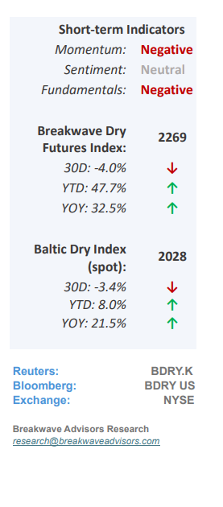
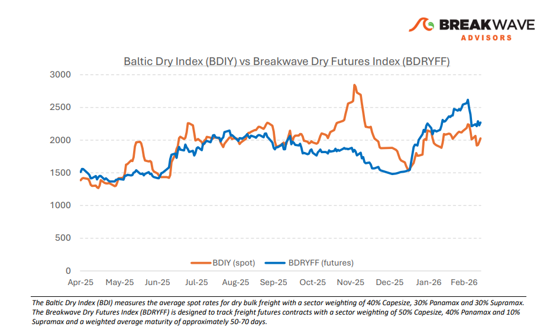
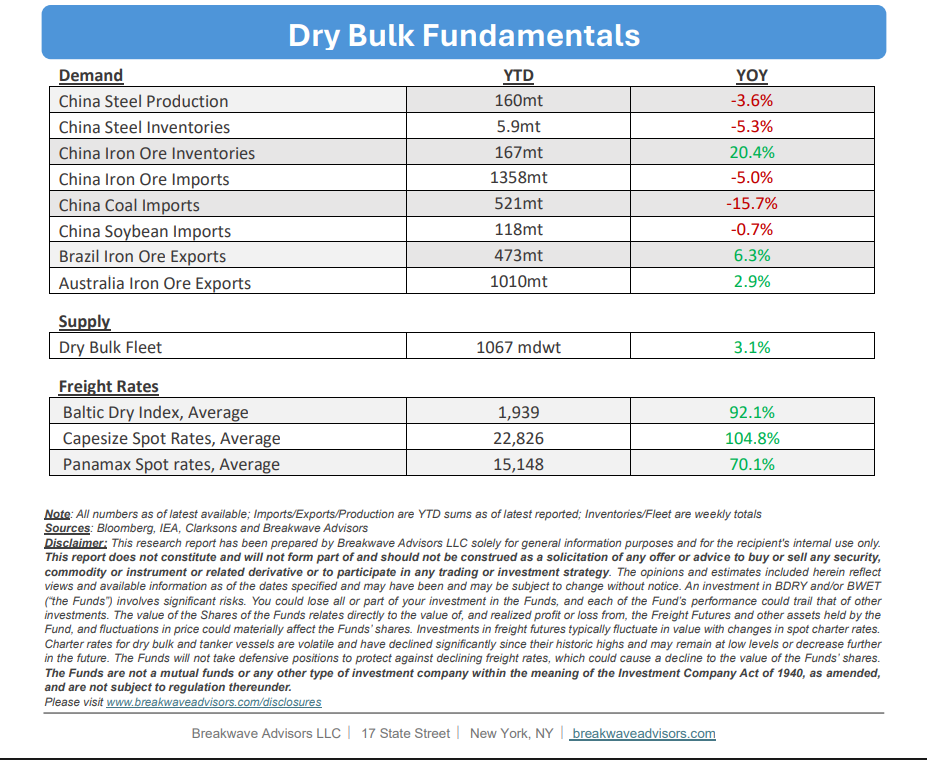

# Breakwave Bi-Weekly Dry Bulk Report - March 17, 2026

**Date:** March 17, 2026  
**Publisher:** Breakwave Advisors | **Category:** Market Insights  
**Original URL:** [https://www.breakwaveadvisors.com/insights/3172026db-report2026kkji3jju786yyh](https://www.breakwaveadvisors.com/insights/3172026db-report2026kkji3jju786yyh)  

---

•**Dry Bulk Futures React to Geopolitical Uncertainty, but Spot Supported**– The fast-moving developments on the geopolitical front over the last few weeks is affecting dry bulk shipping. As we discussed in our previous report, the institutionalization of**freight has left the futures market vulnerable**to broader macroeconomic risk repricing, and thus, the futures curve has now also experienced a meaningful correction. Yet the**spot market managed to come out relatively unscathed**and so far, has not seen a major negative reaction. We remain concerned about the broader economic impact that high oil prices might have as shipping will not be immune to such a shock. It is too early to see the effects of higher fuel prices on economic activity, but we expect a**meaningful slowdown in consumer spending, especially in Asia**, which in turn will have a negative effect on broader economic activity. Dry bulk will be negatively impacted in such a scenario, and thus the second half of the year we now see the risks tilted to the downside versus where freight futures prices currently are. Of course,**the news cycle is so unpredictable,**and thus, could shift the outlook dramatically at any moment, but oil prices might remain elevated and even rise further given the damage already done to the energy logistical chain. Some**incremental negative news**also might contribute to such a cautious outlook (record high Chinese iron ore inventories, talk of Guinea bauxite export controls). Overall, the macro-outlook**contradicts an optimistic futures curve**, although one must remember that this is something that has persisted for a while now.

> **Figure 1: Cea3cf84ceb9ceb3cebcceb9cf8ccf84cf85**  
> [Local Asset](file:///C:/Users/Dell/Github/Shipping/corpus/03-breakwave/insights/2026/assets/2026-03-17_3172026db-report2026kkji3jju786yyh_img_cea3cf84ceb9ceb3cebcceb9cf8ccf84cf85_e3cbb16415ab.png)

•**Chinese Iron Ore Portside Inventories Continue to Climb**– The iron ore market currently exhibits an interesting anomaly, characterized by a**paradox of seaborne supply-side tightness and record-breaking inventories.**While the seaborne market faces logistical pressures from the ongoing US-Iran conflict, port stockpiles have surged to all-time highs as Chinese imports maintain a record pace. Despite stagnant Chinese steel demand,**prices have stabilized in the $100–$110 range**, suggesting a shift toward**strategic stockbuilding**similar to China’s approach to crude oil. This centralized influence, spearheaded by the China Mineral Resources Group (CMRG), complicates traditional supply-and-demand analysis; however, the**shipping sector continues to benefit**from these high volumes, with freight futures and dry bulk markets seeing sustained support from the persistent inventory buildup.

•**Our Long-term View**– The last few years have been characterized by increased geopolitical uncertainty. Going forward, we expect such events to continue to affect global trade and have a meaningful impact on effective vessel supply. Combined with the potential for a multi-year cyclical rebound in China’s economic activity following the recent economic turmoil, dry bulk shipping should experience higher volatility on top of a secular tightness driven by stable bulk commodity demand and a slower fleet growth owing to a relatively low orderbook.

> **Figure 2: Στιγμιότυπο Οθόνης 2026 03 17 092124**  
> [Local Asset](file:///C:/Users/Dell/Github/Shipping/corpus/03-breakwave/insights/2026/assets/2026-03-17_3172026db-report2026kkji3jju786yyh_img_cea3cf84ceb9ceb3cebcceb9cf8ccf84cf85_65497a0192e7.png)

> **Figure 3: Στιγμιότυπο Οθόνης 2026 03 17 102712**  
> [Local Asset](file:///C:/Users/Dell/Github/Shipping/corpus/03-breakwave/insights/2026/assets/2026-03-17_3172026db-report2026kkji3jju786yyh_img_cea3cf84ceb9ceb3cebcceb9cf8ccf84cf85_0a7ea8db49a7.png)

### Subscribe:
