# Crude-Laden Tankers Build in Hormuz as Production Cuts Loom

**Date:** March 17, 2026  
**Publisher:** Breakwave Advisors | **Category:** Market Insights  
**Original URL:** [https://www.breakwaveadvisors.com/insights/2026/3/17/crude-laden-tankers-build-in-hormuz-as-production-cuts-loom](https://www.breakwaveadvisors.com/insights/2026/3/17/crude-laden-tankers-build-in-hormuz-as-production-cuts-loom)  

---

Record crude accumulation and a historic shift in ballast–laden ratios signal deepening supply disruption in the Gulf.

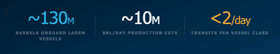

> **Figure 1: Cea3cf84ceb9ceb3cebcceb9cf8ccf84cf85**  
> **Interactive Data & Source:** [Signal Ocean Platform](https://www.thesignalgroup.com/signal-ocean-platform) | [Local Asset](file:///C:/Users/Dell/Github/Shipping/corpus/03-breakwave/insights/2026/assets/2026-03-17_crude-laden-tankers-build-in-hormuz-as-production-cuts-loom_img_cea3cf84ceb9ceb3cebcceb9cf8ccf84cf85_df3955f12aab.png)

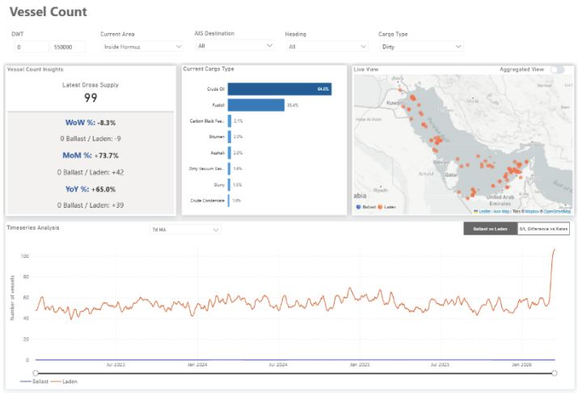

> **Figure 2: Market Chart 2**  
> **Interactive Data & Source:** [Signal Ocean Platform](https://www.thesignalgroup.com/signal-ocean-platform) | [Local Asset](file:///C:/Users/Dell/Github/Shipping/corpus/03-breakwave/insights/2026/assets/2026-03-17_crude-laden-tankers-build-in-hormuz-as-production-cuts-loom_img_unnamed_5c62f36b5a42.png)

Tensions in the Gulf have been escalating for nearly two weeks, culminating most recently in U.S. strikes on military targets on Kharg Island, Iran's primary crude export terminal. In parallel with disruptions to export flows, Gulf producers have announced production curtailments of approximately 10 million barrels per day, equivalent to around 5 VLCC cargoes per day, removed from the seaborne market.

To evaluate how these developments are affecting tanker activity in the region, vessel data from The Signal Ocean Platform (TSOP) were analyzed. The scale of the latest production cuts, combined with the record accumulation of laden crude tankers within the Strait of Hormuz, points to the potential for deeper supply reductions and increasing upward pressure on oil prices, with market expectations now shifting toward levels above $100 per barrel.

This analysis focuses solely on non-sanctioned vessels and examines the number of laden and ballast vessels currently operating in the Strait of Hormuz, as well as capacity utilization across crude and product tanker segments. These indicators provide an early view of how tanker markets are responding to the rapidly evolving security environment in the Gulf.

### Spotlight

## Laden Tanker Counts Reach Record Levels

Recent AIS data show a sharp reversal in the typical ballast–laden balance in the Strait of Hormuz, with laden vessels now significantly outnumbering ballast vessels.

**Historical**~135 ballast vs ~85 laden vessels

**Typical gap**50 vessels in favor of ballast traffic

**Recent**~75 ballast vessels vs ~145 laden

**Latest crude tanker snapshot**85 laden vs 25 ballast vessels in the latest observations

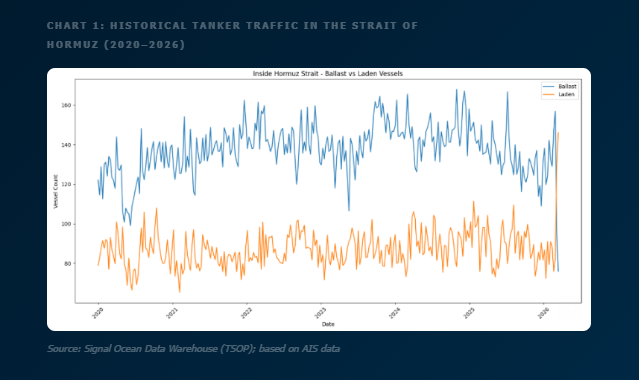

> **Figure 3: Στιγμιότυπο Οθόνης 2026 03 17 132950**  
> **Interactive Data & Source:** [Signal Ocean Platform](https://www.thesignalgroup.com/signal-ocean-platform) | [Local Asset](file:///C:/Users/Dell/Github/Shipping/corpus/03-breakwave/insights/2026/assets/2026-03-17_crude-laden-tankers-build-in-hormuz-as-production-cuts-loom_img_cea3cf84ceb9ceb3cebcceb9cf8ccf84cf85_91eca8f6c43e.png)

During March 2026, owing to the effective closure of the Strait of Hormuz, a clear divergence emerged between ballast and laden tanker counts. Ballast tanker numbers declined sharply, falling from an average of 135 vessels to around 75. Over the same period, laden tanker counts increased significantly, rising from an average of 85 vessels to roughly 145.

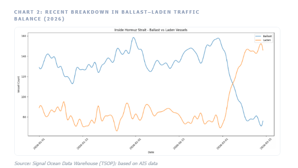

> **Figure 4: Στιγμιότυπο Οθόνης 2026 03 17 133006**  
> **Interactive Data & Source:** [Signal Ocean Platform](https://www.thesignalgroup.com/signal-ocean-platform) | [Local Asset](file:///C:/Users/Dell/Github/Shipping/corpus/03-breakwave/insights/2026/assets/2026-03-17_crude-laden-tankers-build-in-hormuz-as-production-cuts-loom_img_cea3cf84ceb9ceb3cebcceb9cf8ccf84cf85_478689c814e7.png)

## Where the Distortion Is Most Visible

The imbalance becomes particularly clear when focusing on crude tankers specifically. Laden crude tanker counts have risen to roughly 85 vessels, while ballast crude tankers have fallen to about 25 vessels. This indicates a buildup of laden crude carriers inside the Gulf, instead of the normal circulation of vessels exiting the region.

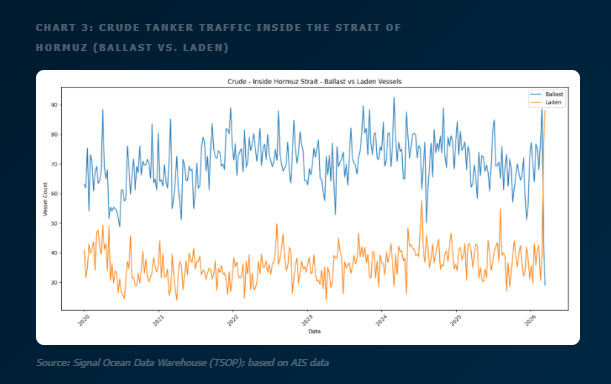

> **Figure 5: Στιγμιότυπο Οθόνης 2026 03 17 133015**  
> **Interactive Data & Source:** [Signal Ocean Platform](https://www.thesignalgroup.com/signal-ocean-platform) | [Local Asset](file:///C:/Users/Dell/Github/Shipping/corpus/03-breakwave/insights/2026/assets/2026-03-17_crude-laden-tankers-build-in-hormuz-as-production-cuts-loom_img_cea3cf84ceb9ceb3cebcceb9cf8ccf84cf85_cdd901c3962b.png)

## Crude Cargo Buildup Inside the Strait of Hormuz

Based on AIS-derived estimates, approximately 130 million barrels of crude oil are currently onboard tankers in the region, with around 40 million barrels of spare capacity remaining. The pattern is similar for clean product tankers, though on a smaller scale. Roughly 25 million barrels of refined products are currently onboard vessels, with about 20 million barrels of spare product tanker capacity available.

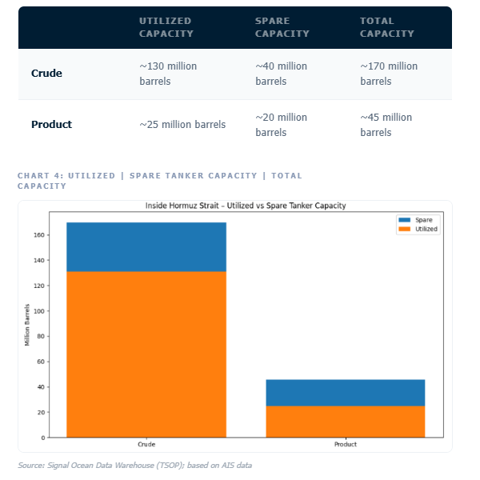

> **Figure 6: Στιγμιότυπο Οθόνης 2026 03 17 134955**  
> **Interactive Data & Source:** [Signal Ocean Platform](https://www.thesignalgroup.com/signal-ocean-platform) | [Local Asset](file:///C:/Users/Dell/Github/Shipping/corpus/03-breakwave/insights/2026/assets/2026-03-17_crude-laden-tankers-build-in-hormuz-as-production-cuts-loom_img_cea3cf84ceb9ceb3cebcceb9cf8ccf84cf85_52281134bcf5.png)

## Estimated Daily Transit Capacity

In January 2026, under normal operating conditions, the number of daily tanker transits through the Strait of Hormuz was around 20 each for West to East and East to West (total 40).

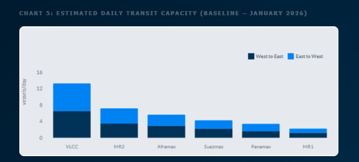

> **Figure 7: Στιγμιότυπο Οθόνης 2026 03 17 133147**  
> **Interactive Data & Source:** [Signal Ocean Platform](https://www.thesignalgroup.com/signal-ocean-platform) | [Local Asset](file:///C:/Users/Dell/Github/Shipping/corpus/03-breakwave/insights/2026/assets/2026-03-17_crude-laden-tankers-build-in-hormuz-as-production-cuts-loom_img_cea3cf84ceb9ceb3cebcceb9cf8ccf84cf85_2ef2b8ae110f.png)

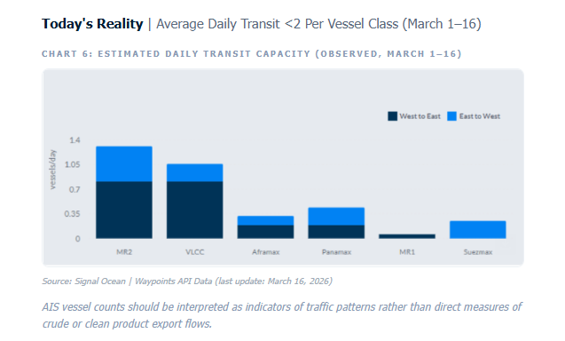

> **Figure 8: Στιγμιότυπο Οθόνης 2026 03 17 133154**  
> **Interactive Data & Source:** [Signal Ocean Platform](https://www.thesignalgroup.com/signal-ocean-platform) | [Local Asset](file:///C:/Users/Dell/Github/Shipping/corpus/03-breakwave/insights/2026/assets/2026-03-17_crude-laden-tankers-build-in-hormuz-as-production-cuts-loom_img_cea3cf84ceb9ceb3cebcceb9cf8ccf84cf85_4239f820bb81.png)

Although only one or two confirmed vessel transits per day per vessel class are observed on average, this does not necessarily mean that only that number of ships are passing through the strait. Limited AIS visibility, delayed reporting, or selective disclosure by operators can significantly reduce the number of visible movements. Even under elevated security conditions, the strait may still record approximately 10 to 15 tanker movements per day, if including the vessels not detectable via AIS, which tends to make traffic patterns less predictable due to shadow fleet activity.

## Per Commercial Operator | VLCC

The operator distribution highlights a notable presence of Asian-linked companies, including Sinokor, Idemitsu, Unipec, COSCO, Bahri, and trading houses such as Trafigura. Their presence among VLCC operators aligns with the high number of tanker transits through the Strait of Hormuz, as these vessels are largely employed in transporting Middle Eastern crude to Asian import markets.

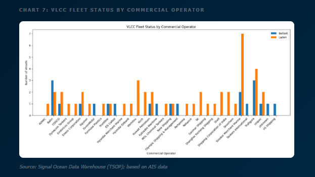

> **Figure 9: Στιγμιότυπο Οθόνης 2026 03 17 133203**  
> **Interactive Data & Source:** [Signal Ocean Platform](https://www.thesignalgroup.com/signal-ocean-platform) | [Local Asset](file:///C:/Users/Dell/Github/Shipping/corpus/03-breakwave/insights/2026/assets/2026-03-17_crude-laden-tankers-build-in-hormuz-as-production-cuts-loom_img_cea3cf84ceb9ceb3cebcceb9cf8ccf84cf85_4e5043f1667a.png)

## Tanker Transits and Insurance Environment

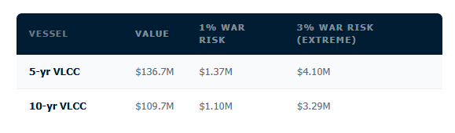

> **Figure 10: Στιγμιότυπο Οθόνης 2026 03 17 133211**  
> **Interactive Data & Source:** [Signal Ocean Platform](https://www.thesignalgroup.com/signal-ocean-platform) | [Local Asset](file:///C:/Users/Dell/Github/Shipping/corpus/03-breakwave/insights/2026/assets/2026-03-17_crude-laden-tankers-build-in-hormuz-as-production-cuts-loom_img_cea3cf84ceb9ceb3cebcceb9cf8ccf84cf85_b3d311530f88.png)

War-risk premiums for Gulf transits have risen significantly following the recent escalation. Industry indications suggest that premiums have increased from roughly 0.2–0.4% of vessel value previously to around 1% in many cases, with significantly higher levels possible for voyages assessed as carrying elevated risk (from 3% to 5%).

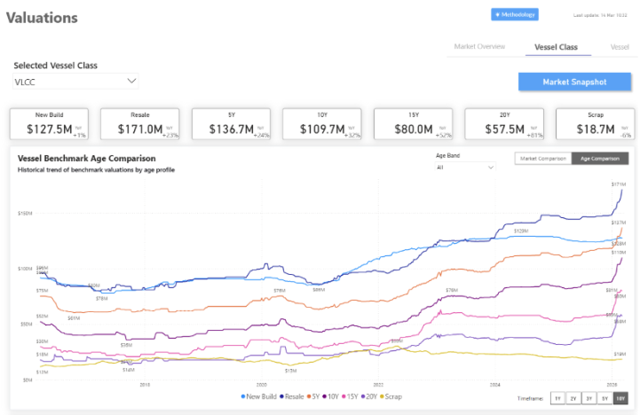

> **Figure 11: Market Chart 11**  
> **Interactive Data & Source:** [Signal Ocean Platform](https://www.thesignalgroup.com/signal-ocean-platform) | [Local Asset](file:///C:/Users/Dell/Github/Shipping/corpus/03-breakwave/insights/2026/assets/2026-03-17_crude-laden-tankers-build-in-hormuz-as-production-cuts-loom_img_unnamed28329_845ee3a191c0.png)

Based on indicative VLCC market valuations of approximately $137 million for a five-year-old vessel and about $110 million for a ten-year-old vessel, a 1% premium could imply costs in the range of approximately $1–1.4 million per transit, with higher-risk scenarios potentially resulting in materially higher premiums.

### Market Outlook

## Volatility Persists As Floating Storage Builds

Maritime security across the Gulf remains highly volatile, and tanker operators are likely to remain cautious until clearer signals emerge regarding the stability of navigation through the Strait of Hormuz.

In the near term, developments surrounding Iranian export infrastructure, the availability of war-risk insurance, and the willingness of shipowners to deploy vessels in the region will remain key factors shaping tanker freight markets and crude trade flows. At the same time, the continued expansion of Russian exports toward Asia, the increased use of Red Sea export routes for Saudi crude, and the operational flexibility of the shadow fleet demonstrate that global energy logistics are already adapting to the evolving geopolitical landscape.

With the Strait effectively closed and no tonnage replenishment entering the Gulf, vessels already inside are increasingly filling with crude and acting as temporary floating storage. This provides producers with a short-term buffer, but as long as export bottlenecks persist and tanker capacity becomes saturated, further production cuts may become increasingly unavoidable.

Data Source:[Signal Ocean Platform](https://www.thesignalgroup.com/signal-ocean-platform)

---

**Tags:** Crude, Shipping, Tankers  
