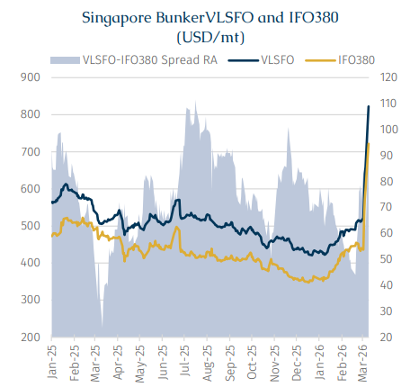
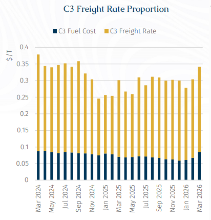
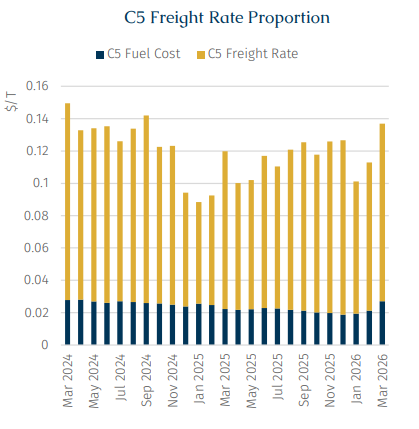
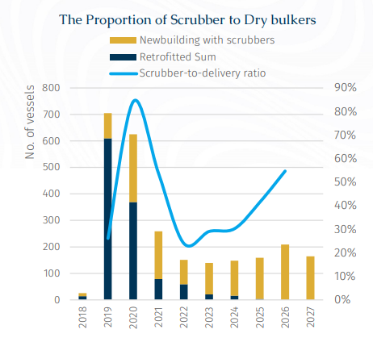

# Oil Spike Challenges Dry Bulk Fuel Equation

**Date:** March 17, 2026  
**Publisher:** Breakwave Advisors | **Category:** Market Insights  
**Original URL:** [https://www.breakwaveadvisors.com/insights/2026/3/17/oil-spike-challenges-dry-bulk-fuel-equation](https://www.breakwaveadvisors.com/insights/2026/3/17/oil-spike-challenges-dry-bulk-fuel-equation)  

---

> **Figure 1: Rgb Color Brs Shipbrokers Monogram L**  
> [Local Asset](file:///C:/Users/Dell/Github/Shipping/corpus/03-breakwave/insights/2026/assets/2026-03-17_oil-spike-challenges-dry-bulk-fuel-equation_img_rgb-color-brs-shipbrokers-monogram-l_c365f35f1de5.png)

The Middle Eastern Conflict has triggered wild swings in oil and marine fuel prices. Following the outbreak of the conflict, and reflecting the closure of the Strait of Hormuz through which around 20-21 mb/d of crude and refined products pass, oil prices have been on a roller-coaster ride and by the time of writing, prompt month ICE Brent was standing at over $100/bbl. Indeed, considering the scale of the disruption to oil flows, prices are increasingly volatile and reacting to newsflow. For example, prices saw record intra-day volatility last Monday. Moreover, this volatility is feeding into other markets – from finance to other commodities.

Consequently, bunker prices, which are heavily influenced by crude prices movements and account for a significant proportion of total voyage expenses, have been on a similarly wild ride, hindering the ability of some freight providers to offer prices, within a certain confidence interval, for new voyages. Indeed, there have been accounts of some operators defaulting on contracts, with claims that their bulkers are unable to bunker in a timely fashion prior to their stipulated laycans.

For context, much of the oil trapped in the Middle East Gulf is medium-sour crude, with high diesel and jet fuel yields. Alternative supplies from the Atlantic Basin are generally lighter grades, producing a different mix of products and requiring longer transport times. Conventional bunkers used for voyages on the high seas are generally HSFO and VLSFO. The latter is often made by blending heavier, high-sulfur residual oils with lighter, low-sulfur distillates to achieve the desired sulfur content.

> **Figure 2: Στιγμιότυπο Οθόνης 2026 03 17 125640**  
> [Local Asset](file:///C:/Users/Dell/Github/Shipping/corpus/03-breakwave/insights/2026/assets/2026-03-17_oil-spike-challenges-dry-bulk-fuel-equation_img_cea3cf84ceb9ceb3cebcceb9cf8ccf84cf85_30bc47b01ba3.png)

The recent events have driven a rapid widening of the high-sulphur and low-sulphur fuel spread. Most of this widening has come from absolute prices moving higher. However, each fuel has reacted slightly differently reflecting the sour crude supply crunch. For instance, in Singapore, a key global bunkering hub, the price of high-sulphur fuel oil (IFO380) rose by 65.4% from the outbreak of the conflict to the second week, while very low-sulphur fuel oil （VLSFO） prices increased by 57.7% over the same period, widening the spread to $100.5 per tonne. Consequently, the proportion of voyage costs accounted by bunkers on the Capesize C3 route (Brazil to China) and C5 route (West Australia to China) soared to 33.1% and 24.7% respectively, their highest levels in eight months.

> **Figure 3: Στιγμιότυπο Οθόνης 2026 03 17 125653**  
> [Local Asset](file:///C:/Users/Dell/Github/Shipping/corpus/03-breakwave/insights/2026/assets/2026-03-17_oil-spike-challenges-dry-bulk-fuel-equation_img_cea3cf84ceb9ceb3cebcceb9cf8ccf84cf85_fdc8a2d01cee.png)

> **Figure 4: High Oil Prices Are Placing Considerable Operational Pressure On**  
> *High oil prices are placing considerable operational pressure on dry bulk shipping companies. For voyages already in progress, rising bunker costs directly erode voyage profits. For forward contracts with locked-in fuel prices, potential supply disruptions could lead to contract performance risks due toforce majeure. Considering that the conflict is intensifying, expectations are that fuel costs will remain strong for the foreseeable future (this is also indicated by crude futures contracts), fuel premiums for future dry bulker voyages have risen and will likely continue to rise.*  
> [Local Asset](file:///C:/Users/Dell/Github/Shipping/corpus/03-breakwave/insights/2026/assets/2026-03-17_oil-spike-challenges-dry-bulk-fuel-equation_img_cea3cf84ceb9ceb3cebcceb9cf8ccf84cf85_c8d67e9c09ce.png)

Against this backdrop, the continued widening of the spread between high-sulphur and low-sulphur fuels gives scrubber-fitted vessels a distinct advantage in fuel costs, enhancing their operational flexibility and resilience.

> **Figure 5: Meanwhile**  
> *Meanwhile, the strait of Hormuz blocked is also propelling LNG prices upwards. The Strait of Hormuz typically handles approximately 23% of global LNG trade, making it one of the most critical transit routes for gas exports to Asia and Europe. The impact has already become evident, with Qatar Energy halting LNG production and declaringforce majeureon supply contracts. Qatar alone accounts for nearly 20% of global LNG supply, meaning that even temporary disruptions remove a substantial share of available volumes from the market, leading to sharp price increases in both Asia and Europe. This has also triggered a scramble for alternative supplies, with LNG carrier hire rates surging by 500%, to hit their highest levels since 2022.*  
> [Local Asset](file:///C:/Users/Dell/Github/Shipping/corpus/03-breakwave/insights/2026/assets/2026-03-17_oil-spike-challenges-dry-bulk-fuel-equation_img_cea3cf84ceb9ceb3cebcceb9cf8ccf84cf85_a06f5a933643.png)

Data on bulk carriers indicate that 19.6% of the current fleet is equipped with scrubbers. Scrubber installations are particularly concentrated on large vessels: VLOCs 92.1%, and Capesizes 47.1%. This reflects that these vessels undertake longer voyages where bunker costs are proportionally more important than for shorter voyages. Beyond larger vessel segments, newly built Kamsarmaxes and Ultramax are also typically equipped with scrubbers, resulting in high installation rates of 37.7% for Kamsarmaxes and 30.8% for Ultramaxes. The key reason lies in the integration process: scrubbers can be seamlessly incorporated into a vessel's design and construction, which is far more cost-effective than the complex retrofitting required for existing ships. According to equipment suppliers, installation costs for scrubbers have declined by nearly 39% over the past six years, incentivizing shipowners to invest in technology.

LNG dual-fuel vessels currently account for approximately 0.65% of the global bulk carrier fleet, with Capesizes making up nearly 77 units of this share. Currently, only shipping magnates with large-scale operations are ordering large vessels equipped with LNG propulsion. Moving forward, this situation serves as a critical reminder: if the supply of alternative fuels like LNG, ammonia, or methanol cannot be geopolitically guaranteed, then the traditional focus on fuel-switching economics alone is insufficient when ordering dual-fuel tonnage. Therefore, the delicate balancing act between decarbonization commitments, fuel cost volatility, and bunker availability with geopolitics at its core will remain a complex challenge for shipowners to navigate. At the same time, higher bunker prices and geopolitical instability should drive greater interest in fuel-saving technologies such as Wind Assisted Propulsion Systems （WAPS） and hull airflow, as these solutions offer a practical hedge against uncertainty, regardless of which fuel eventually powers the fleet.

---

**Tags:** Shipping, Markets, Geopolitics  
