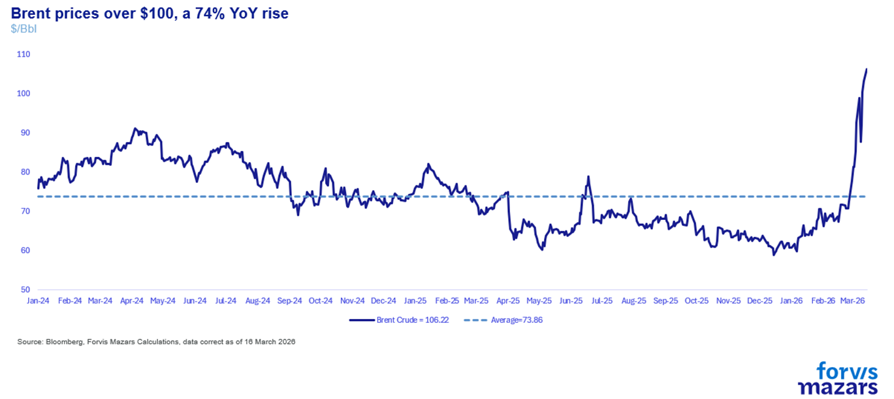
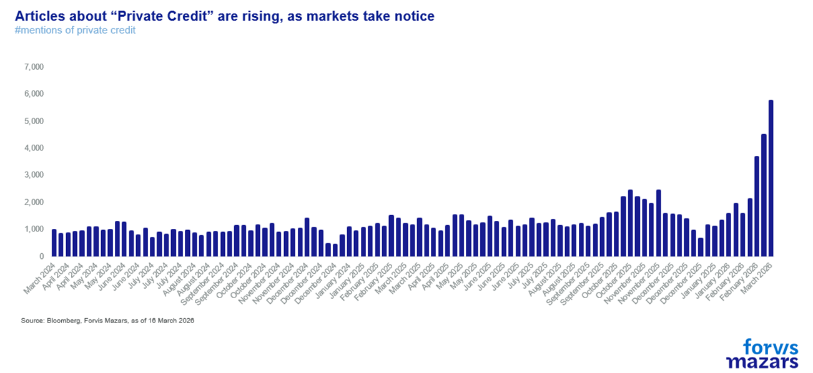
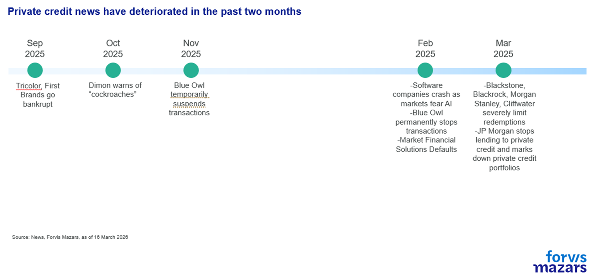
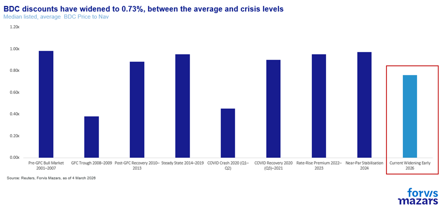
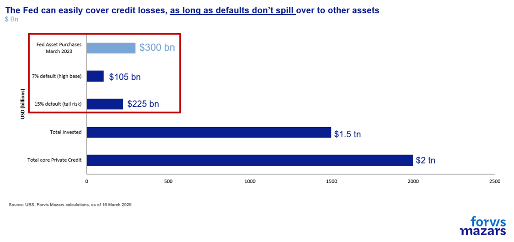

# Private Credit: Still quite far from a 2008-event

**Date:** March 19, 2026  
**Publisher:** Breakwave Advisors | **Category:** Market Insights  
**Original URL:** [https://www.breakwaveadvisors.com/insights/2026/3/19/private-credit-still-quite-far-from-a-2008-event](https://www.breakwaveadvisors.com/insights/2026/3/19/private-credit-still-quite-far-from-a-2008-event)  

---

Private Credit becoming a systemic risk capable of destabilising broader asset classes is not a central scenario, however, it warrants close monitoring. The market itself is not particularly large, $1.5 trillion, with approximately $100–$225 billion of assets considered at risk. As a proportion of total bank lending, exposure is estimated at roughly 7.5%–8.0% of aggregate loans. Nevertheless, given the opacity of interconnections with other markets, central banks must remain vigilant and be prepared to act swiftly should credit conditions begin to freeze, and investors should monitor central bank reactions closely.

*By*[*George Lagarias*](https://www.linkedin.com/in/george-lagarias-mba-3baa769/)

The closure of the Strait of Hormuz has now entered its third week, with oil prices once again trading above $100 per barrel.

The United States is actively seeking an exit strategy from the Iran conflict. Strikes on Kharg Island, through which 90% of Iranian crude exports pass, serve not only as a mechanism of pressure on the regime, but also as a warning to its regional allies: “Cease your support, or face severe disruption to your oil supplies long after the conflict ends.” The strikes represent an equally pointed message to the Islamic Revolutionary Guard Corps that its provocative conduct, attacking international shipping in open waters beyond the so-called “shadow fleet”, will no longer be tolerated.

That said, a change of regime in Iran appears unlikely. The United States appears to be gravitating towards a more limited objective: the systematic destruction of Iran’s military infrastructure and the protection of freedom of navigation through the Strait of Hormuz, thereby preparing the ground for potential future interventions.

Whilst petrol prices in the United States have risen sharply, both the American and global economies can withstand several further weeks of elevated energy costs. Equity markets remain near all-time highs, though short-duration bonds are exhibiting signs of weakness, as investors now anticipate fewer rate cuts, and, in some scenarios, rate increases.

> **Figure 1: Market Chart 1**  
> [Local Asset](file:///C:/Users/Dell/Github/Shipping/corpus/03-breakwave/insights/2026/assets/2026-03-19_private-credit-still-quite-far-from-a-2008-event_img_image008_6f5cb0581332.png)

Even as it remains difficult to look beyond the all-consuming Iran story, the time has come to direct our attention to a rapidly developing situation in the American financial markets: the unfolding stress in the non-bank Private Credit industry.

> **Figure 2: Market Chart 2**  
> [Local Asset](file:///C:/Users/Dell/Github/Shipping/corpus/03-breakwave/insights/2026/assets/2026-03-19_private-credit-still-quite-far-from-a-2008-event_img_image009_2dc475d69437.png)

Market crises fall broadly into two categories: exogenous and endogenous.

**Exogenous shocks,**wars, pandemics etc, are, as a rule, manageable. Precisely because the cause is external and identifiable, central banks and the financial system can mobilise to absorb the impact. Capitalism has survived countless wars and external shocks since the seventeenth century.

The second type of crisis is**endogenous**: one in which the system itself exhibits a dysfunction. Because such crises do not generate the same immediate headlines as an external shock, the response typically sometimes lags, allowing the problem to compound.

In the aftermath of the Great Financial Crisis of 2007–2008, governments substantially tightened the regulatory framework, curtailing banks’ capacity to lend. However, demand for credit, particularly from start-ups and the technology sector, remained robust. Combined with historically low interest rates, this created fertile conditions for private investors to step in, either by taking equity stakes (Private Equity) or by extending loans outside the banking system under bespoke contractual terms (Private Credit).

Unlike banks, which prefer broadly diversified lending portfolios, private investors concentrated their capital in a small number of high-growth sectors, most notably technology.

In search of larger deployable volumes, fund managers structured their vehicles to accommodate retail investors who had previously been unable to access this asset class, as well as pension funds. Both sets of investors were seeking access to non-equity, fixed-income returns at a time when interest rates, and thus bond yields, were suppressed by Quantitative Easing. The search for yield led investors to sacrifice liquidity they did not believe they would need. The industry’s assets under management surged from a mere $300 billion to approximately $3.5 trillion (or $2 trillion, excluding real estate, asset-backed securities and infrastructure).

The system functioned smoothly whilst the cost of capital remained low. However, the sharp rise in interest rates from 2022, following the pandemic and the outbreak of the Ukraine conflict, drove borrowing costs sharply higher and severely disrupted both the Private Equity and Private Credit industries.

The inherent difficulty of accurately valuing privately held companies, precisely because they are not publicly traded, became a tangible problem once cheap money was withdrawn.

Over recent months, and particularly recent weeks, Private Credit-related incidents have been multiplying at an exponential rate. From the bankruptcies of Tricolor and First Brands last September, to Jamie Dimon’s “cockroaches” warning in October, and through to the temporary suspension of redemptions by Blue Owl funds in November. A significant number of companies, particularly in software, are reliant upon Private Credit financing. Following the widespread adoption of artificial intelligence, fears have intensified that technology firms may face severe distress.

From February onwards, the newsflow has become considerably more alarming. Blue Owl has permanently ceased redemptions; Market Financial Solutions, a Private Credit fund specialising in real estate lending, has collapsed into administration. In March, Blackstone, BlackRock, Morgan Stanley and Cliffwater all imposed redemption gates. JP Morgan has effectively blocked private lending to software companies and has marked down the valuations of private portfolios. The situation has been compounded by the Iran conflict, which has heightened near-term inflation expectations and pushed borrowing rates higher.

> **Figure 3: Market Chart 3**  
> [Local Asset](file:///C:/Users/Dell/Github/Shipping/corpus/03-breakwave/insights/2026/assets/2026-03-19_private-credit-still-quite-far-from-a-2008-event_img_image010_5fac599c1984.png)

### Three Key Risks

1. What are Private Credit portfolios actually worth? The average Business Development Company (a special-purpose vehicle accounting for approximately one-third of market share) now trades at 73% of its Net Asset Value, crisis-level pricing and the lowest multiple recorded in recent years (source: Reuters, Morningstar).

> **Figure 4: Portfolio Valuations:**  
> [Local Asset](file:///C:/Users/Dell/Github/Shipping/corpus/03-breakwave/insights/2026/assets/2026-03-19_private-credit-still-quite-far-from-a-2008-event_img_image011_1e27ba0d3e99.png)

Approximately $220 billion (out of $2 trillion total industry AUM and $1.5 trillion deployed) is considered to be at elevated risk. Roughly 11% of capital deployed in software companies carries potentially higher default risk. UBS estimates that default rates could rise by 3% to 4% to reach 5–7% of total, whilst the author of the report, Matthew Mish, indicated that in a tail scenario defaults could reach as high as 15%.

> **Figure 5: 2. Potential Losses:**  
> [Local Asset](file:///C:/Users/Dell/Github/Shipping/corpus/03-breakwave/insights/2026/assets/2026-03-19_private-credit-still-quite-far-from-a-2008-event_img_image012_8e0fa07fa434.png)

**3. Systemic contagion:**Whilst the market is not large in absolute terms, the experience of 2008 demonstrates that even a relatively small market can cause serious dislocations across global financial markets. Only days ago, Deutsche Bank disclosed $30 billion of direct exposure to Private Credit, which sent its CDS spreads (the market’s measure of default risk) rising. The issuance of new leveraged loans has declined by 30% over the past year, which may in turn, create a broader drag on M&A activity and market liquidity.

The risks inherent in private investments are a concern we have been raising since 2023, indeed, the author of this note was called to give evidence on the matter before the British Parliament.

> **Figure 6: Market Chart 6**  
> [Local Asset](file:///C:/Users/Dell/Github/Shipping/corpus/03-breakwave/insights/2026/assets/2026-03-19_private-credit-still-quite-far-from-a-2008-event_img_image013_ea1a09e09403.png)

### Implications for Investors

A number of factors suggest the problem remains contained.

The market itself is not particularly large. If 7% of the $1.5 trillion deployed capital defaults, the loss would amount to approximately $110 billion. In the UBS tail scenario of 15% defaults, the figure rises to $225 billion. For context, in March 2023, when the regional banking system came under acute stress, the Federal Reserve deployed $300 billion into the market within a matter of days, a figure some 50% larger than even the worst-case loss estimate.

Moreover, banks do not carry particularly significant direct exposure to Private Credit, which was, of course, the original policy intent post-2009. Total bank exposure is estimated at 7.5–8.0% of aggregate lending. Even at the 15% tail default rate, this would imply an increase in non-performing loans of approximately 1.12% of total bank loans, a level that well-capitalised institutions should be able to absorb.

Nonetheless, for those of us who lived through 2008, a degree of caution is warranted. The subprime mortgage market was also small and seemingly contained. In our view, everything will depend upon the speed and decisiveness of the Federal Reserve’s response. If the US central bank acts promptly, the probability of Private Credit evolving into a systemic crisis remains low.

However, therein lies the Catch-22. The Federal Reserve cannot directly inject public funds into Private Credit vehicles, precisely because they are private. To justify intervention, it must first observe clear signs of contagion spreading to banks or the broader bond markets. Yet by the time such spillover becomes visible, it may well be too late, and a far larger intervention may be required. The timing of any potential response will therefore be critical, and close monitoring is essential.

**We believe the lessons of 2008 remain firmly in mind. Private Credit becoming a systemic risk capable of destabilising broader asset classes is not our central scenario, but it is a development that merits serious attention. It is important to monitor conditions closely, including both market developments and the public commentary of Federal Reserve officials.**

---

**Tags:** Macro, Economy, Markets  
