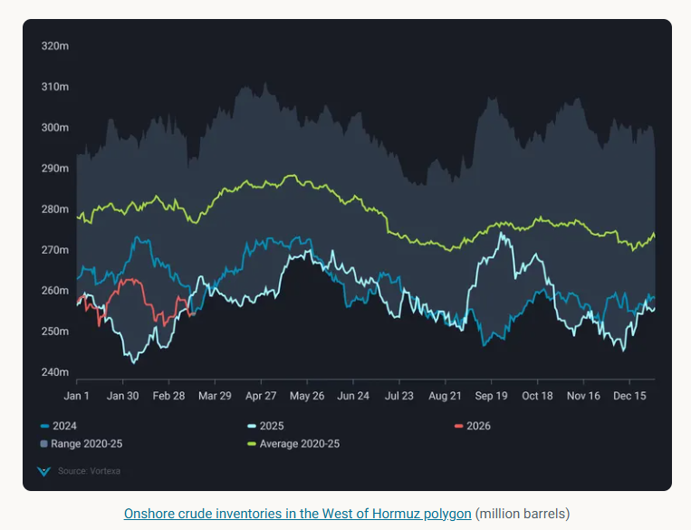

# The puzzle of low Middle East Gulf oil storage levels

**Date:** March 19, 2026  
**Publisher:** Breakwave Advisors | **Category:** Market Insights  
**Original URL:** [https://www.breakwaveadvisors.com/insights/2026/3/19/the-puzzle-of-low-middle-east-gulf-oil-storage-levels](https://www.breakwaveadvisors.com/insights/2026/3/19/the-puzzle-of-low-middle-east-gulf-oil-storage-levels)  

---

Many expect crude storage levels in the Middle East Gulf to reach tank tops - but do they? And should they?

*By*[*David Wech*](https://www.linkedin.com/in/david-wech-83a163165/)

There is quite a lot of speculation on when oil storage in the Middle East Gulf will reach tank tops. Most are thinking producers will continue to keep production up as long as they can.

But does this actually make sense? I would argue it does not.

Full storage tanks would mean the local producers would have to wait with restarting production until they have actually new ballast vessels arriving at their ports - if and once the war or at least the blockade of the Strait of Hormuz comes to an end.

That would be only days, perhaps even a week, after the fact, thereby delaying their production restarting efforts substantially! As a consequence, the oil companies would not be at full production capacity when ballasting vessels are waiting at their ports, as it will surely take some time for a proper restart.

It makes more sense to maintain significant spare storage capacity to allow for an immediate and well-managed production restarting process, once and if the Strait of Hormuz is free to pass.

And in fact,[Vortexa](https://www.linkedin.com/company/vortexa/)onshore inventory data for the West of Hormuz polygon (full Middle East looks similar) shows storage levels at a seasonal low close to the levels of the last two years (see chart).

> **Figure 1: Στιγμιότυπο Οθόνης 2026 03 19 105249**  
> **Interactive Data & Source:** [Analytics Vortexa](https://analytics.vortexa.com/InsightsHubPage?articleId=a5MUutWBPveyQ9D7NL40l&articleType=report&categoryFilters=%5B%22report%22%5D&page=InsightsHubPage&productFilters=%5B%227Gl8wR81ACDZf4DIdJWpul%22%5D&searchTerm=&tabId=345e97a0-0c9c-4c82-b05b-46c70d5d0894) | [Local Asset](file:///C:/Users/Dell/Github/Shipping/corpus/03-breakwave/insights/2026/assets/2026-03-19_the-puzzle-of-low-middle-east-gulf-oil-storage-levels_img_cea3cf84ceb9ceb3cebcceb9cf8ccf84cf85_67737b3ebf32.png)

You can also see how stocks have been drawn markedly in the second half of February, as Saudi Arabia, UAE and Iran all hiked their exports in the weeks ahead of the war as we pointed out in the[Vortexa Crude Monthly Report](https://analytics.vortexa.com/InsightsHubPage?articleId=a5MUutWBPveyQ9D7NL40l&articleType=report&categoryFilters=%5B%22report%22%5D&page=InsightsHubPage&productFilters=%5B%227Gl8wR81ACDZf4DIdJWpul%22%5D&searchTerm=&tabId=345e97a0-0c9c-4c82-b05b-46c70d5d0894), published ahead of the current escalation on 25 February. Then there has been a short spike before volumes fell back to the typical levels of the last two years.

In sum, I think it is more relevant to look at two following two indicators rather than storage levels:

1) Oil liftings from the Middle East, especially from Yanbu, Fujairah, and Ceyhan, to assess the success of the bypassing options, with particularly the former looking very promising.

2) Passages through the Strait, which happen nearly daily, especially with Iranian oil on board, or at least with Iranian authorisation.

Data Source:[Vortexa](https://www.vortexa.com//oil-gas-data-traders-analysts-data-scientists?gclid=Cj0KCQjw8_qRBhCXARIsAE2AtRZKOvMnbilZ_6_91d7huSFFy71pWLrnPwGwOHVzXsmsG-1a1mZnQw8aAt89EALw_wcB&hsa_acc=1782073842&hsa_ad=548425387665&hsa_cam=14746637662&hsa_grp=125038601902&hsa_kw=&hsa_mt=&hsa_net=adwords&hsa_src=g&hsa_tgt=dsa-1431852288425&hsa_ver=3&utm_campaign=%5BCD%5D%20-%20DSA%20-%20EMEA&utm_medium=cpc&utm_medium=ppc&utm_source=google&utm_source=adwords&utm_term=)

---

**Tags:** Crude, Geopolitics, Shipping  
