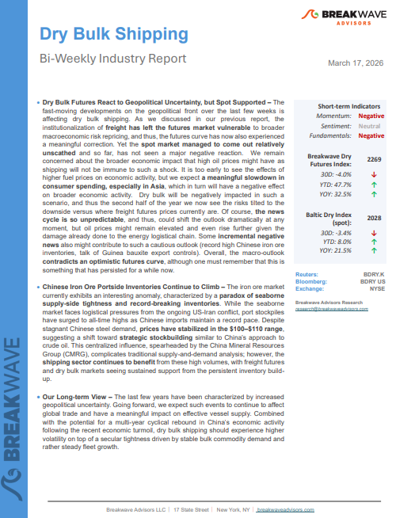
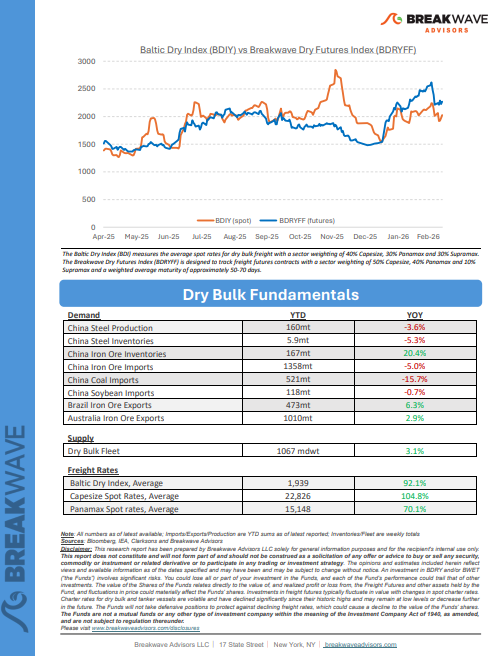

# Breakwave Weekend Read

**Date:** March 20, 2026  
**Publisher:** Breakwave Advisors | **Category:** Market Insights  
**Original URL:** [https://www.breakwaveadvisors.com/insights/2026/2/20breakwave-weekend-read-554747hhg-9tdx4-kh5nf-t3e27](https://www.breakwaveadvisors.com/insights/2026/2/20breakwave-weekend-read-554747hhg-9tdx4-kh5nf-t3e27)  

---

## Welcome Tobreakwave Advisorsweekend Read

***As the week comes to a close, take a moment to review the key insights from the past few days. Missed something? We've gathered all the top insights for you to catch up at your convenience.***

## Breakwave Shipping Report

**Dry Bulk Futures React to Geopolitical Uncertainty, but Spot Supported**– The fast-moving developments on the geopolitical front over the last few weeks is affecting dry bulk shipping.

[Read More](https://www.breakwaveadvisors.com/insights/3172026db-report2026kkji3jju786yyh)

> **Figure 1: Στιγμιότυπο Οθόνης 2026 03 20 095738**  
> **Interactive Data & Source:** [Breakwave Advisors Market Insights](https://www.breakwaveadvisors.com/insights/2026/3/16/the-dry-bulk-market-began-2026-with-considerable-momentum) | [Local Asset](file:///C:/Users/Dell/Github/Shipping/corpus/03-breakwave/insights/2026/assets/2026-03-20_20breakwave-weekend-read-554747hhg-9tdx4-kh5nf-t3e27_img_cea3cf84ceb9ceb3cebcceb9cf8ccf84cf85_a1d8d6c75f3e.png)

> **Figure 2: Στιγμιότυπο Οθόνης 2026 03 20 101501**  
> **Interactive Data & Source:** [Breakwave Advisors Market Insights](https://www.breakwaveadvisors.com/insights/2026/3/16/the-dry-bulk-market-began-2026-with-considerable-momentum) | [Local Asset](file:///C:/Users/Dell/Github/Shipping/corpus/03-breakwave/insights/2026/assets/2026-03-20_20breakwave-weekend-read-554747hhg-9tdx4-kh5nf-t3e27_img_cea3cf84ceb9ceb3cebcceb9cf8ccf84cf85_984d598ef0d0.png)

## Insights of the Week

## The Dry Bulk Market Began 2026 with Considerable Momentum

> **Figure 3: Unsplash Image Akdd4u Ytwa**  
> **Interactive Data & Source:** [Breakwave Advisors Market Insights](https://www.breakwaveadvisors.com/insights/2026/3/16/the-dry-bulk-market-began-2026-with-considerable-momentum) | [Local Asset](file:///C:/Users/Dell/Github/Shipping/corpus/03-breakwave/insights/2026/assets/2026-03-20_20breakwave-weekend-read-554747hhg-9tdx4-kh5nf-t3e27_img_unsplash-image-akdd4u-ytwa_a0ff05ea2e51.jpg)

The dry bulk market began 2026 with considerable momentum.

Doric Weekly Market Insights

## Locked Strait

> **Figure 4: Istock 485480338**  
> **Interactive Data & Source:** [Breakwave Advisors Market Insights](https://www.breakwaveadvisors.com/insights/2026/3/16/locked-strait) | [Local Asset](file:///C:/Users/Dell/Github/Shipping/corpus/03-breakwave/insights/2026/assets/2026-03-20_20breakwave-weekend-read-554747hhg-9tdx4-kh5nf-t3e27_img_istock-485480338_ce7742c70ec8.jpg)

The crisis in the Middle East shows no signs of abating.

Gibson Tanker Market Report

## Oil Spike Challenges Dry Bulk Fuel Equation

The Middle Eastern Conflict has triggered wild swings in oil and marine fuel prices.

[Read More](https://www.breakwaveadvisors.com/insights/2026/3/17/oil-spike-challenges-dry-bulk-fuel-equation)

BRS Weekly Dry Bulk Newsletter

> **Figure 5: Unsplash Image 9dvefpgfsfu**  
> **Interactive Data & Source:** [Breakwave Advisors Market Insights](https://www.breakwaveadvisors.com/insights/2026/3/17/shipping-is-at-the-centre-of-the-adjustment) | [Local Asset](file:///C:/Users/Dell/Github/Shipping/corpus/03-breakwave/insights/2026/assets/2026-03-20_20breakwave-weekend-read-554747hhg-9tdx4-kh5nf-t3e27_img_unsplash-image-9dvefpgfsfu_d0f829c5472f.jpg)

## Shipping Is at the Centre of the Adjustment

> **Figure 6: Unsplash Image Ceibpffctha**  
> **Interactive Data & Source:** [Breakwave Advisors Market Insights](https://www.breakwaveadvisors.com/insights/2026/3/17/shipping-is-at-the-centre-of-the-adjustment) | [Local Asset](file:///C:/Users/Dell/Github/Shipping/corpus/03-breakwave/insights/2026/assets/2026-03-20_20breakwave-weekend-read-554747hhg-9tdx4-kh5nf-t3e27_img_unsplash-image-ceibpffctha_731bb1683dda.jpg)

The conflict in the Arabian Gulf has rapidly evolved from a geopolitical shock into a structural disruption for global energy logistics, forcing the oil market and the tanker industry to adjust in real time.

Xclusiv Shipbrokers Weekly Report

## Crude-Laden Tankers Build in Hormuz As Production Cuts Loom

> **Figure 7: Στιγμιότυπο Οθόνης 2026 03 20 103416**  
> **Interactive Data & Source:** [Breakwave Advisors Market Insights](https://www.breakwaveadvisors.com/insights/2026/3/17/crude-laden-tankers-build-in-hormuz-as-production-cuts-loom) | [Local Asset](file:///C:/Users/Dell/Github/Shipping/corpus/03-breakwave/insights/2026/assets/2026-03-20_20breakwave-weekend-read-554747hhg-9tdx4-kh5nf-t3e27_img_cea3cf84ceb9ceb3cebcceb9cf8ccf84cf85_86a2b761a4e3.png)

Record crude accumulation and a historic shift in ballast–laden ratios signal deepening supply disruption in the Gulf.

Signal Ocean Market Insights

## Bauxite Trade

> **Figure 8: Στιγμιότυπο Οθόνης 2026 03 18 104228**  
> **Interactive Data & Source:** [Breakwave Advisors Market Insights](https://www.breakwaveadvisors.com/insights/2026/3/18/bauxite-trade) | [Local Asset](file:///C:/Users/Dell/Github/Shipping/corpus/03-breakwave/insights/2026/assets/2026-03-20_20breakwave-weekend-read-554747hhg-9tdx4-kh5nf-t3e27_img_cea3cf84ceb9ceb3cebcceb9cf8ccf84cf85_2d14bf2d3c1e.png)

Recent developments in the Guinea bauxite trade are introducing a more complex outlook for the Capesize segment..

Intermodal Weekly Market Report

## Private Credit: Still Quite Far From a 2008-Event

> **Figure 9: Market Chart 9**  
> **Interactive Data & Source:** [Breakwave Advisors Market Insights](https://www.breakwaveadvisors.com/insights/2026/3/19/private-credit-still-quite-far-from-a-2008-event) | [Local Asset](file:///C:/Users/Dell/Github/Shipping/corpus/03-breakwave/insights/2026/assets/2026-03-20_20breakwave-weekend-read-554747hhg-9tdx4-kh5nf-t3e27_img_unnamed_2434803b4e78.jpg)

Private Credit becoming a systemic risk capable of destabilising broader asset classes is not a central scenario, however, it warrants close monitoring.

Forvis Mazars Weekly Note

## The Puzzle of Low Middle East Gulf Oil Storage Levels

> **Figure 10: Στιγμιότυπο Οθόνης 2026 03 19 105006**  
> **Interactive Data & Source:** [Breakwave Advisors Market Insights](https://www.breakwaveadvisors.com/insights/2026/3/19/the-puzzle-of-low-middle-east-gulf-oil-storage-levels) | [Local Asset](file:///C:/Users/Dell/Github/Shipping/corpus/03-breakwave/insights/2026/assets/2026-03-20_20breakwave-weekend-read-554747hhg-9tdx4-kh5nf-t3e27_img_cea3cf84ceb9ceb3cebcceb9cf8ccf84cf85_eb9407c4b23e.png)

Many expect crude storage levels in the Middle East Gulf to reach tank tops - but do they? And should they?

Vortexa Freight Weekly

## Dry Bulk Spot Chartering Activity Falls Back Down to Earth

> **Figure 11: Unsplash Image F5iq3rpbwm0**  
> **Interactive Data & Source:** [Breakwave Advisors Market Insights](https://www.breakwaveadvisors.com/insights/2026/3/20/dry-bulk-spot-chartering-activity-falls-back-down-to-earth) | [Local Asset](file:///C:/Users/Dell/Github/Shipping/corpus/03-breakwave/insights/2026/assets/2026-03-20_20breakwave-weekend-read-554747hhg-9tdx4-kh5nf-t3e27_img_unsplash-image-f5iq3rpbwm0_cb767b491dac.jpg)

It remains to be seen what comes next with the war in Iran and related dry bulk spot chartering activity.

From Commodore's Weekly Dry Bulk Reports

## U.s. Leads Brazil in Corn Exports to China

> **Figure 12: Unsplash Image Oi Kzwtbqes**  
> **Interactive Data & Source:** [Breakwave Advisors Market Insights](https://www.breakwaveadvisors.com/insights/2026/3/20/us-leads-brazil-in-corn-exports-to-china) | [Local Asset](file:///C:/Users/Dell/Github/Shipping/corpus/03-breakwave/insights/2026/assets/2026-03-20_20breakwave-weekend-read-554747hhg-9tdx4-kh5nf-t3e27_img_unsplash-image-oi-kzwtbqes_5a43d5c9d6ab.jpg)

Chinese corn imports declined to approximately 3.8M mt in 2025, down from 8.4M mt in 2024. Of this, around 2.5M mt originated from Brazil..

Signal Ocean Dry Weekly Market Monitor

---

**Tags:** Shipping, Tankers, Drybulk  
