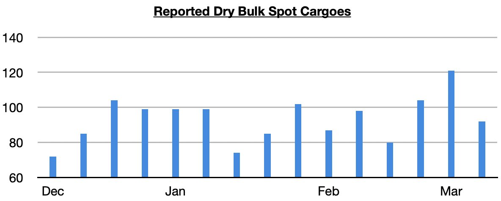
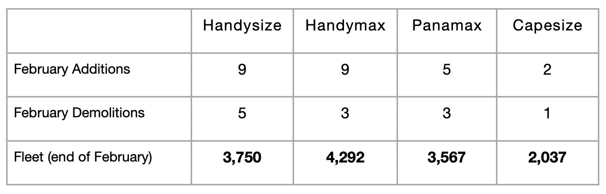

# Dry Bulk Spot Chartering Activity Falls Back Down To Earth

**Date:** March 20, 2026  
**Publisher:** Breakwave Advisors | **Category:** Market Insights  
**Original URL:** [https://www.breakwaveadvisors.com/insights/2026/3/20/dry-bulk-spot-chartering-activity-falls-back-down-to-earth](https://www.breakwaveadvisors.com/insights/2026/3/20/dry-bulk-spot-chartering-activity-falls-back-down-to-earth)  

---

*By*[*Jeffrey Landsberg*](https://www.linkedin.com/in/jeffrey-landsberg-70ab957/)

As we discussed in Commodore Research's most recent Weekly Executive Report, It remains to be seen what comes next with the war in Iran and related dry bulk spot chartering activity. For now, an intense desire to bring in more cargoes (as seen two weeks ago) has subsided.

> **Figure 1: Chart 1**  
> [Local Asset](file:///C:/Users/Dell/Github/Shipping/corpus/03-breakwave/insights/2026/assets/2026-03-20_dry-bulk-spot-chartering-activity-falls-back-down-to-earth_img_chart1_258cb616c70b.jpg)

On the vessel supply side, the fleet continues to grow by a moderate amount, and overall dry bulk trade volume still needs to continue to grow this year to offset moderate fleet growth. Most recently, approximately 25 dry bulk newbuildings were delivered in February, which is 46 less than were delivered in January (dry bulk newbuilding deliveries always plummet in February after a January surge). Approximately 11 dry bulk vessels were scrapped, which is 3 more than were scrapped in January. For this year, we continue to expect that the dry bulk fleet will grow by a net addition of at least another 375 vessels.

> **Figure 2: Chart 2**  
> [Local Asset](file:///C:/Users/Dell/Github/Shipping/corpus/03-breakwave/insights/2026/assets/2026-03-20_dry-bulk-spot-chartering-activity-falls-back-down-to-earth_img_chart2_320d75a6d881.jpg)

---

**Tags:** Drybulk, Markets, Shipping  
