# U.S. Leads Brazil in Corn Exports to China

**Date:** March 20, 2026  
**Publisher:** Breakwave Advisors | **Category:** Market Insights  
**Original URL:** [https://www.breakwaveadvisors.com/insights/2026/3/20/us-leads-brazil-in-corn-exports-to-china](https://www.breakwaveadvisors.com/insights/2026/3/20/us-leads-brazil-in-corn-exports-to-china)  

---

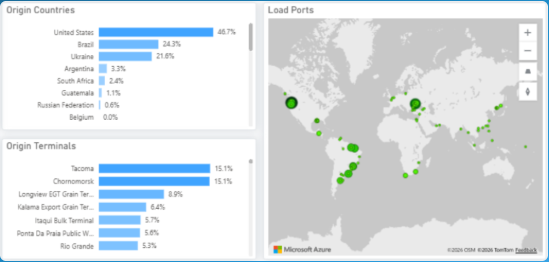

> **Figure 1: Στιγμιότυπο Οθόνης 2026 03 20 113701**  
> **Interactive Data & Source:** [Signal Ocean Platform](https://go.signalocean.com/e/983831/dry-dynamic-drybulkflows/2ryhjf/588348612/h/kh-9bN-U_q3TZfBR_PjW2Uz3r1l-K9mRTbrPsY6N0hM) | [Local Asset](file:///C:/Users/Dell/Github/Shipping/corpus/03-breakwave/insights/2026/assets/2026-03-20_us-leads-brazil-in-corn-exports-to-china_img_cea3cf84ceb9ceb3cebcceb9cf8ccf84cf85_62ff6e6b8de8.png)

### Key Takeaways

●**China's corn flows are shifting in early 2026.**Brazil dominated China's corn imports in 2025, but early Q1 2026 data indicate the U.S. is regaining market share.

●**Dry bulk sentiment improved week over week.**The BDI moved back above 2,000, supported mainly by gains in the Capesize and Panamax segments.

● Atlantic freight strength remains concentrated in larger sizes.

●**Vessel supply remains elevated in several basins.**Ballaster counts are still high across parts of the Pacific and Atlantic, especially in Supramax and Handysize, limiting upside in some segments.

## Spotlight | Corn

### U.s. Overtakes Brazil in Corn Exports to China Ahead of End-Q1 2026

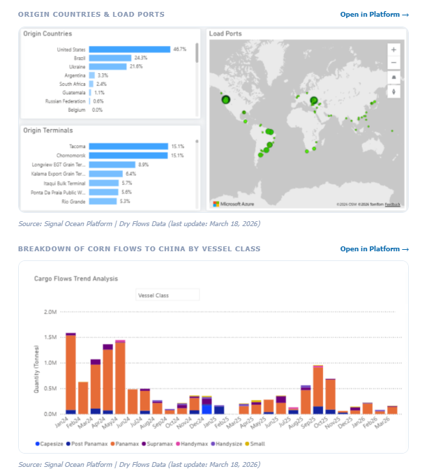

> **Figure 2: Στιγμιότυπο Οθόνης 2026 03 20 113725**  
> **Interactive Data & Source:** [Signal Ocean Platform](https://go.signalocean.com/e/983831/dry-dynamic-drybulkflows/2ryhjf/588348612/h/kh-9bN-U_q3TZfBR_PjW2Uz3r1l-K9mRTbrPsY6N0hM) | [Local Asset](file:///C:/Users/Dell/Github/Shipping/corpus/03-breakwave/insights/2026/assets/2026-03-20_us-leads-brazil-in-corn-exports-to-china_img_cea3cf84ceb9ceb3cebcceb9cf8ccf84cf85_37f5cacfdc7f.png)

Chinese corn imports declined to approximately 3.8M mt in 2025, down from 8.4M mt in 2024. Of this, around 2.5M mt originated from Brazil (Panamax: ~2.0M mt vs. 1.78M mt in 2024), while imports from the U.S. totaled 169k mt (Panamax: ~153k mt vs. 1.36M mt in 2024). This contraction aligns with China's policy direction over the past three years. The focus has been on increasing domestic self-sufficiency. As such, the recent decline in imports is not primarily driven by trade tensions, but rather reflects a policy-driven agricultural transformation underway in Beijing.

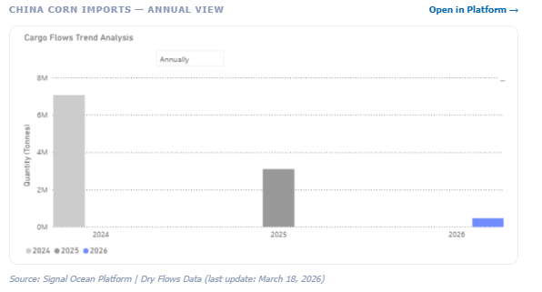

> **Figure 3: Στιγμιότυπο Οθόνης 2026 03 20 113736**  
> **Interactive Data & Source:** [Signal Ocean Platform](https://go.signalocean.com/e/983831/dry-dynamic-drybulkflows/2ryhjf/588348612/h/kh-9bN-U_q3TZfBR_PjW2Uz3r1l-K9mRTbrPsY6N0hM) | [Local Asset](file:///C:/Users/Dell/Github/Shipping/corpus/03-breakwave/insights/2026/assets/2026-03-20_us-leads-brazil-in-corn-exports-to-china_img_cea3cf84ceb9ceb3cebcceb9cf8ccf84cf85_e3b63fa412e1.png)

With imports declining and[**domestic output**](https://go.signalocean.com/e/983831/dry-dynamic-drybulkflows/2ryhjf/588348612/h/kh-9bN-U_q3TZfBR_PjW2Uz3r1l-K9mRTbrPsY6N0hM)rising, China's evolving grain policy is expected to have far-reaching implications for major exporters, including Brazil, the U.S., and Ukraine. Looking ahead, China is likely to continue prioritizing internal efficiency, requiring global corn exporters to adapt to a lower level of Chinese import demand.

While Brazil was the primary supplier of corn to China in 2025, early Q1 2026 data show the U.S. has regained market share and moved ahead by late March.

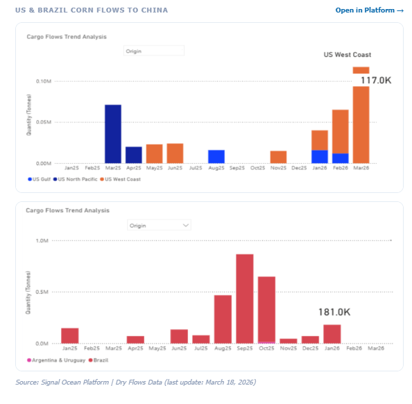

> **Figure 4: Στιγμιότυπο Οθόνης 2026 03 20 113743**  
> **Interactive Data & Source:** [Signal Ocean Platform](https://go.signalocean.com/e/983831/ry-market-monitor-week-11-2026/2ryhjj/588348612/h/kh-9bN-U_q3TZfBR_PjW2Uz3r1l-K9mRTbrPsY6N0hM) | [Local Asset](file:///C:/Users/Dell/Github/Shipping/corpus/03-breakwave/insights/2026/assets/2026-03-20_us-leads-brazil-in-corn-exports-to-china_img_cea3cf84ceb9ceb3cebcceb9cf8ccf84cf85_7405b66bee3c.png)

## Freight Market Overview

The Baltic Dry Index (BDI) recorded an uptick in sentiment before the end of the week, with the index value moving above the 2,000-point mark, driven by weekly gains in the Capesize and Panamax segments.

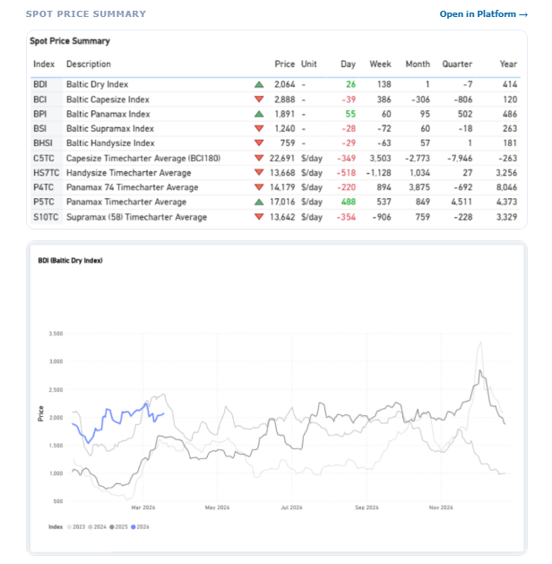

> **Figure 5: Στιγμιότυπο Οθόνης 2026 03 20 113757**  
> **Interactive Data & Source:** [Signal Ocean Platform](https://go.signalocean.com/e/983831/ry-market-monitor-week-11-2026/2ryhjj/588348612/h/kh-9bN-U_q3TZfBR_PjW2Uz3r1l-K9mRTbrPsY6N0hM) | [Local Asset](file:///C:/Users/Dell/Github/Shipping/corpus/03-breakwave/insights/2026/assets/2026-03-20_us-leads-brazil-in-corn-exports-to-china_img_cea3cf84ceb9ceb3cebcceb9cf8ccf84cf85_742805d64d86.png)

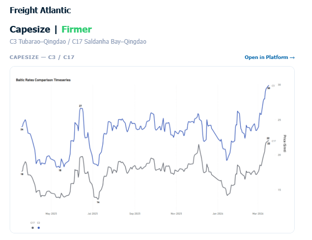

> **Figure 6: Στιγμιότυπο Οθόνης 2026 03 20 113816**  
> **Interactive Data & Source:** [Signal Ocean Platform](https://go.signalocean.com/e/983831/ry-market-monitor-week-11-2026/2ryhjj/588348612/h/kh-9bN-U_q3TZfBR_PjW2Uz3r1l-K9mRTbrPsY6N0hM) | [Local Asset](file:///C:/Users/Dell/Github/Shipping/corpus/03-breakwave/insights/2026/assets/2026-03-20_us-leads-brazil-in-corn-exports-to-china_img_cea3cf84ceb9ceb3cebcceb9cf8ccf84cf85_a0f702ef67e3.png)

The rate for the Tubarao to Qingdao route held the firmer sentiment of the previous week, with rates still around $30/mt (+23% YoY). Similarly, the Saldanha Bay-Qingdao rates were assessed at around $22/mt (+24% YoY).

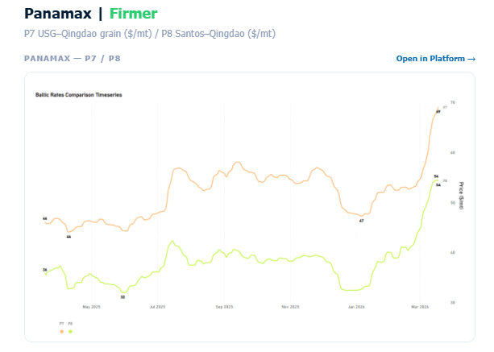

> **Figure 7: Στιγμιότυπο Οθόνης 2026 03 20 113825**  
> **Interactive Data & Source:** [Signal Ocean Platform](https://go.signalocean.com/e/983831/ry-market-monitor-week-11-2026/2ryhjj/588348612/h/kh-9bN-U_q3TZfBR_PjW2Uz3r1l-K9mRTbrPsY6N0hM) | [Local Asset](file:///C:/Users/Dell/Github/Shipping/corpus/03-breakwave/insights/2026/assets/2026-03-20_us-leads-brazil-in-corn-exports-to-china_img_cea3cf84ceb9ceb3cebcceb9cf8ccf84cf85_25ce843392ee.png)

Rates for the USG–Qingdao and Santos–Qingdao routes are reaching exceptional highs. The Santos–Qingdao rate was assessed at $54/mt (+50% YoY). Notably, the USG–Qingdao rate strengthened further to around $70/mt, approximately $10/mt higher than the previous week (+49% YoY).

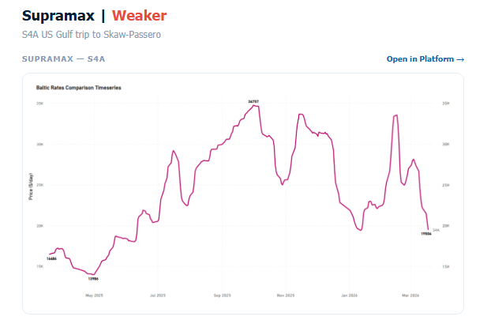

> **Figure 8: Στιγμιότυπο Οθόνης 2026 03 20 113832**  
> **Interactive Data & Source:** [Signal Ocean Platform](https://go.signalocean.com/e/983831/ry-market-monitor-week-11-2026/2ryhjj/588348612/h/kh-9bN-U_q3TZfBR_PjW2Uz3r1l-K9mRTbrPsY6N0hM) | [Local Asset](file:///C:/Users/Dell/Github/Shipping/corpus/03-breakwave/insights/2026/assets/2026-03-20_us-leads-brazil-in-corn-exports-to-china_img_cea3cf84ceb9ceb3cebcceb9cf8ccf84cf85_0b4e33922006.png)

Rates on the USG-to-Skaw–Passero route continued to decline, as highlighted in our previous[**Dry Market Monitor**](https://go.signalocean.com/e/983831/ry-market-monitor-week-11-2026/2ryhjj/588348612/h/kh-9bN-U_q3TZfBR_PjW2Uz3r1l-K9mRTbrPsY6N0hM), and are now around $19k/day, down by $11k/day over the past month.

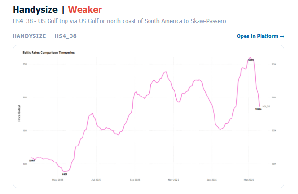

> **Figure 9: Στιγμιότυπο Οθόνης 2026 03 20 113841**  
> **Interactive Data & Source:** [Signal Ocean Platform](https://www.thesignalgroup.com/signal-ocean-platform) | [Local Asset](file:///C:/Users/Dell/Github/Shipping/corpus/03-breakwave/insights/2026/assets/2026-03-20_us-leads-brazil-in-corn-exports-to-china_img_cea3cf84ceb9ceb3cebcceb9cf8ccf84cf85_e673d1b15973.png)

The USG trip to Skaw–Passero recorded levels of around $18k/day, a decrease of approximately $5k/day from the previous week, which contrasts with the annual rebound of $7.7k/day.

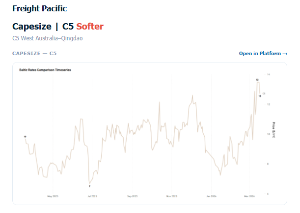

> **Figure 10: Στιγμιότυπο Οθόνης 2026 03 20 113848**  
> **Interactive Data & Source:** [Signal Ocean Platform](https://www.thesignalgroup.com/signal-ocean-platform) | [Local Asset](file:///C:/Users/Dell/Github/Shipping/corpus/03-breakwave/insights/2026/assets/2026-03-20_us-leads-brazil-in-corn-exports-to-china_img_cea3cf84ceb9ceb3cebcceb9cf8ccf84cf85_c9176687e06b.png)

Rates on the West Australia–Qingdao route extended their softening trend WoW, at around $13/mt (+27% YoY). Despite the recent easing, levels remain well above the mid-January trough of approximately $7.5/mt.

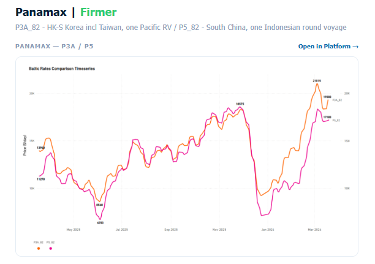

> **Figure 11: Στιγμιότυπο Οθόνης 2026 03 20 113855**  
> **Interactive Data & Source:** [Signal Ocean Platform](https://www.thesignalgroup.com/signal-ocean-platform) | [Local Asset](file:///C:/Users/Dell/Github/Shipping/corpus/03-breakwave/insights/2026/assets/2026-03-20_us-leads-brazil-in-corn-exports-to-china_img_cea3cf84ceb9ceb3cebcceb9cf8ccf84cf85_4b63c691946f.png)

The Panamax Pacific market has now reversed the weaker trend recorded in the previous week. Specifically, rates on the P3A_82 route rose to $19k/day, and on the P5_82 route to $17k/day.

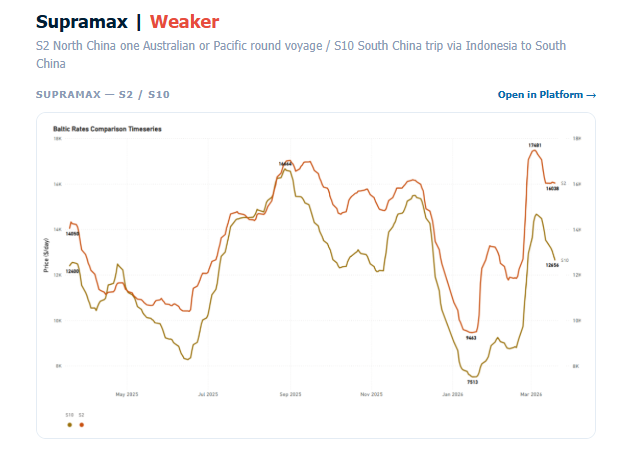

> **Figure 12: Στιγμιότυπο Οθόνης 2026 03 20 113902**  
> **Interactive Data & Source:** [Signal Ocean Platform](https://www.thesignalgroup.com/signal-ocean-platform) | [Local Asset](file:///C:/Users/Dell/Github/Shipping/corpus/03-breakwave/insights/2026/assets/2026-03-20_us-leads-brazil-in-corn-exports-to-china_img_cea3cf84ceb9ceb3cebcceb9cf8ccf84cf85_1f93fc6773fa.png)

The positive trend in the Supramax Pacific market has reversed to a weaker sentiment. Compared with the previous week, rates for the S10 route have now settled below $13k/day.

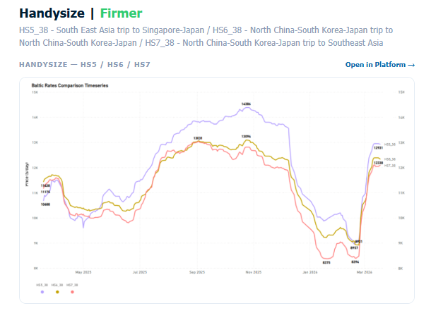

> **Figure 13: Στιγμιότυπο Οθόνης 2026 03 20 113912**  
> **Interactive Data & Source:** [Signal Ocean Platform](https://www.thesignalgroup.com/signal-ocean-platform) | [Local Asset](file:///C:/Users/Dell/Github/Shipping/corpus/03-breakwave/insights/2026/assets/2026-03-20_us-leads-brazil-in-corn-exports-to-china_img_cea3cf84ceb9ceb3cebcceb9cf8ccf84cf85_eacb3a3cf73d.png)

The Pacific Handysize freight market appears to have reached its highest point since the lows recorded in January and February. Rates for the HS5_38 and HS6_38 routes have strengthened to around $12–13k/day each compared with the previous week, while the HS7_38 rate confirmed the sentiment of the previous week at $12k/day.

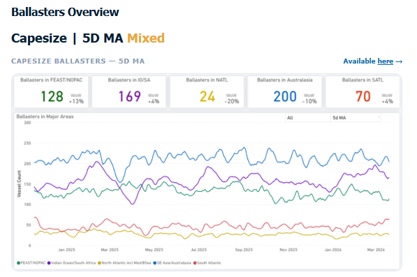

> **Figure 14: Στιγμιότυπο Οθόνης 2026 03 20 113920**  
> **Interactive Data & Source:** [Signal Ocean Platform](https://www.thesignalgroup.com/signal-ocean-platform) | [Local Asset](file:///C:/Users/Dell/Github/Shipping/corpus/03-breakwave/insights/2026/assets/2026-03-20_us-leads-brazil-in-corn-exports-to-china_img_cea3cf84ceb9ceb3cebcceb9cf8ccf84cf85_11490aa7e18e.png)

Vessel supply, although still elevated, showed a decrease to 200 vessels in Australasia, compared with last week when the vessel count climbed to over 230 units. In the Atlantic, both the North saw a notable decrease (-20%), while in the South, the vessel count maintained a similar trend to the previous week (~70, 5D MA).

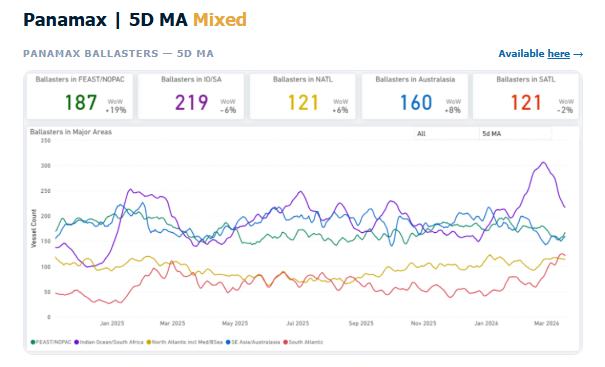

> **Figure 15: Στιγμιότυπο Οθόνης 2026 03 20 113930**  
> **Interactive Data & Source:** [Signal Ocean Platform](https://www.thesignalgroup.com/signal-ocean-platform) | [Local Asset](file:///C:/Users/Dell/Github/Shipping/corpus/03-breakwave/insights/2026/assets/2026-03-20_us-leads-brazil-in-corn-exports-to-china_img_cea3cf84ceb9ceb3cebcceb9cf8ccf84cf85_16f072b55088.png)

The Indian Ocean experienced a decrease in levels to around 220 after peaking above 300 at the end of February. Meanwhile, in the Far East/NOPAC, following signs of a decline a week ago, levels have started to increase again to nearly 190, whereas early indications in the previous week pointed to a drop below 170. Evidence of increased supply pressure remains in the South, with a vessel count of nearly 120.

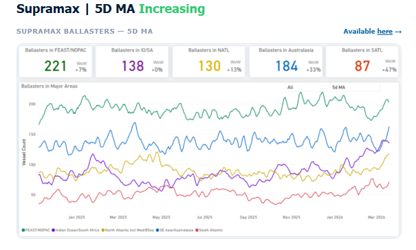

> **Figure 16: Στιγμιότυπο Οθόνης 2026 03 20 113941**  
> **Interactive Data & Source:** [Signal Ocean Platform](https://www.thesignalgroup.com/signal-ocean-platform) | [Local Asset](file:///C:/Users/Dell/Github/Shipping/corpus/03-breakwave/insights/2026/assets/2026-03-20_us-leads-brazil-in-corn-exports-to-china_img_cea3cf84ceb9ceb3cebcceb9cf8ccf84cf85_c9e9ec0db16e.png)

The Pacific region continued to exhibit elevated vessel availability, a trend persisting from the preceding three weeks. The vessel count in the Far East/NOPAC has climbed notably, now standing at 220. Meanwhile, the Atlantic saw a sharp rise in ballasters, particularly in the North Atlantic, where the number held at the elevated level of 130 vessels.

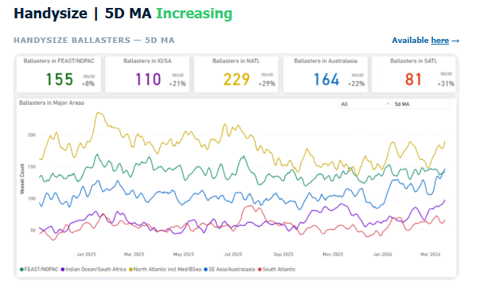

> **Figure 17: Στιγμιότυπο Οθόνης 2026 03 20 113952**  
> **Interactive Data & Source:** [Signal Ocean Platform](https://www.thesignalgroup.com/signal-ocean-platform) | [Local Asset](file:///C:/Users/Dell/Github/Shipping/corpus/03-breakwave/insights/2026/assets/2026-03-20_us-leads-brazil-in-corn-exports-to-china_img_cea3cf84ceb9ceb3cebcceb9cf8ccf84cf85_b7a9dfd6f9af.png)

Handysize vessels continued to face elevated supply pressure since the end of February. In the North Atlantic, the vessel count remained high, exceeding 220 and now nearing 230 (+29% WoW). In the Pacific, pressure intensified in Australasia, where the vessel count surpassed 160 (+20% WoW).

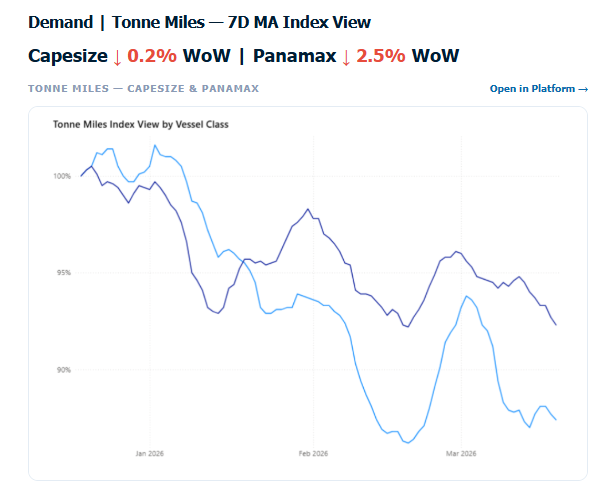

> **Figure 18: Στιγμιότυπο Οθόνης 2026 03 20 114007**  
> **Interactive Data & Source:** [Signal Ocean Platform](https://www.thesignalgroup.com/signal-ocean-platform) | [Local Asset](file:///C:/Users/Dell/Github/Shipping/corpus/03-breakwave/insights/2026/assets/2026-03-20_us-leads-brazil-in-corn-exports-to-china_img_cea3cf84ceb9ceb3cebcceb9cf8ccf84cf85_588fbd8b5c5e.png)

The tonne-mile growth rate, measured on a Base 100 Index basis, weakened for the larger vessel classes this week. The Capesize index declined to 87.7, down 0.6% WoW from 87.9. The Panamax index also fell to 93.1, decreasing 2.6% WoW from 95.5. Despite the softer weekly performance, Panamax remains closer to the Base 100 benchmark, while Capesize continues to lag more significantly. Capesize now sits 12.3 points below base, while Panamax stands 6.9 points below the benchmark.

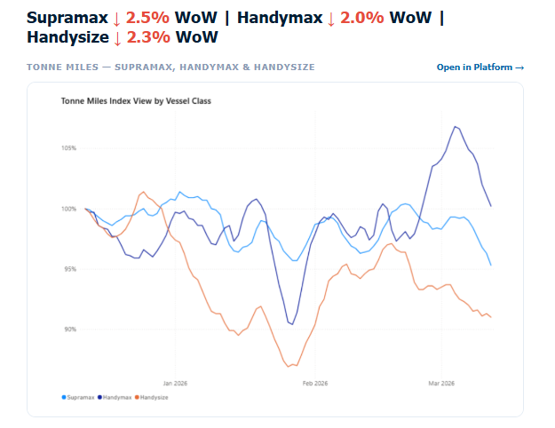

> **Figure 19: Στιγμιότυπο Οθόνης 2026 03 20 114020**  
> **Interactive Data & Source:** [Signal Ocean Platform](https://www.thesignalgroup.com/signal-ocean-platform) | [Local Asset](file:///C:/Users/Dell/Github/Shipping/corpus/03-breakwave/insights/2026/assets/2026-03-20_us-leads-brazil-in-corn-exports-to-china_img_cea3cf84ceb9ceb3cebcceb9cf8ccf84cf85_af67289fd484.png)

The tonne-mile growth rate, measured on a Base 100 Index basis, showed a mixed trend this week. Supramax declined to 95.9% from 98.3% WoW, while Handysize also eased to 94.9% from 96.2%. In contrast, Handymax remained above the benchmark at 105.8%, although slightly lower than 107% the previous week.

Data Source:[Signal Ocean Platform](https://www.thesignalgroup.com/signal-ocean-platform)

---

**Tags:** Capesize, Drybulk, Shipping  
