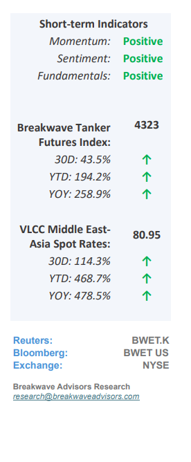
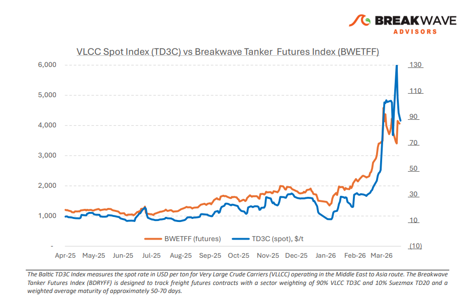
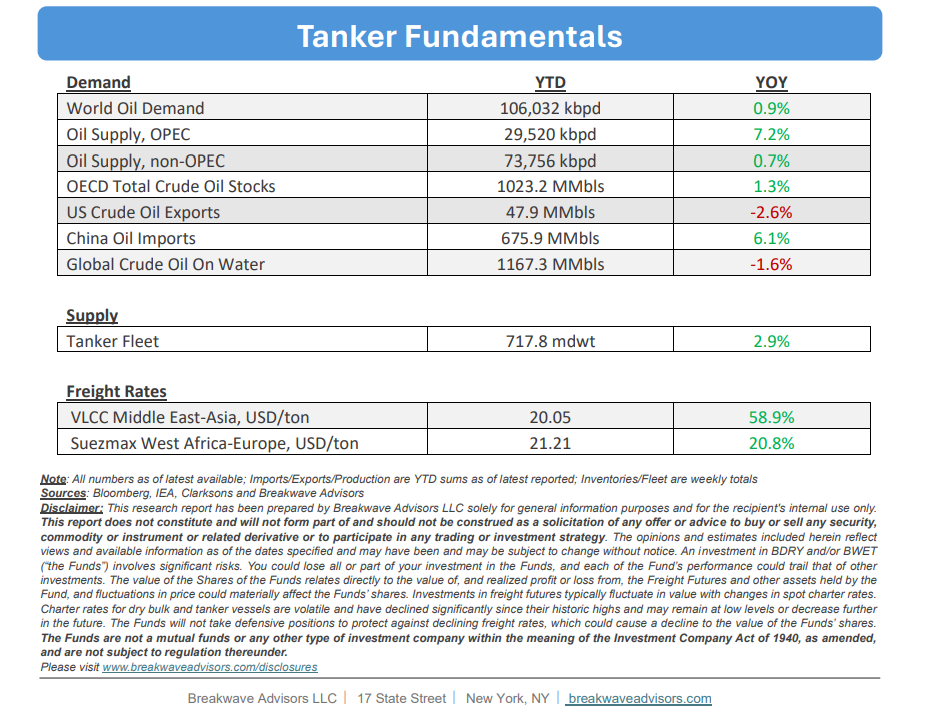

# Breakwave Bi-Weekly Tanker Report - March 24, 2026

**Date:** March 24, 2026  
**Publisher:** Breakwave Advisors | **Category:** Market Insights  
**Original URL:** [https://www.breakwaveadvisors.com/insights/3242026wetreport98jj-98jnk](https://www.breakwaveadvisors.com/insights/3242026wetreport98jj-98jnk)  

---

•**Straits Remain Unnavigable as Tanker Market Adjusts to Alternatives**–**Tensions**in the Middle East have continued to**intensify**and the situation is becoming increasingly fragile. The Strait of Hormuz remains shut, and despite Iran’s narrative of selective transits, the signaling remains deliberately ambiguous, and there is still**no clear pathway**towards normalization. In practice, tanker crossings are now close to a**standstill**. In the freight market, the key dynamic remains unchanged but more extreme: rates are rising sharply, yet actual physical activity is severely constrained. The surge in VLCC earnings is not being driven by cargo demand, but by elevated risk premiums, tightening insurance conditions, and a growing dislocation in vessel availability.**A two-tier market**now clearly exists, with amble vessel availability outside the Gulf and a minimal (almost nonexistent) VLCC fixing activity for vessels inside the Gulf. There is**little to say about the outcome**of the current situation. The world’s economic progress relies on the near-term outcome of any resolution, and our guess is as good as anybody else’s when it comes to the most important energy crisis ever. If and when there is a resolution that allows tanker vessels to cross the straits, then we**expect rates adjust but still to remain elevated**for quite some time as the risk premium would not evaporate overnight.

> **Figure 1: Cea3cf84ceb9ceb3cebcceb9cf8ccf84cf85**  
> [Local Asset](file:///C:/Users/Dell/Github/Shipping/corpus/03-breakwave/insights/2026/assets/2026-03-24_3242026wetreport98jj-98jnk_img_cea3cf84ceb9ceb3cebcceb9cf8ccf84cf85_fe33708ef18d.png)

•**Damage Already Done, Oil Prices to Remain Elevated for Quite Some Time**–**Oil prices continue to advance**but still are nowhere close to the level that a crisis of this magnitude depicts, in our view. The expectation of a**swift resolution**is in the minds of investors and thus there is little concern at the moment of a prolonged disruption, something that is clearly reflect in prices. We believe there**has been enough damage done**to the physical markets that even a positive outcome in the very near term (if that’s possible) will only cause a minimal decline in oil prices. The**previous “glut” of oil is gone**, inventories are being drawn at record pace, and there is decreasing buffer in the system every day that goes by. In addition, disruptions in the actual extraction process combined with serious infrastructure destruction are not reversable immediately. As such, we think the**lower range**of oil prices (Brent) is now closer to**$80/bbl**irrespective of outcome. That is a sizable drop from the current $100/bbl level, but it is up quite a bit from the previous $60/bbl level in the pre-war period. Everyday that goes by,**the global oil market is tightening**and although there is a lot of noise around the outcome of the war, the clock is ticking against the global economy.

•**Our Long-term View**– The tanker market is recovering from a long period of staggered rates as the growth in new vessel supply shrinks while oil demand remains elevated in line with the global economy. A historically low orderbook combined with favorable shifting trade patterns should continue to support increased spot rate volatility, which combined with the ongoing geopolitical turmoil, should sustain freight rates in the medium to long term.

> **Figure 2: Στιγμιότυπο Οθόνης 2026 03 24 101026**  
> [Local Asset](file:///C:/Users/Dell/Github/Shipping/corpus/03-breakwave/insights/2026/assets/2026-03-24_3242026wetreport98jj-98jnk_img_cea3cf84ceb9ceb3cebcceb9cf8ccf84cf85_a02b40e58ae7.png)

> **Figure 3: Στιγμιότυπο Οθόνης 2026 03 24 120514**  
> [Local Asset](file:///C:/Users/Dell/Github/Shipping/corpus/03-breakwave/insights/2026/assets/2026-03-24_3242026wetreport98jj-98jnk_img_cea3cf84ceb9ceb3cebcceb9cf8ccf84cf85_99794c73f48e.png)

### Subscribe:
