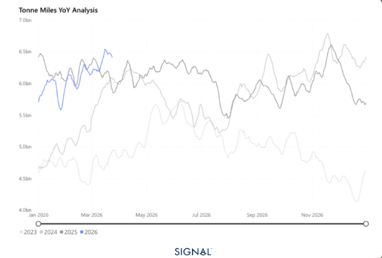
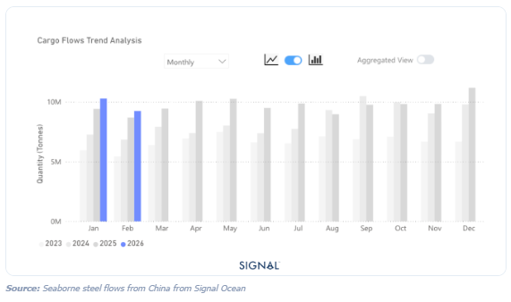
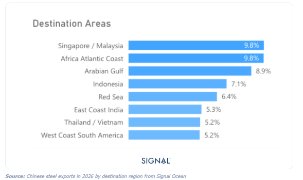

# The war in Iran will have knock-on effects for the steel markets in the upcoming months

**Date:** March 26, 2026  
**Publisher:** Breakwave Advisors | **Category:** Market Insights  
**Original URL:** [https://www.breakwaveadvisors.com/insights/2026/3/26/the-war-in-iran-will-have-knock-on-effects-for-the-steel-markets-in-the-upcoming-months](https://www.breakwaveadvisors.com/insights/2026/3/26/the-war-in-iran-will-have-knock-on-effects-for-the-steel-markets-in-the-upcoming-months)  

---

> **Figure 1: Στιγμιότυπο Οθόνης 2026 03 26 163723**  
> **Interactive Data & Source:** [Signal Ocean Platform](https://www.thesignalgroup.com/signal-ocean-platform) | [Local Asset](file:///C:/Users/Dell/Github/Shipping/corpus/03-breakwave/insights/2026/assets/2026-03-26_the-war-in-iran-will-have-knock-on-effects-for-the-steel-markets-in-the-upcoming_img_cea3cf84ceb9ceb3cebcceb9cf8ccf84cf85_0f9151237aa9.png)

### Key Takeaways

● Global steel flows remain flat in February.

● Flows from China have increased by 6%.

● Flows from outside of China have decreased by 4%.

● Indonesia's seaborne imports of steel surged by over 42% in February.

Seaborne steel flows reached 21.1mt in February 2026, up less than 1% from the same period last year. The global flatline came despite a 6% rise in steel flows from China, as this was mitigated by an aggregated fall of 4% elsewhere.

The relationship between Chinese steel exports and domestic steel production continued in the typical trend in 2026 so far. Weaker domestic production, a result of weak domestic demand, drives producers to find export markets. For the first two months of 2026, Chinese crude steel production fell by 4%, as exports rose by 9% in January and 6% in February.

The largest receiver of these increased flows has been nations in South East Asia, most notably Indonesia, Singapore, and Malaysia, which have combined to account for just shy of 20% of all Chinese steel exports in 2026 so far. These regions have absorbed the surge in shipments due to their expanding construction and infrastructure sectors, as well as their strategic positions as regional trading hubs. This shift underscores a growing reorientation of Chinese steel exports away from traditional Western markets toward the dynamic economies of the Asia-Pacific region.

### Seaborne Steel Flows From China From Signal Ocean

> **Figure 2: Στιγμιότυπο Οθόνης 2026 03 26 163739**  
> **Interactive Data & Source:** [Signal Ocean Platform](https://www.thesignalgroup.com/signal-ocean-platform) | [Local Asset](file:///C:/Users/Dell/Github/Shipping/corpus/03-breakwave/insights/2026/assets/2026-03-26_the-war-in-iran-will-have-knock-on-effects-for-the-steel-markets-in-the-upcoming_img_cea3cf84ceb9ceb3cebcceb9cf8ccf84cf85_da28a1408edf.png)

The disruption in the Arabian Gulf has yet to materially impact global steel flows, although early signs of regional dislocation are emerging. Historically, the region accounts for around 11% of Chinese steel exports, making it the single largest regional destination. In 2026, this share has declined to 8.4%, falling behind key Southeast Asian markets and the African Atlantic coast. While this may partly reflect an acceleration of pre-existing trade reorientation toward Southeast Asia, continued disruption to transit via the Strait of Hormuz would likely reinforce this trend by increasing both cost and uncertainty around deliveries into the Gulf.

To date, the limited global impact reflects the relatively low time sensitivity of steel shipments, alongside the ability of markets to absorb short-term disruption through inventory drawdowns and shipment delays. As such, the primary transmission mechanism is likely to be indirect, via energy markets rather than physical trade flows.

Steel production remains highly energy-intensive, accounting for approximately 7–8% of global final energy demand. Sustained increases in energy prices would push production costs and compress margins. Rather than driving immediate demand destruction, this is more likely to trigger supply-side adjustments, with higher-cost capacity curtailments in regions such as Europe.

While this could, in theory, widen arbitrage opportunities and support import demand, the extent of any increase in trade flows will be constrained by existing protectionist frameworks, including safeguard measures. As a result, any uplift in imports is likely to be incremental, reflected in higher quota utilisation rather than a step-change in volumes.

### Chinese Steel Exports in 2026 by Destination Region From Signal Ocean

> **Figure 3: Στιγμιότυπο Οθόνης 2026 03 26 163750**  
> **Interactive Data & Source:** [Signal Ocean Platform](https://www.thesignalgroup.com/signal-ocean-platform) | [Local Asset](file:///C:/Users/Dell/Github/Shipping/corpus/03-breakwave/insights/2026/assets/2026-03-26_the-war-in-iran-will-have-knock-on-effects-for-the-steel-markets-in-the-upcoming_img_cea3cf84ceb9ceb3cebcceb9cf8ccf84cf85_0a7455c9273d.png)

## China's Steel Exports Can Withstand the War in Iran

Against this backdrop, Chinese steel exports are expected to remain resilient. The ongoing structural shift toward Southeast Asia, where demand is underpinned by construction-led growth and trade barriers are relatively limited, provides a stable outlet for surplus Chinese production. As such, the net effect of current geopolitical disruption is likely to be a reinforcement of existing trade patterns rather than a material reconfiguration of global steel flows.

In summary, the disruption in the Arabian Gulf is unlikely to drive a material reconfiguration of global steel trade flows, at least in the near term. While regional dislocations are emerging, these appear to reflect a combination of logistical friction and an acceleration of existing trade shifts rather than a structural break. The more meaningful transmission channel remains indirect, via higher energy prices, which are likely to compress margins and prompt supply-side adjustments in higher-cost regions such as Europe. However, any resulting increase in import demand will be tempered by entrenched protectionist measures. Against this backdrop, China's export position remains robust, supported by strong demand across Southeast Asia and limited exposure to energy-driven cost inflation. As such, current geopolitical tensions are more likely to reinforce prevailing trade patterns than to materially disrupt them.

Data Source:[Signal Ocean Platform](https://www.thesignalgroup.com/signal-ocean-platform)

---

**Tags:** China, Ironore, Shipping  
