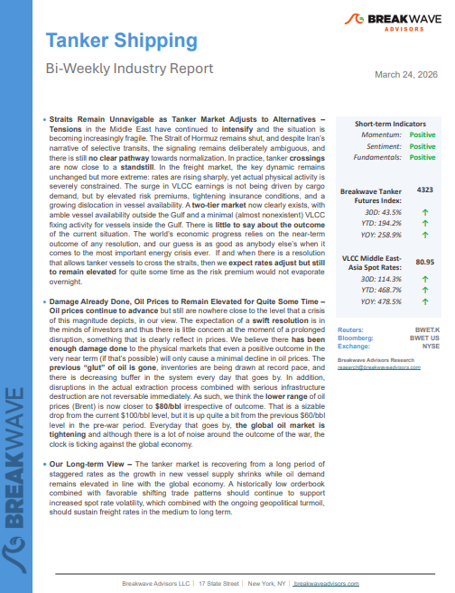
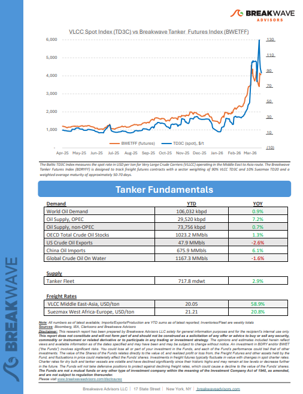
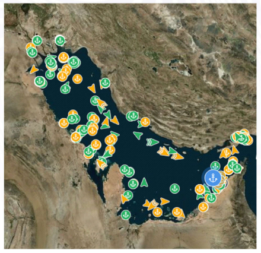

# Breakwave Weekend Read

**Date:** March 27, 2026  
**Publisher:** Breakwave Advisors | **Category:** Market Insights  
**Original URL:** [https://www.breakwaveadvisors.com/insights/2026/2/20breakwave-weekend-read-554747hhg-9tdx4-kh5nf-t3e27-z22hs](https://www.breakwaveadvisors.com/insights/2026/2/20breakwave-weekend-read-554747hhg-9tdx4-kh5nf-t3e27-z22hs)  

---

## Welcome Tobreakwave Advisorsweekend Read

***As the week comes to a close, take a moment to review the key insights from the past few days. Missed something? We've gathered all the top insights for you to catch up at your convenience.***

## Breakwave Shipping Report

**Straits Remain Unnavigable as Tanker Market Adjusts to Alternatives**–**Tensions**in the Middle East have continued to**intensify**and the situation is becoming increasingly fragile.

[Read More](https://www.breakwaveadvisors.com/insights/3242026wetreport98jj-98jnk)

> **Figure 1: Στιγμιότυπο Οθόνης 2026 03 26 170608**  
> **Interactive Data & Source:** [Breakwave Advisors Market Insights](https://www.breakwaveadvisors.com/insights/2026/3/22/the-global-economic-landscape) | [Local Asset](file:///C:/Users/Dell/Github/Shipping/corpus/03-breakwave/insights/2026/assets/2026-03-27_20breakwave-weekend-read-554747hhg-9tdx4-kh5nf-t3e27-z22hs_img_cea3cf84ceb9ceb3cebcceb9cf8ccf84cf85_515203870754.png)

> **Figure 2: Στιγμιότυπο Οθόνης 2026 03 26 170616**  
> **Interactive Data & Source:** [Breakwave Advisors Market Insights](https://www.breakwaveadvisors.com/insights/2026/3/22/the-global-economic-landscape) | [Local Asset](file:///C:/Users/Dell/Github/Shipping/corpus/03-breakwave/insights/2026/assets/2026-03-27_20breakwave-weekend-read-554747hhg-9tdx4-kh5nf-t3e27-z22hs_img_cea3cf84ceb9ceb3cebcceb9cf8ccf84cf85_b7a46c14c4d2.png)

## Insights of the Week

## The Global Economic Landscape

> **Figure 3: Unsplash Image Krelishkxtm**  
> **Interactive Data & Source:** [Breakwave Advisors Market Insights](https://www.breakwaveadvisors.com/insights/2026/3/22/the-global-economic-landscape) | [Local Asset](file:///C:/Users/Dell/Github/Shipping/corpus/03-breakwave/insights/2026/assets/2026-03-27_20breakwave-weekend-read-554747hhg-9tdx4-kh5nf-t3e27-z22hs_img_unsplash-image-krelishkxtm_1597e837d0cc.jpg)

The global economic landscape has undergone a profound transformation over the past five years, shaped by a succession of defining phases that have fundamentally altered market dynamics, policy direction, and trade behaviour.

Doric Weekly Market Insights

## Upstream Under Attack

> **Figure 4: Crude Tanker 500x333**  
> **Interactive Data & Source:** [Breakwave Advisors Market Insights](https://www.breakwaveadvisors.com/insights/2026/3/22/upstream-under-attack) | [Local Asset](file:///C:/Users/Dell/Github/Shipping/corpus/03-breakwave/insights/2026/assets/2026-03-27_20breakwave-weekend-read-554747hhg-9tdx4-kh5nf-t3e27-z22hs_img_crude-tanker-500x333_14f2d449cf38.jpg)

The past few days have seen the conflict extend beyond chokepoint disruption into direct strikes on production and refining infrastructure across the Gulf.

Gibson Tanker Market Report

## Asian Crude Shortage Propels Afra and S’max to New Highs in the Atlantic - Vlccs Should Benefit Soon

Aframaxes in the all-important US Gulf load region leapt to W700 for voyages to Europe yesterday..

[Read More](https://www.breakwaveadvisors.com/insights/2026/3/24/asian-crude-shortage-propels-afra-and-smax-to-new-highs-in-the-atlantic-vlccs-should-benefit-soon)

Braemar Research

> **Figure 5: Pexels Atmadeep Das 1776637129 28247236**  
> **Interactive Data & Source:** [Breakwave Advisors Market Insights](https://www.breakwaveadvisors.com/insights/2026/3/24/the-impact-of-the-middle-east-conflict-on-dry-bulkers) | [Local Asset](file:///C:/Users/Dell/Github/Shipping/corpus/03-breakwave/insights/2026/assets/2026-03-27_20breakwave-weekend-read-554747hhg-9tdx4-kh5nf-t3e27-z22hs_img_pexels-atmadeep-das-1776637129-28247_28f5ca7edab3.jpg)

## The Impact of the Middle East Conflict on Dry Bulkers

> **Figure 6: Στιγμιότυπο Οθόνης 2026 03 24 141759**  
> **Interactive Data & Source:** [Breakwave Advisors Market Insights](https://www.breakwaveadvisors.com/insights/2026/3/24/the-impact-of-the-middle-east-conflict-on-dry-bulkers) | [Local Asset](file:///C:/Users/Dell/Github/Shipping/corpus/03-breakwave/insights/2026/assets/2026-03-27_20breakwave-weekend-read-554747hhg-9tdx4-kh5nf-t3e27-z22hs_img_cea3cf84ceb9ceb3cebcceb9cf8ccf84cf85_83fa956ded41.png)

According to AXSMarine data, a total of 338 bulkers has been recorded in the Middle East Gulf.

BRS Weekly Dry Bulk Newsletter

## A System Under Stress

> **Figure 7: Unsplash Image Vosp2wly3bs**  
> **Interactive Data & Source:** [Breakwave Advisors Market Insights](https://www.breakwaveadvisors.com/insights/2026/3/25/a-system-under-stress) | [Local Asset](file:///C:/Users/Dell/Github/Shipping/corpus/03-breakwave/insights/2026/assets/2026-03-27_20breakwave-weekend-read-554747hhg-9tdx4-kh5nf-t3e27-z22hs_img_unsplash-image-vosp2wly3bs_34ae2465feff.jpg)

Record crude accumulation and a historic shift in ballast–laden ratios signal deepening supply disruption in the Gulf.

Xclusiv Shipbrokers Weekly Report

## Strait of Hormuz Update

> **Figure 8: Unsplash Image Wof7xn1anta**  
> **Interactive Data & Source:** [Breakwave Advisors Market Insights](https://www.breakwaveadvisors.com/insights/2026/3/25/strait-of-hormuz-update) | [Local Asset](file:///C:/Users/Dell/Github/Shipping/corpus/03-breakwave/insights/2026/assets/2026-03-27_20breakwave-weekend-read-554747hhg-9tdx4-kh5nf-t3e27-z22hs_img_unsplash-image-wof7xn1anta_4715f72c901d.jpg)

Selective Transit, Elevated Costs, and Persistent Attack Risk

Allied Weekly Report

## The LNG Carrier Market

> **Figure 9: Unsplash Image Wwcsa79 0vi**  
> **Interactive Data & Source:** [Breakwave Advisors Market Insights](https://www.breakwaveadvisors.com/insights/2026/3/26/the-lng-carrier-market) | [Local Asset](file:///C:/Users/Dell/Github/Shipping/corpus/03-breakwave/insights/2026/assets/2026-03-27_20breakwave-weekend-read-554747hhg-9tdx4-kh5nf-t3e27-z22hs_img_unsplash-image-wwcsa79-0vi_b71adff733cc.jpg)

While the global gas market was preparing for a substantial increase in natural gas supply in the next years, driven by new liquefaction projects expected to come online,

Intermodal Weekly Market Report

## The War in Iran Will Have Knock-On Effects for the Steel Markets in the Upcoming Months

> **Figure 10: Unsplash Image Uqr1eezbmyy**  
> **Interactive Data & Source:** [Breakwave Advisors Market Insights](https://www.breakwaveadvisors.com/insights/2026/3/26/the-war-in-iran-will-have-knock-on-effects-for-the-steel-markets-in-the-upcoming-months) | [Local Asset](file:///C:/Users/Dell/Github/Shipping/corpus/03-breakwave/insights/2026/assets/2026-03-27_20breakwave-weekend-read-554747hhg-9tdx4-kh5nf-t3e27-z22hs_img_unsplash-image-uqr1eezbmyy_2dfb4d887a11.jpg)

Seaborne steel flows reached 21.1mt in February 2026, up less than 1% from the same period last year.

Signal Ocean Commodity Radar

## Tailwind for Chinese Coal Imports

> **Figure 11: Unsplash Image 1bmzno9tc W**  
> **Interactive Data & Source:** [Breakwave Advisors Market Insights](https://www.breakwaveadvisors.com/insights/2026/3/27/tailwind-for-chinese-coal-imports) | [Local Asset](file:///C:/Users/Dell/Github/Shipping/corpus/03-breakwave/insights/2026/assets/2026-03-27_20breakwave-weekend-read-554747hhg-9tdx4-kh5nf-t3e27-z22hs_img_unsplash-image-1bmzno9tc-w_7f6f58dd4075.jpg)

As we discussed in Commodore Research's most recent Weekly Executive Report, China’s coal production averaged 381.5 million tons in January/February.

From Commodore's Weekly Dry Bulk Reports

## Oil Rallies As Us-Iran Negotiations Fail

> **Figure 12: Unsplash Image Hy97yy3e03a**  
> **Interactive Data & Source:** [Breakwave Advisors Market Insights](https://www.breakwaveadvisors.com/insights/2026/3/27/oil-rallies-as-us-iran-negotiations-fail) | [Local Asset](file:///C:/Users/Dell/Github/Shipping/corpus/03-breakwave/insights/2026/assets/2026-03-27_20breakwave-weekend-read-554747hhg-9tdx4-kh5nf-t3e27-z22hs_img_unsplash-image-hy97yy3e03a_5dd3e91d94e7.jpg)

Energy markets rallied as the prospect of peace talks diminished. Precious metals dropped sharply amid ongoing inflationary concerns. Industrial metals were mixed.

Commodities Wrap

---

**Tags:** Shipping, Tankers, Drybulk  
