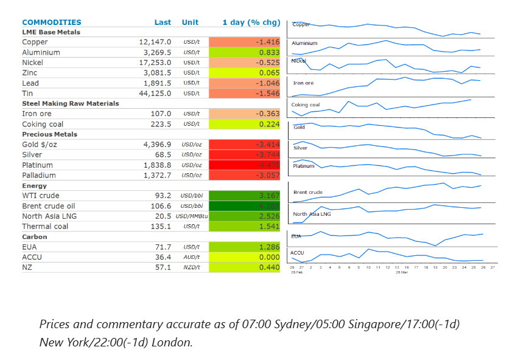
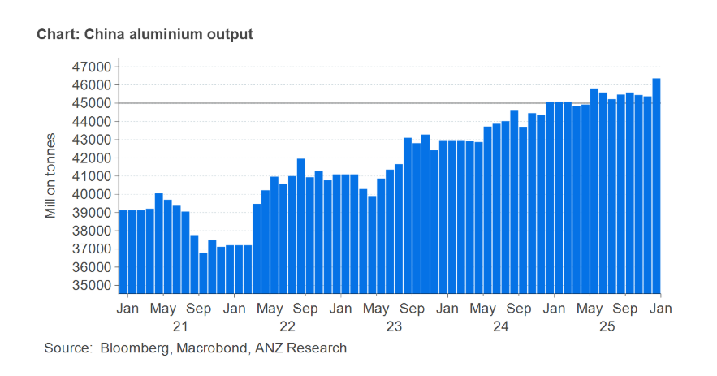

# Oil rallies as US-Iran negotiations fail

**Date:** March 27, 2026  
**Publisher:** Breakwave Advisors | **Category:** Market Insights  
**Original URL:** [https://www.breakwaveadvisors.com/insights/2026/3/27/oil-rallies-as-us-iran-negotiations-fail](https://www.breakwaveadvisors.com/insights/2026/3/27/oil-rallies-as-us-iran-negotiations-fail)  

---

Energy markets rallied as the prospect of peace talks diminished. Precious metals dropped sharply amid ongoing inflationary concerns. Industrial metals were mixed.

*By*[*Daniel Hynes*](https://www.linkedin.com/in/dahynes/)

> **Figure 1: Στιγμιότυπο Οθόνης 2026 03 27 152605**  
> [Local Asset](file:///C:/Users/Dell/Github/Shipping/corpus/03-breakwave/insights/2026/assets/2026-03-27_oil-rallies-as-us-iran-negotiations-fail_img_cea3cf84ceb9ceb3cebcceb9cf8ccf84cf85_c33cf40aa591.png)

### Market Commentary

**Crude oil**rallied after signs of negotiations gave way to rising tensions in the Middle East conflict. President Trump threatened Iran with intensified military action, with both sides seemingly miles apart in talks over a ceasefire. Oil prices rose after Trump said that he doesn’t know if the US is willing to work with Iran on a deal. This came not long after the US warned ships of a potential threat by Iran-backed Houthi militants in the key Bab El-Mandeb Strait. This is one of the few alternative paths for oil from Persian Gulf producers to the international market. Saudi Arabia is currently exporting around 4mb/d from its Red Sea terminal at Yanbu by utilising the east-west pipeline. Attempts to talk oil prices down through a mix of rhetoric and policy signals appear to be having limited impact. Trump said he’s considering suspending a federal gasoline tax and expressed flexibility around a Friday deadline for Iran to negotiate a deal. The latter point came into focus later in the day after Iran’s semi-official Tasnim news agency reported that Iran responded to the US’ 15-point peace proposal through intermediaries. Reuters reported that a senior Iranian official labelled the US proposal as “one-sided and unfair”.

The prospect of an escalation in the Middle East conflict also pushed**global gas**prices higher. The hope of additional sources of supply are also fading. Business leaders in the US are warning that the US lacks the infrastructure to alleviate a global shortage of LNG. Charles Reidl, chief of the Centre for Liquefied Natural Gas, said the US has the resources but not the infrastructure. Concerns over supply shortages were exacerbated by reports that LNG production in Australia at two plants operated by Chevron had been reduced after a tropical cyclone. Disruptions to Qatar’s LNG exports have already been reshaping LNG trade. Shipments to European ports have significantly dropped since February’s record high. Ship tracking data show the US is now sending more shipments to Asia, as buyers replace volumes typically sourced from the Persian Gulf.

**Copper**fell while aluminium gained as the Middle East conflict has different impacts across the metals complex. The prospect of an escalation in military action by the US weighed on sentiment in the copper market. The metal has been under pressure amid concerns the higher energy costs will curtail economic activity and hurt demand.**Aluminium**bucked the trend to push higher on concerns supply disruptions are mounting. The Middle East supplies 9% of global aluminium and meets 18% of world ex-China demand. The scale of disruption to shipments and production hinges on how long the Middle East conflict persists, with about 4–5mt of exports currently at risk. Global aluminium growth is constrained by China’s output cap of 45mt, while US import tariffs and Europe’s carbon tax are adding to the hurdles. Unlike the energy crisis that followed Russia’s invasion of Ukraine in 2022, there is[**no alternative supply**](../pdfs/2026-03-27_oil-rallies-as-us-iran-negotiations-fail_aluminium-s-rising-supply-risk_b372e0fce2ef.pdf)to cover the 4–5mt shortfall. Following the imposition of sanctions on Russian metal, the Middle East became a crucial supplier to the European Union and countries including the US and Japan. Any further disruption to deliveries would add upward pressure on aluminium prices and premiums.

**Gold**dropped as much as 2.6% to trade near USD4,400/oz after Iran rejected a push for peace talks. The precious metal has been trading contrary to its normal safe haven properties. Instead, concerns over higher inflation prompting central banks to increase rates have prompted investors to reduce their exposure. We discuss this further in[**today’s edition of the 5in5withANZ podcast**](https://open.spotify.com/episode/60YFU7i6XJZiSRQCsZEvXZ?si=adc0315f07ba4390).

### Chart of the Day

There are only three channels through which China’s aluminium output could rise in the short term; higher intensity at existing smelters, faster restarts after power curtailments and accelerated completion of near-finished projects. A small number of smelters are mid-construction or relocating under replacement rules. Removing the cap would simplify approvals, but physical completion still takes time.

So, we think China would only marginally increase aluminium production by lifting the cap. In the short-termextra output likely capped at <1 mt, mostly through optimisation and restarts. Over the medium term (2–3 years) we could see larger increases possible, but constrained by power, carbon policy, and economics. This is why the 45mt ceiling, even if adjusted, will not accelerate production growth.

> **Figure 2: Στιγμιότυπο Οθόνης 2026 03 27 152707**  
> **Interactive Data & Source:** [Linkedin](https://www.linkedin.com/newsletters/commodities-wrap-6692196755876012032/?fbclid=IwAR3kiXJqZdxmp9ZcRwBNI7FsBySI-XSC0pfPur1qzjt7OZp7PTE59Tsl1QI) | [Local Asset](file:///C:/Users/Dell/Github/Shipping/corpus/03-breakwave/insights/2026/assets/2026-03-27_oil-rallies-as-us-iran-negotiations-fail_img_cea3cf84ceb9ceb3cebcceb9cf8ccf84cf85_eb759ae3ba81.png)

Data source:[Commodities Wrap](https://www.linkedin.com/newsletters/commodities-wrap-6692196755876012032/?fbclid=IwAR3kiXJqZdxmp9ZcRwBNI7FsBySI-XSC0pfPur1qzjt7OZp7PTE59Tsl1QI)

---

**Tags:** Shipping, Commodities, Markets  
