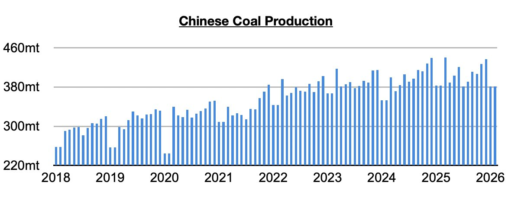
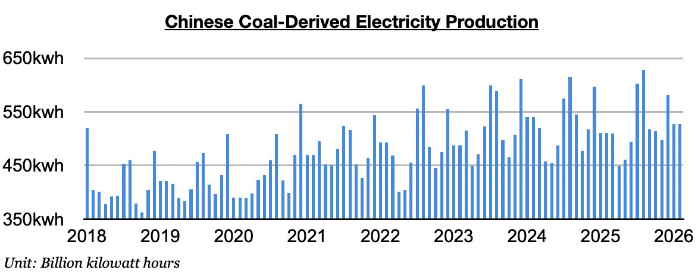
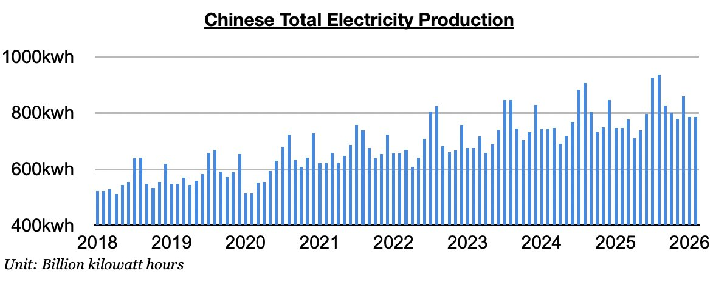

# Tailwind For Chinese Coal Imports

**Date:** March 27, 2026  
**Publisher:** Breakwave Advisors | **Category:** Market Insights  
**Original URL:** [https://www.breakwaveadvisors.com/insights/2026/3/27/tailwind-for-chinese-coal-imports](https://www.breakwaveadvisors.com/insights/2026/3/27/tailwind-for-chinese-coal-imports)  

---

*By*[*Jeffrey Landsberg*](https://www.linkedin.com/in/jeffrey-landsberg-70ab957/)

As we discussed in Commodore Research's most recent Weekly Executive Report, China’s coal production averaged 381.5 million tons in January/February. This is 55.5 million tons (-12%) less than was produced in December and is down year-on-year by 1.2 million tons. Very significant is that China's coal production has now contracted on a year-on-year basis for eight straight months. Previously, China's coal production had grown on a year-on-year basis for thirteen straight months.

> **Figure 1: Chart 1**  
> [Local Asset](file:///C:/Users/Dell/Github/Shipping/corpus/03-breakwave/insights/2026/assets/2026-03-27_tailwind-for-chinese-coal-imports_img_chart1_1d4bdb6b7970.jpg)

Coal-derived electricity generation, which makes up the bulk of China’s electricity generation, averaged 527 billion kilowatt hours. This is 54.2 billion kilowatt hours (-9%) less than was produced in December but is up year-on-year by 16.3 billion kilowatt hours (3%). Very helpful for coal import demand and the dry bulk market is that China's coal-derived electricity generation has fared better than domestic coal production. Before January/February, China's coal-derived electricity generation had fared worse than domestic coal production during three of the prior four months.

> **Figure 2: Chart 2**  
> [Local Asset](file:///C:/Users/Dell/Github/Shipping/corpus/03-breakwave/insights/2026/assets/2026-03-27_tailwind-for-chinese-coal-imports_img_chart2_675e89816bba.jpg)

Total electricity production averaged 785.9 billion kilowatt hours. This is 72.7 billion kilowatt hours (-8%) less than was produced in December but is up year-on-year by 39.8 billion kilowatt hours (5%) and has marked the strongest growth since October.

> **Figure 3: Chart 3**  
> [Local Asset](file:///C:/Users/Dell/Github/Shipping/corpus/03-breakwave/insights/2026/assets/2026-03-27_tailwind-for-chinese-coal-imports_img_chart3_fd01323c8e83.jpg)

---

**Tags:** Coal, China, Commodities  
