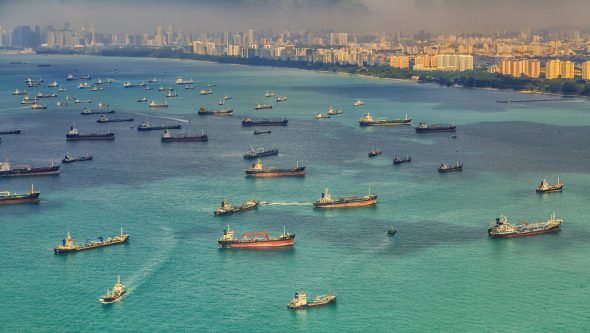
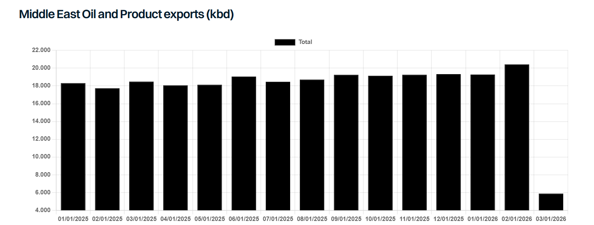

# Aftershock

**Date:** March 30, 2026  
**Publisher:** Breakwave Advisors | **Category:** Market Insights  
**Original URL:** [https://www.breakwaveadvisors.com/insights/2026/3/29/aftershock](https://www.breakwaveadvisors.com/insights/2026/3/29/aftershock)  

---

> **Figure 1: Singapore 590x333**  
> **Interactive Data & Source:** [Gibsons Co](https://www.gibsons.co.uk/market-reports) | [Local Asset](file:///C:/Users/Dell/Github/Shipping/corpus/03-breakwave/insights/2026/assets/2026-03-30_aftershock_img_singapore-590x333_b0a3a447b7b1.jpg)

With so much short-term uncertainty surrounding the Middle East War, most are focused on the near-term implications. However, the conflict will have lasting impacts, forcing many countries to reevaluate their attitudes towards energy security in terms of free trade and sourcing of essential commodities, alongside domestic energy production and the fuel mix which powers their economies. Yet in a less extreme sense, we have been here before with the Russia-Ukraine War. Here, the loss of energy supplies was primarily a European problem, with the conflict ultimately doing little to reduce Europe’s import burden and ironically making the region even more dependent on Middle East energy. So, with Europe facing its second major energy crisis in the space of 4 years, and Asia reeling from the loss of its most critical suppliers, surely economies around the world will be forced to make major changes to energy policy to avoid ever being crippled in the same way again?

Nations around the world have several options. Firstly, the current crisis could accelerate a shift away from imported hydrocarbons. Given that higher oil and gas prices can ultimately improve the competitiveness of renewables, energy sources such as solar and wind, which have taken a beating over the past 12 months but are quick to deploy, could see a surge in demand. Electric vehicles are already seeing an increase in demand, with reports of sales bouncing back in the US and Europe following a slow down last year.

However, in an energy crisis, how green, clean or ethical a fuel might be is less of a concern. Countries across Asia, including India, South Korea, Vietnam, Indonesia and Thailand have all taken steps to increase coal fired power generation, despite environmental regulations. Likewise, countries are re-evaluating attitudes towards sanctioned commodities, taking a “needs must” approach, as evidenced by the recent EU decision to delay the full ban on Russian oil. Gas to oil switching is also unlikely. In previous gas price spikes, fuel oil might be used to substitute LNG, though the scope for that today is constrained by oil supply. Countries with idle nuclear capacity such as Korea and Japan are also taking steps to accelerate restarts despite some lingering controversy around the technology. Longer-term, the current crisis will boost the attractiveness of nuclear.

But what about oil and gas? It would be premature to suggest the current crisis could be the beginning of the end for a sector which has shown remarkable resilience in shrugging off any challenge to its dominance in the energy mix. Further, the crisis should refocus politicians on security of supply and resilience. Major economies which have allowed refining capacity to close, such as the UK, might need to ensure no further closures occur to safeguard domestic refining capabilities.

Domestic oil production policies are also likely to be revisited, with an increasingly hostile world showing that both established and relatively new supply chains cannot be unconditionally relied upon. This further highlights the importance of strategic reserves, which many vulnerable countries will need to consider expanding in the coming years to cushion future supply shocks.

So, what might this mean for tankers? Well, that depends on how long the crisis lasts and how deep the economic scars are. In the shorter to medium-term, if this all “blows over”, countries are surely going to be focused on rebuilding strategic reserves. In the case of the US this might divert exports into storage, whereas for Asia and Europe it is likely to boost import demand. Beyond government inventories, commercial storage and refinery stocks will also need to be rebuilt, whilst strong pent-up demand from consumers is also likely to boost demand, provided the crisis doesn’t persist so long that the economic damage is dire. Longer-term, the structural shifts in energy security could alter trade flows and demand levels, though it is too soon to tell how significant those changes may prove to be.

> **Figure 2: Στιγμιότυπο Οθόνης 2026 03 29 192152**  
> **Interactive Data & Source:** [Gibsons Co](https://www.gibsons.co.uk/market-reports) | [Local Asset](file:///C:/Users/Dell/Github/Shipping/corpus/03-breakwave/insights/2026/assets/2026-03-30_aftershock_img_cea3cf84ceb9ceb3cebcceb9cf8ccf84cf85_edfb01168083.png)

Data source:[Gibson Shipbrokers](https://www.gibsons.co.uk/market-reports)

---

**Tags:** Geopolitics, Markets, Shipping  
