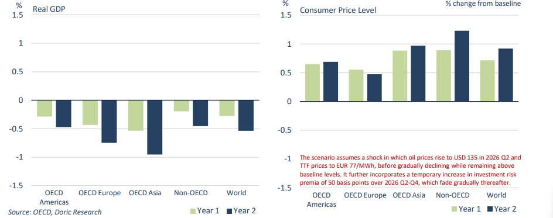

# Impact of an unexpected oil price increase

**Date:** March 30, 2026  
**Publisher:** Breakwave Advisors | **Category:** Market Insights  
**Original URL:** [https://www.breakwaveadvisors.com/insights/2026/3/29/impact-of-an-unexpected-oil-price-increase](https://www.breakwaveadvisors.com/insights/2026/3/29/impact-of-an-unexpected-oil-price-increase)  

---

*By*[*Michalis Voutsinas*](https://www.linkedin.com/in/michalis-voutsinas-587544163/)

The oil shocks of the 1970s, most notably the 1973 oil crisis and the 1979 oil crisis, underscored the pivotal role of energy within the global economic framework, at a time when oil intensity was markedly higher than it is today. Although subsequent decades have brought about structural transformation, technological advancement, and a degree of diversification in the energy mix, the fundamental importance of energy has by no means diminished. It remains an indispensable input across production chains, transportation networks, and global trade flows. The prevailing geopolitical environment serves as a timely reminder that, notwithstanding these shifts, disruptions in oil and gas markets continue to exert an outsized influence on global growth dynamics, inflationary pressures, and, by extension, the trajectory of shipping demand.

Against this backdrop, global economic activity is projected to remain broadly stable, with growth of 2.9 percent in 2026 and 3.0 percent in 2027, reflecting a finely balanced interplay between supportive structural drivers and mounting headwinds, according to the OECD. On the positive side, continued strength in technology-related investment, more favourable trade conditions through lower effective tariffs, and generally supportive macroeconomic policies are expected to underpin activity. However, these tailwinds are increasingly offset by higher energy and fertiliser costs, alongside persistent geopolitical uncertainty, which are set to weigh on demand. Across the major economies, a degree of divergence is evident. The U.S. are expected to see growth moderate from 2.0 percent in 2026 to 1.7 percent in 2027, as the erosion of purchasing power constrains consumer spending. In the Eurozone, growth is projected to slow to 0.8 percent in 2026, before recovering modestly to 1.2 percent in 2027, reflecting the drag from elevated energy prices and tighter fiscal conditions. Within emerging markets, the pace of expansion is also expected to ease, albeit from higher levels. China is projected to see growth decelerate to 4.4 percent in 2026 and 4.3 percent in 2027, as structural challenges in the property sector and the withdrawal of policy support weigh on momentum, partially offset by infrastructure investment. Similarly, India is expected to experience a moderation in growth to 6.1 percent in FY 2026-27, before a slight recovery to 6.4 percent, as fading fiscal support and energy-related constraints temper what remains one of the strongest growth profiles globally.

Inflation dynamics are set to re-accelerate in the near term, with aggregate G20 inflation projected to rise from 3.4 percent in 2025 to 4.0 percent in 2026, largely driven by the renewed upswing in energy prices. This resurgence underscores the persistent sensitivity of price levels to commodity market developments, even as broader disinflationary trends had begun to take hold. A moderation is anticipated thereafter, with inflation easing to 2.7 percent in 2027. In the U.S., inflation is projected to increase notably from 2.6 percent in 2025 to 4.2 percent in 2026, as higher energy costs more than offset the dampening effects of lower effective tariffs. A similar pattern is evident in the Eurozone, where energy-driven price pressures are expected to push inflation higher in the near term. Across advanced economies more broadly, headline inflation is forecast to rise from 2.5 percent to 3.5 percent in 2026. Among emerging markets, inflation is also expected to edge higher, increasing from 4.1 percent in 2025 to 4.4 percent in 2026. India is likely to experience a pronounced rebound in inflation, rising to 5.1 percent as the effects of earlier food and energy price declines fade and higher global energy costs feed through. In contrast, China is projected to move out of its low-inflation environment, with inflation rising from -0.1 percent to 1.3 percent, reflecting both higher input costs and a gradual absorption of excess capacity. Overall, while inflationary pressures are expected to intensify in the short term, the medium-term trajectory remains one of gradual stabilisation, with important implications for monetary policy and global demand conditions.

Conditions surrounding Iran continue to reverberate across global supply chains, with impacts reaching far beyond energy markets into a broad set of critical industrial inputs. The PG region plays a pivotal role in fertiliser production, accounting for approximately 34 percent of global urea exports and around 20 percent of key inputs such as diammonium phosphate and ammonia. With LNG serving as a key feedstock for nitrogen-based fertilisers, the recent surge in gas prices has already translated into a sharp increase in fertiliser costs, with urea prices rising by over 40 percent since mid-February. Should these pressures persist, the implications for agricultural output and global food prices in 2027 could be significant. Beyond fertilisers, the region is also a key supplier of aluminium, helium and bromine, all of which are integral to industrial production and high-tech supply chains, including semiconductors. At the same time, the Gulf’s role as a global logistics and aviation hub adds vulnerability, with air traffic disruptions –around 15 percent of global air freight – likely increasing trade costs.

Looking ahead, the trajectory of the conflict remains highly uncertain, with material implications for both growth and inflation. OECD’s Baseline projections assume that current disruptions will gradually ease, allowing energy prices to stabilise into 2027. However, a more adverse scenario involving prolonged outages of oil and gas infrastructure or disruptions within the Strait of Hormuz could trigger a significantly larger shock than currently priced by markets. This risk is further compounded by relatively low gas storage levels in parts of Europe and the limited flexibility in global spare oil production capacity, much of which is concentrated in Saudi Arabia. In such a downside scenario, energy prices could rise sharply, tightening financial conditions and reducing global output by around 0.5 percent over the following two years, while pushing global inflation higher by close to 0.9 percent. Energy-importing economies, particularly in Asia would be disproportionately affected. Conversely, a more benign outcome – characterised by a faster-than-expected deescalation – could see energy prices retreat towards pre-conflict levels, providing a meaningful boost to real incomes and easing inflationary pressures.

More broadly, the ultimate impact will depend not only on the path of energy prices but also on the adaptability of firms and supply chains. While recent years have demonstrated a notable degree of resilience in the face of successive shocks, the persistence of geopolitical tensions, combined with potential financial market vulnerabilities suggests that risks to the global outlook remain firmly tilted to the downside, even as pockets of upside potential persist.

Missing image: https://images.squarespace-cdn.com/content/v1/5a4d1d26e5dd5b537a6647c5/1774800881654-SBINLWQ9D1BSTZTXJKJ4/%CE%A3%CF%84%CE%B9%CE%B3%CE%BC%CE%B9%CF%8C%CF%84%CF%85%CF%80%CE%BF+%CE%BF%CE%B8%CF%8C%CE%BD%CE%B7%CF%82+2026-03-29+191208.png

> **Figure 1: Στιγμιότυπο Οθόνης 2026 03 29 191155**  
> **Interactive Data & Source:** [Doric](https://www.doric.gr/) | [Local Asset](file:///C:/Users/Dell/Github/Shipping/corpus/03-breakwave/insights/2026/assets/2026-03-30_impact-of-an-unexpected-oil-price-increase_img_cea3cf84ceb9ceb3cebcceb9cf8ccf84cf85_9325b70f1d55.png)

Data source:[Doric](https://www.doric.gr/)

---

**Tags:** Economy, Shipping, Markets  
