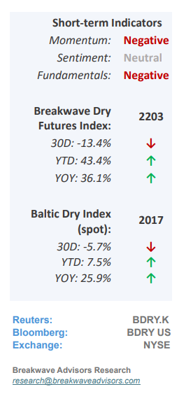
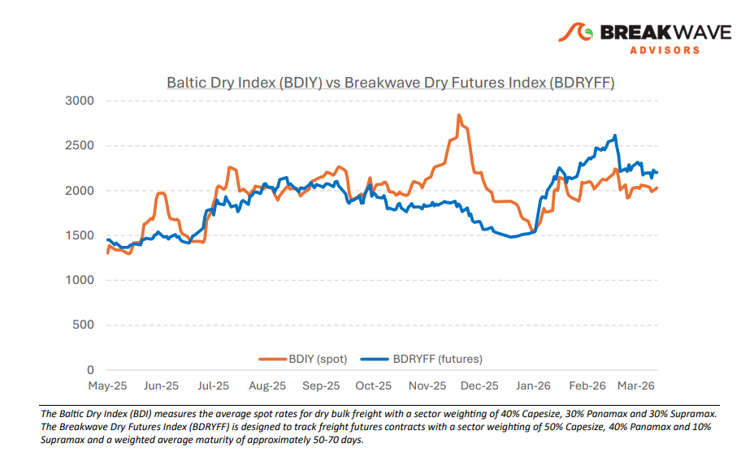
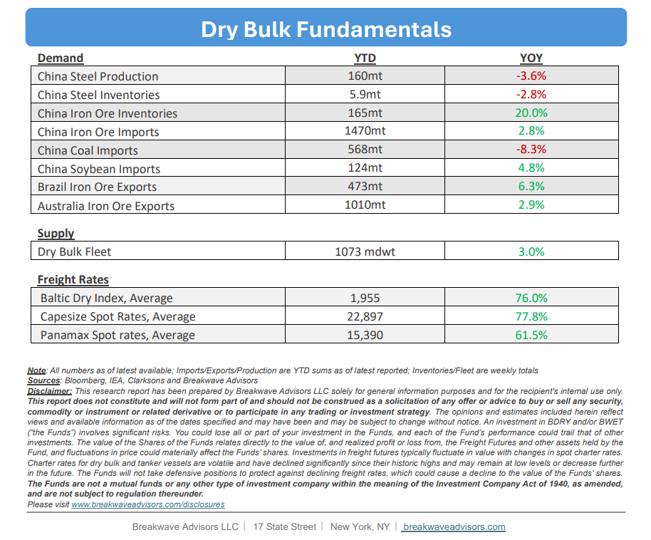

# Breakwave Bi-Weekly Dry Bulk Report - March 31, 2026

**Date:** March 31, 2026  
**Publisher:** Breakwave Advisors | **Category:** Market Insights  
**Original URL:** [https://www.breakwaveadvisors.com/insights/3312026db-report202631llo4](https://www.breakwaveadvisors.com/insights/3312026db-report202631llo4)  

---

•**Dry Bulk Numbed as Slowdown Risk Offsets Market Optimism**– The current**emerging economic crisis**related to high oil prices will have a profound impact on economic growth, especially for most Asian economies that are highly dependent on Middle Eastern oil. Although**China**is surprisingly the**best positioned economy**given their ample oil inventories and the country’s increasing reliance on renewable sources of energy as well as on coal, the incremental hit to commodities demand by the rest of Asia should have a**negative impact on overall dry demand**in the second half of the year. Potential substitution and switching from LNG to coal might provide some support, but the current energy crisis is different compared to the 2022 one, as it focuses mostly on oil and not on natural gas (other than LNG). On the other hand,**market participants remain relatively optimistic**as evident by the futures curve, while spot rates also remain strong. We believe the current stalemate and inactivity is a result of the speed that the current crisis has evolved and the lagging impact of high oil prices. We are**concerned that a slowdown in the global economy**will have a negative impact on dry bulk, which historically has been very sensitive to changes in economic growth. A swift resolution of the crisis might provide some near-term optimism, but it is**difficult**to envision**a scenario**that**oil prices decline****substantially**given the infrastructure damage already done.

> **Figure 1: Cea3cf84ceb9ceb3cebcceb9cf8ccf84cf85**  
> [Local Asset](file:///C:/Users/Dell/Github/Shipping/corpus/03-breakwave/insights/2026/assets/2026-03-31_3312026db-report202631llo4_img_cea3cf84ceb9ceb3cebcceb9cf8ccf84cf85_e4b46ef11d02.png)

•**Chinese Iron Ore Portside Inventories Stabilize at All Time Highs**– The recent resolution in the dispute between CMRG and BHP has led to a small drawdown in iron ore inventories, mainly reflecting**existing material previously stuck**at the port and not able to move in the system. Yet, it is important to understand that inventories remain at very high levels and although iron ore imports continue to grow, our models show stable (at best) implied demand for the steelmaking material. The**Chinese economy is performing better than expected,**but steel production has not recovered. Year-to-date, steel production capacity has declined more than 3% as China is**focusing on reducing excess capacity**. With the Middle East crisis putting further pressure on iron ore demand as steel mills and palletization plants are caught right tin the middle of the conflict, we continue to expect a decline in seaborne iron ore demand for the rest of the year.

•**Our Long-term View**– The last few years have been characterized by increased geopolitical uncertainty. Going forward, we expect such events to continue to affect global trade and have a meaningful impact on effective vessel supply. Combined with the potential for a multi-year cyclical rebound in China’s economic activity following the recent economic turmoil, dry bulk shipping should experience higher volatility on top of a secular tightness driven by stable bulk commodity demand and a slower fleet growth owing to a relatively low orderbook.

> **Figure 2: Στιγμιότυπο Οθόνης 2026 03 31 101005**  
> [Local Asset](file:///C:/Users/Dell/Github/Shipping/corpus/03-breakwave/insights/2026/assets/2026-03-31_3312026db-report202631llo4_img_cea3cf84ceb9ceb3cebcceb9cf8ccf84cf85_dd443ad8d5c4.png)

> **Figure 3: Στιγμιότυπο Οθόνης 2026 03 31 101021**  
> [Local Asset](file:///C:/Users/Dell/Github/Shipping/corpus/03-breakwave/insights/2026/assets/2026-03-31_3312026db-report202631llo4_img_cea3cf84ceb9ceb3cebcceb9cf8ccf84cf85_20a6fbf7866c.png)

### Subscribe:
