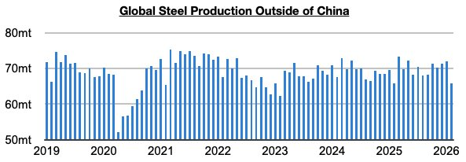
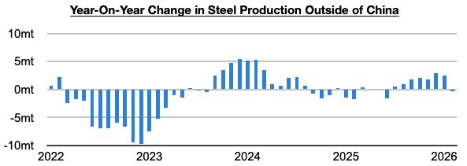
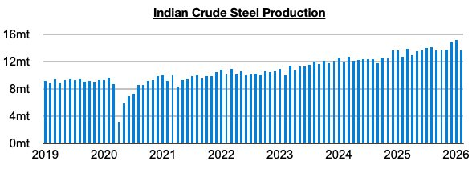

# Steel Production Ex-China Returns To Contraction

**Date:** April 01, 2026  
**Publisher:** Breakwave Advisors | **Category:** Market Insights  
**Original URL:** [https://www.breakwaveadvisors.com/insights/2026/4/1/steel-production-ex-china-returns-to-contraction](https://www.breakwaveadvisors.com/insights/2026/4/1/steel-production-ex-china-returns-to-contraction)  

---

*By*[*Jeffrey Landsberg*](https://www.linkedin.com/in/jeffrey-landsberg-70ab957/)

As we discussed in Commodore Research's most recent Weekly Executive Report, global steel production totaled approximately 141.8 million tons in February. This is down month-on-month by 5.5 million tons (-4%) and is down year-on-year by 2.9 million tons (-2%). Steel production ex-China totaled approximately 65.7 million tons. This is down month-on-month by 6.3 million tons (-9%), is down year-on-year by 100,000 tons, and is the smallest amount produced since 2023.

> **Figure 1: $1.png**  
> [Local Asset](file:///C:/Users/Dell/Github/Shipping/corpus/03-breakwave/insights/2026/assets/2026-04-01_steel-production-ex-china-returns-to-contraction_img_241png_df78db7207ec.jpg)

Steel production ex-China had previously grown on a year-on-year basis for seven straight months (before that period, it had contracted during eight of the prior ten months).

> **Figure 2: 242**  
> [Local Asset](file:///C:/Users/Dell/Github/Shipping/corpus/03-breakwave/insights/2026/assets/2026-04-01_steel-production-ex-china-returns-to-contraction_img_242_cf44cd522f1c.jpg)

Taking India out of the equation, production also reverted back to a contraction. Steel production ex-Chin/India contracted on a year-on-year basis last month by 1 million tons (-2%). Previously, it grew year-on-year for four straight months. Indian steel production totaled 13.6 million tons last month. This is down month-on-month by 1.5 million tons (-10%) but is up year-on-year by 900,000 tons (7%). India’s steel production has grown year-on-year for thirty-six straight months.

Indian steel production totaled 13.6 million tons last month. This is down month-on-month by 1.5 million tons (-10%) but is up year-on-year by 900,000 tons (7%). India’s steel production has grown year-on-year for thirty-six straight months.

> **Figure 3: 243**  
> [Local Asset](file:///C:/Users/Dell/Github/Shipping/corpus/03-breakwave/insights/2026/assets/2026-04-01_steel-production-ex-china-returns-to-contraction_img_243_55c4702c4ef1.jpg)

---

**Tags:** China, Steel, Commodities  
