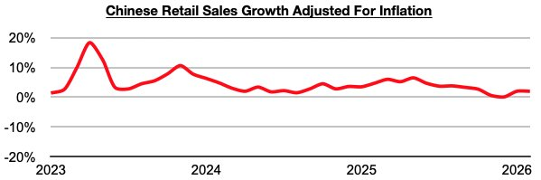
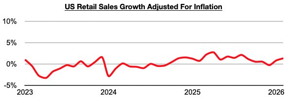
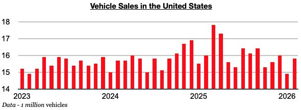

# China's Consumer Sector Faring Better Than US Consumer Sector

**Date:** April 02, 2026  
**Publisher:** Breakwave Advisors | **Category:** Market Insights  
**Original URL:** [https://www.breakwaveadvisors.com/insights/2026/4/2/chinas-consumer-sector-faring-better-than-us-consumer-sector](https://www.breakwaveadvisors.com/insights/2026/4/2/chinas-consumer-sector-faring-better-than-us-consumer-sector)  

---

*By*[*Jeffrey Landsberg*](https://www.linkedin.com/in/jeffrey-landsberg-70ab957/)

As we discussed in Commodore Research's most recent Weekly China Report, China’s overall consumer sector has improved recently (even while vehicle sales have remained weak). The most recently released data shows that China’s retail sales in February grew year-on-year by 2.8%. Taking February’s 0.8% inflation into account, retail sales adjusted for inflation grew year-on-year by 2%. This has marked the strongest growth since October.

> **Figure 1: 241**  
> [Local Asset](file:///C:/Users/Dell/Github/Shipping/corpus/03-breakwave/insights/2026/assets/2026-04-02_chinas-consumer-sector-faring-better-than-us-consumer-sector_img_241_b23c05f2060a.jpg)

US retail sales in February grew year-on-year by 3.7%. Taking February’s 2.4% inflation into account, retail sales adjusted for inflation grew year-on-year by 1.3%. This has marked the strongest growth since August.

> **Figure 2: 242**  
> [Local Asset](file:///C:/Users/Dell/Github/Shipping/corpus/03-breakwave/insights/2026/assets/2026-04-02_chinas-consumer-sector-faring-better-than-us-consumer-sector_img_242_920499396b98.jpg)

While the US consumer sector is also experiencing improvement, of note is that growth has long remained lower than what is seen in China. China’s retail sales growth adjusted for inflation has now fared better than growth in the United States for thirty-eight straight months. Vehicle sales in the United States (which exceed vehicle sales in China by over 1000%) have also now contracted on a year-on-year basis for five straight months.

> **Figure 3: 243**  
> [Local Asset](file:///C:/Users/Dell/Github/Shipping/corpus/03-breakwave/insights/2026/assets/2026-04-02_chinas-consumer-sector-faring-better-than-us-consumer-sector_img_243_d397a7942de2.jpg)

---

**Tags:** China, Economy, Markets  
