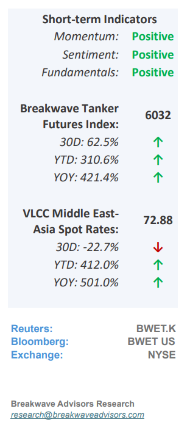
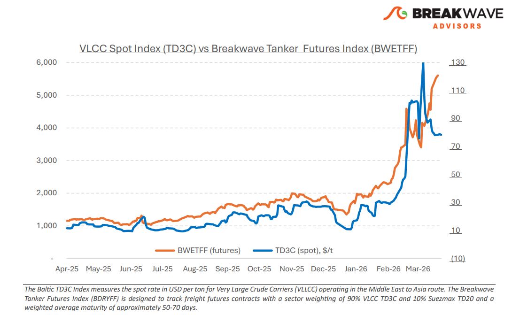
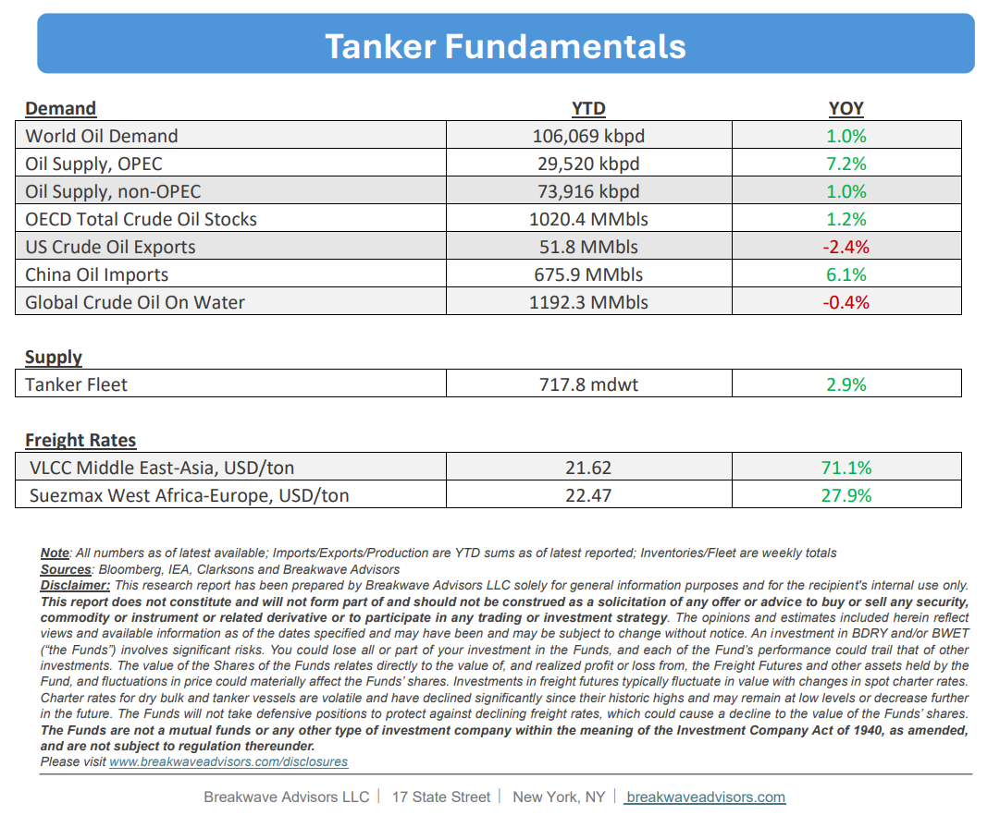

# Breakwave Bi-Weekly Tanker Report - April 7, 2026

**Date:** April 07, 2026  
**Publisher:** Breakwave Advisors | **Category:** Market Insights  
**Original URL:** [https://www.breakwaveadvisors.com/insights/tanker4726](https://www.breakwaveadvisors.com/insights/tanker4726)  

---

•**Little Progress for MEG VLCCs as War Enters its Second Month –**Over the past fortnight, VLCC activity originating from the Arabian Gulf has remained subdued, prompting the market to pivot its focus toward cargo loadings from Yanbu and the Gulf of Oman, where**volumes have surged**significantly above pre-conflict levels. While global attention remains fixed on the Strait of Hormuz, the extreme volatility of**the situation****precludes definitive short-term projections**; currently, transit through the straits is largely restricted, with activity primarily limited to Iranian-linked cargoes. Despite this regional instability, the broader VLCC market remains supported by substantial global oil arbitrage opportunities, a trend we expect to persist. The VLCC futures curve is currently in**steep backwardation**, reflecting market expectations of an eventual resolution, with third-quarter futures trading at a nearly**50% discount**to the current TD3C Index. Looking ahead, the significant drawdown in global oil inventories resulting from the ongoing energy crisis is establishing a**robust foundation for the tanker market**in the coming years, though this demand growth will be partially tempered by an expanding orderbook that now represents over**20% of the existing fleet**. Ultimately, while the post-conflict energy landscape remains uncertain, indicators suggest the tanker market may emerge from this period with**stronger fundamentals**than when the conflict began.

> **Figure 1: Screenshot2026 04 07113721**  
> [Local Asset](file:///C:/Users/Dell/Github/Shipping/corpus/03-breakwave/insights/2026/assets/2026-04-07_tanker4726_img_screenshot2026-04-07113721_53e579b2b70b.png)

•**The Clock is Ticking as Inventories Draw and Oil Deliveries Dry Out –**Over a month into the conflict, the oil market has yet to fully adjust to the scale of current disruptions, with price increases remaining**more tempered than anticipated**despite the effective closure of the Strait of Hormuz. While pipeline bypasses and strategic inventory releases have provided**temporary relief**to a strained market, these measures are insufficient to offset the substantial drawdown in global inventories or the profound logistical chain interruptions. The next two weeks represent a**critical juncture**as the final cargoes loaded prior to the conflict reach their destinations, likely revealing a significant supply gap as tanker arrivals begin to dwindle. Given that restarting the global oil supply chain is a multi-month process, if the current geopolitical landscape remains unchanged, we anticipate that market equilibrium will be achieved solely through price escalation, leading to inevitable**demand destruction**. Asia and Europe remain the**most vulnerable**regions to this shift; furthermore, while oil prices will remain highly sensitive to headline risk amid ongoing negotiations, the underlying damage to global supply-demand balances has already been established.

•**Our Long-term View**– The tanker market is recovering from a long period of staggered rates as the growth in new vessel supply shrinks while oil demand remains elevated in line with the global economy. A historically low orderbook combined with favorable shifting trade patterns should continue to support increased spot rate volatility, which combined with the ongoing geopolitical turmoil, should sustain freight rates in the medium to long term.

> **Figure 2: Screenshot 2026 04 07 113757**  
> [Local Asset](file:///C:/Users/Dell/Github/Shipping/corpus/03-breakwave/insights/2026/assets/2026-04-07_tanker4726_img_screenshot2026-04-07113757_d1e8583d7808.png)

> **Figure 3: Screenshot 2026 04 07 113823**  
> [Local Asset](file:///C:/Users/Dell/Github/Shipping/corpus/03-breakwave/insights/2026/assets/2026-04-07_tanker4726_img_screenshot2026-04-07113823_7db10c569feb.png)

### Subscribe:
