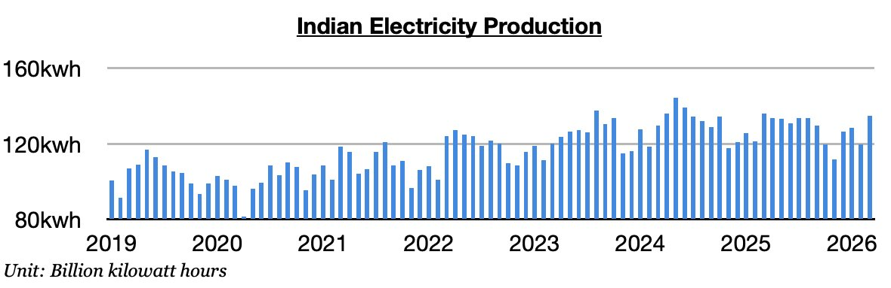
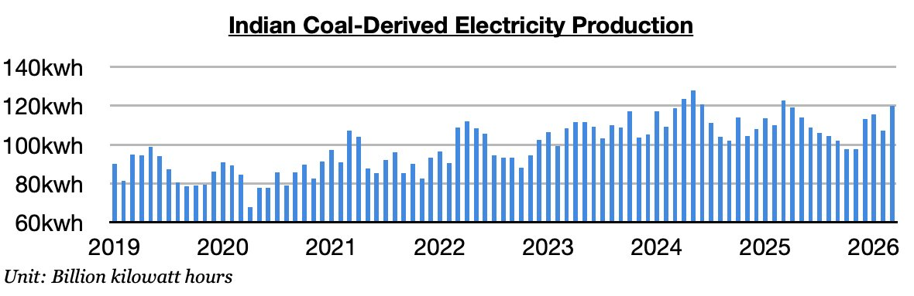
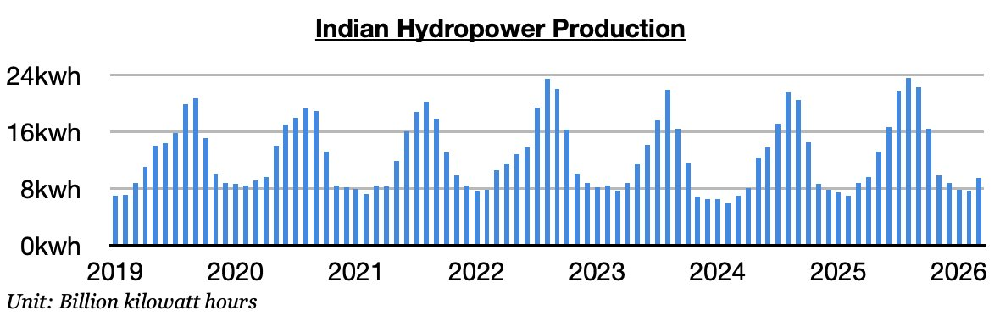

# Indian Electricity Production Remains Weak

**Date:** April 08, 2026  
**Publisher:** Breakwave Advisors | **Category:** Market Insights  
**Original URL:** [https://www.breakwaveadvisors.com/insights/2026/4/8/indian-electricity-production-remains-weak](https://www.breakwaveadvisors.com/insights/2026/4/8/indian-electricity-production-remains-weak)  

---

*By*[*Jeffrey Landsberg*](https://www.linkedin.com/in/jeffrey-landsberg-70ab957/)

As we discussed in Commodore Research's most recent Weekly Executive Report, India produced approximately 134.9 billion kilowatt hours of electricity last month. This is up month-on-month by 15.3 billion kilowatt hours (13%) but is down year-on-year by 1.2 billion kilowatt hours (-1%). Overall, India’s total electricity production has now contracted on a year-on-year basis during eight of the last twelve months.

> **Figure 1: 241**  
> [Local Asset](file:///C:/Users/Dell/Github/Shipping/corpus/03-breakwave/insights/2026/assets/2026-04-08_indian-electricity-production-remains-weak_img_241_016609f3adee.jpg)

Coal-derived electricity generation totaled approximately 119.9 billion kilowatt hours. This is up month-on-month by 12.9 billion kilowatt hours (12%) but is down year-on-year by 2.7 billion kilowatt hours (-2%). Coal-derived generation has now declined a year-on-year basis during nine of the last twelve months. This has marked the**only time this decade**that such an event has occurred, and remains troubling for India’s thermal coal demand prospects. Warmer than usual weather has continued throughout parts of India and remains a headwind on overall electricity demand. Hydropower output has also continued to grow. India’s economy has also faced struggles at times recently.

> **Figure 2: 242**  
> [Local Asset](file:///C:/Users/Dell/Github/Shipping/corpus/03-breakwave/insights/2026/assets/2026-04-08_indian-electricity-production-remains-weak_img_242_a76dbddfdc8f.jpg)

Hydropower output totaled approximately 9.5 billion kilowatt hours. This is up month-on-month by 1.8 million kilowatt hours (23%) and is up year-on-year by 800 million kilowatt hours (9%). India's hydropower output has grown on a year-on-year basis for nineteen straight months.

> **Figure 3: 243**  
> [Local Asset](file:///C:/Users/Dell/Github/Shipping/corpus/03-breakwave/insights/2026/assets/2026-04-08_indian-electricity-production-remains-weak_img_243_fef11c7a6733.jpg)

---

**Tags:** India, Energy, Shipping  
