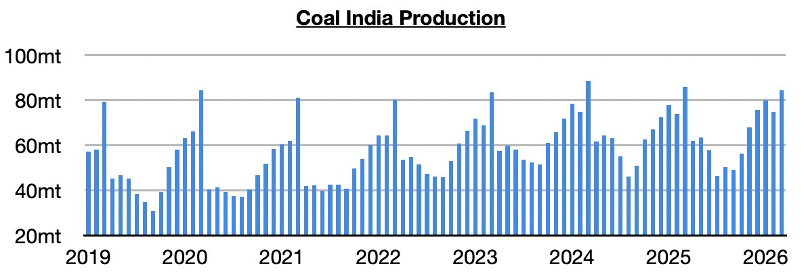
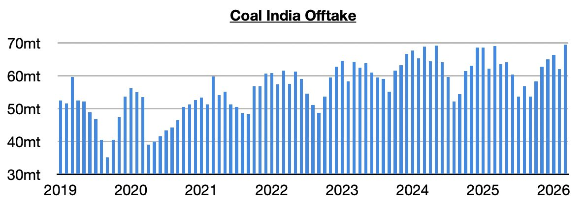
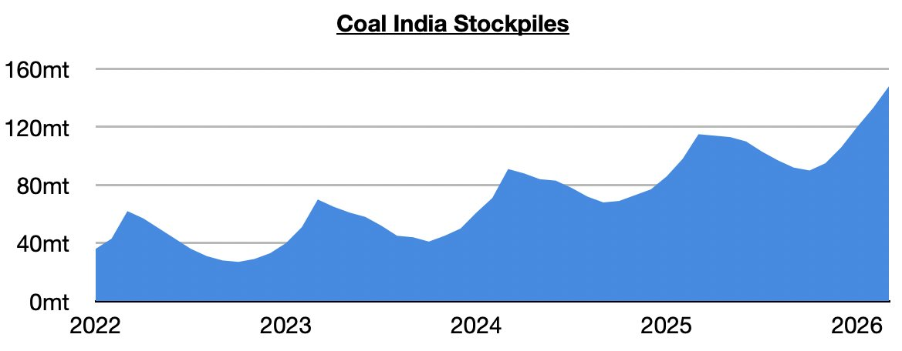

# Coal India's Stockpiles Set Another Record

**Date:** April 13, 2026  
**Publisher:** Breakwave Advisors | **Category:** Market Insights  
**Original URL:** [https://www.breakwaveadvisors.com/insights/2026/4/13/coal-indias-stockpiles-set-another-record](https://www.breakwaveadvisors.com/insights/2026/4/13/coal-indias-stockpiles-set-another-record)  

---

*By*[*Jeffrey Landsberg*](https://www.linkedin.com/in/jeffrey-landsberg-70ab957/)

Coal India (which is responsible for over 75% of India’s coal output) produced 84.5 million tons of coal last month. This is up month-on-month by 9.8 million tons (13%) but is down year-on-year by 1.3 million tons (-2%). Previously, Coal India’s production had grown on a year-on-year basis for four straight months. While it is helpful that Coal India’s production has returned to a contraction, problematic for the dry bulk market is that production last month again fared better than India’s coal-derived electricity generation.

> **Figure 1: 241**  
> [Local Asset](file:///C:/Users/Dell/Github/Shipping/corpus/03-breakwave/insights/2026/assets/2026-04-13_coal-indias-stockpiles-set-another-record_img_241_579490006c5d.jpg)

Offtake (the amount sent to customers) totaled 69.5 million tons. This is up month-on-month by 7.5 million tons (12%) and is up year-on-year by 500,000 tons (1%). Previously, offtake had contracted on a year-on-year basis for six straight months.

> **Figure 2: 242**  
> [Local Asset](file:///C:/Users/Dell/Github/Shipping/corpus/03-breakwave/insights/2026/assets/2026-04-13_coal-indias-stockpiles-set-another-record_img_242_cd4af4fe2530.jpg)

With offtake again coming in below output, India’s stockpiles have climbed even further and have set another record. They now stand at approximately 148 million tons. This is up month-on-month by 15 million tons (11%) and is up year-on-year by 22 million tons (29%).

> **Figure 3: 243**  
> [Local Asset](file:///C:/Users/Dell/Github/Shipping/corpus/03-breakwave/insights/2026/assets/2026-04-13_coal-indias-stockpiles-set-another-record_img_243_6f7bb673b293.jpg)

---

**Tags:** India, Coal, Shipping  
