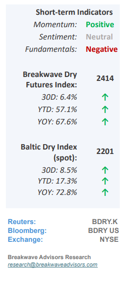
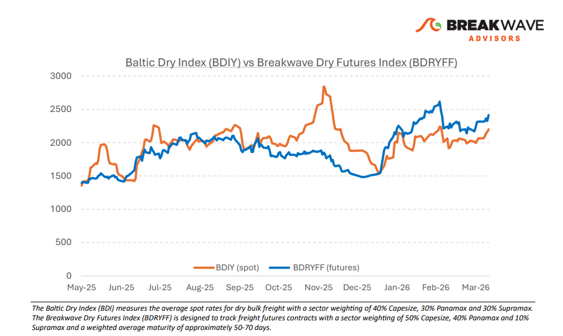
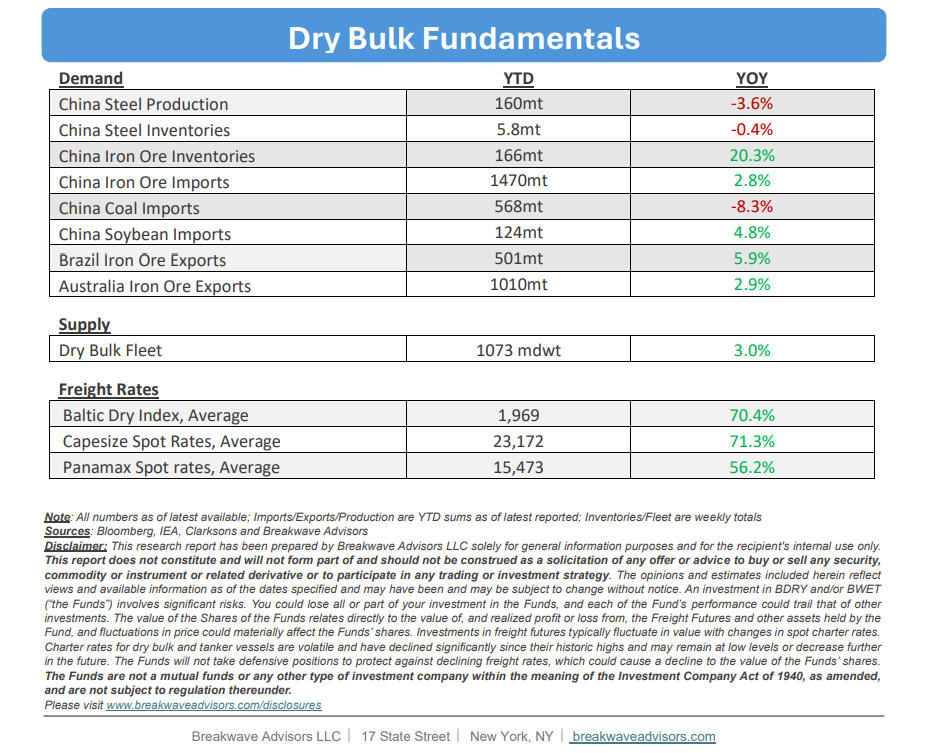

# Breakwave Bi-Weekly Dry Bulk Report - April 14, 2026

**Date:** April 14, 2026  
**Publisher:** Breakwave Advisors | **Category:** Market Insights  
**Original URL:** [https://www.breakwaveadvisors.com/insights/4142026db-report2026april14llo4-wmso9](https://www.breakwaveadvisors.com/insights/4142026db-report2026april14llo4-wmso9)  

---

•**Dry Bulk Volatility Remains Subdued as Spot Rates Hit 2-Month Highs**– The dry bulk spot market remains characterized by a period of relative stability, with spot rates consistently maintaining profitable levels for most owners despite a lack of significant catalysts for movement. While geopolitical tensions and fluctuating oil prices (and sky-high bunkers) continue to influence market sentiment and operational costs, the fundamental supply-and-demand balance has remained largely unchanged since last summer. Aside from a brief volatility spike in December, Capesize rates have held steady near the $25,000 threshold, mirroring the sustained price floor of iron ore at $100 per ton—an interesting correlation suggesting that increased hedging activity in the futures markets may be dampening price swings in both areas to preserve the current equilibrium. Although the broader macroeconomic landscape and elevated energy costs present ongoing risks, these concerns are currently mitigated by resilient trade flows and a freight market that appears increasingly insulated from a potential global slowdown for now.

> **Figure 1: Cea3cf84ceb9ceb3cebcceb9cf8ccf84cf85**  
> [Local Asset](file:///C:/Users/Dell/Github/Shipping/corpus/03-breakwave/insights/2026/assets/2026-04-14_4142026db-report2026april14llo4-wmso9_img_cea3cf84ceb9ceb3cebcceb9cf8ccf84cf85_74649bd5b359.png)

•**Are High Oil Prices a Risk to the Global Economy?**– While the ongoing Middle East conflict has elevated oil prices and heightened concerns regarding global economic growth, we believe the oil price threshold for a meaningful slowdown is significantly higher than in previous crises. Although global inflation has been persistent, energy prices have historically lagged behind this trend, resulting in oil costs representing a smaller portion of discretionary spending than in the past. Consequently, while $100 per barrel was once a critical tipping point, it may no longer be sufficient to trigger a substantial decline in consumer activity. However, with expectations of further price increases and rising global interest rates, which historically constrained trade, the risk of an economic slowdown in the second half of the year continues to escalate. Despite the current market complacency regarding pricing and future expectations, we maintain a cautious outlook, as the potential for a significant impact on the global economy remains high.

•**Our Long-term View**– The last few years have been characterized by increased geopolitical uncertainty. Going forward, we expect such events to continue to affect global trade and have a meaningful impact on effective vessel supply. Combined with the potential for a multi-year cyclical rebound in China’s economic activity following the recent economic turmoil, dry bulk shipping should experience higher volatility on top of a secular tightness driven by stable bulk commodity demand and rather steady fleet growth.

> **Figure 2: Στιγμιότυπο Οθόνης 2026 04 14 083020**  
> [Local Asset](file:///C:/Users/Dell/Github/Shipping/corpus/03-breakwave/insights/2026/assets/2026-04-14_4142026db-report2026april14llo4-wmso9_img_cea3cf84ceb9ceb3cebcceb9cf8ccf84cf85_8b9f0865a0a3.png)

> **Figure 3: Στιγμιότυπο Οθόνης 2026 04 14 112811**  
> [Local Asset](file:///C:/Users/Dell/Github/Shipping/corpus/03-breakwave/insights/2026/assets/2026-04-14_4142026db-report2026april14llo4-wmso9_img_cea3cf84ceb9ceb3cebcceb9cf8ccf84cf85_ca1089e95c13.png)

### Subscribe:
