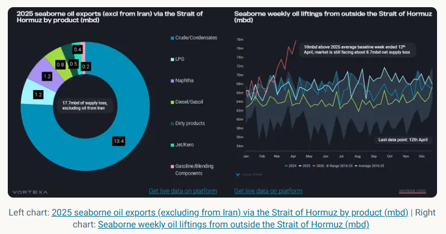
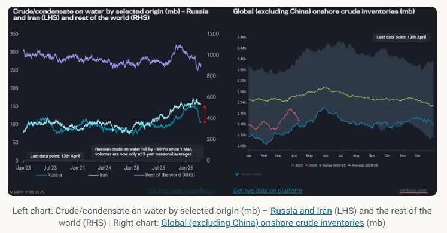
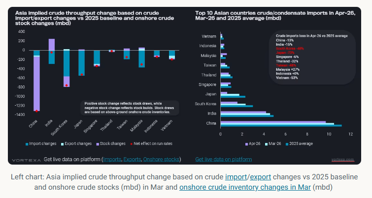

# Stockdraws, sanction/replacement oil, demand loss

**Date:** April 15, 2026  
**Publisher:** Breakwave Advisors | **Category:** Market Insights  
**Original URL:** [https://www.breakwaveadvisors.com/insights/2026/4/15/stockdraws-sanctionreplacement-oil-demand-loss](https://www.breakwaveadvisors.com/insights/2026/4/15/stockdraws-sanctionreplacement-oil-demand-loss)  

---

This article examines the impact of disruptions to oil flows through the Strait of Hormuz and potential solutions to address supply shortages.

*By*[*Xavier Tang*](https://www.linkedin.com/in/xavier-tang/)

The US and Iran failed to reach a deal over the weekend, with the US announcing a complete blockade of Iranian ports, further undermining the already fragile two-week ceasefire starting from 8th April 2026. If enforced, vessel transits via the Strait of Hormuz could come to a complete halt, as Iran may strive itself to block any other transits. The situation remains volatile, and most vessel operators will likely take a wait-and-see approach and delay entry to the Middle East Gulf.

With the Strait of Hormuz remaining mostly closed since the beginning of the conflict, about 17.7mbd of mainstream seaborne oil supplies (excluding those from Iran), based on 2025 averages, have been curtailed from the market. If Iranian oil supplies are also blocked by US military, that would add 1.8mbd to the current shortfall, affecting mainly China’s imports. The world is facing an unprecedented loss of oil supplies, and incremental liftings from elsewhere are insufficient to offset the shortfall.

Over the past few weeks, seaborne weekly oil liftings from outside the Strait of Hormuz have risen rapidly in a bid to offset the shortfall from inside the Strait of Hormuz. In the week ended 12th April, volumes hit 11mbd above 2025 levels, meaning that there is still a net seaborne oil supply loss of 7.7mbd, roughly 7% of global oil demand, after accounting for redirection of crude flows via pipelines and higher product liftings due to increased refinery runs in the Atlantic Basin. It also needs to be seen whether this level is sustainable, while noting that stockdraws rather than production will be a significant contributor here, as illustrated by emerging intra-country crude flows in Japan from storage to refining sites.

> **Figure 1: Στιγμιότυπο Οθόνης 2026 04 15 104923**  
> **Interactive Data & Source:** [Analytics Vortexa](https://analytics.vortexa.com/Flows?dateRange=2023-01-01T00%3A00%3A00.000Z__2026-04-11T23%3A59%3A59.999Z&filtersEnabled=%5B%22p%22%2C%22o%22%2C%22d%22%2C%22d_r%22%2C%22v%22%2C%22intra_d%22%2C%22sts_o%22%2C%22c_o%22%2C%22w%22%5D&from=%5B%22b996521be9c996db3560ca234a56286ac38f798d34be229437555fab4f12a6a5%22%5D&geoBreakdownDestinationGlobal=region&metric=bpd&movementEvent=unloading_start&page=Flows&products=%5B%2254af755a090118dcf9b0724c9a4e9f14745c26165385ffa7f1445bc768f06f11%22%5D&productsExcluded=%5B%22578b0722570521d64e6a1527e1fb88ddb1a064cc15afe1d6023d2a0b6d66be6b%22%2C%22bb70cf56200f5b72ba69a90bda2c6b47ba29da23945c6f1994cfd4c2ef2fe0ff%22%5D&tabId=61cafa26-5e5c-4635-ad46-7a7aed607d01&timeSeriesBaselineEnd=2025-12-31T23%3A59%3A59.999Z&timeSeriesBaselineStart=2025-01-01T00%3A00%3A00.000Z&timeSeriesHiddenSeries=%5B%22seasonal_comparison_12%22%2C%22seasonal_comparison_24%22%5D&timeSeriesProperty=destination_country&v=3) | [Local Asset](file:///C:/Users/Dell/Github/Shipping/corpus/03-breakwave/insights/2026/assets/2026-04-15_stockdraws-sanctionreplacement-oil-demand-loss_img_cea3cf84ceb9ceb3cebcceb9cf8ccf84cf85_e539b1e9bcfc.png)

## Supply Shortage Requires a Mixture of Solutions

This shortage of oil supplies affects Asia the most as the 3 biggest oil exports via the Strait of Hormuz - crude, LPG, and naphtha - are meant for Asian refineries and petrochemical plants. Without these feedstocks, Asian countries will likely reduce their refinery utilisation rates or tap into inventory reserves.

There are four ways to solve this supply shortage:

- 1) drawdown of oil inventories / strategic petroleum reserve (SPR)
- 2) replacement barrels from Atlantic Basin
- 3) absorption of sanctioned oil on water
- 4) substitution of oil products
- 5) demand destruction of oil products

Policymakers across Asia have introduced measures to reduce oil consumption, such as four-day workweeks and work-from-home policies, thereby accelerating the decline in demand for gasoline and diesel. High pump prices across Asia, especially in Vietnam, have also limited consumers' ability to undertake long-haul travel.

Governments could also increase biofuel blending mandates, such as ethanol blending in gasoline and biodiesel blending in conventional diesel, to offset the oil shortage. In addition, alternative energy sources could be used for power generation instead of oil.

## Absorption of Sanctioned Oil at Sea Hit Multi-Year Highs

With the recent waiver of sanctions on Russian and Iranian oil at sea, Chinese and Indian refiners have ramped up purchases of Russian crude/condensate to fill the shortage of medium-sour barrels. The buying spree has led to a sharp drawdown in Russian crude on water of around 60mb since 1st March, with volumes falling to the three-year seasonal average (back to when the reshuffling of Russian flows first started during the Russia-Ukraine war). This translates to an additional 1.5mbd of supplies, and the surplus created by threats of secondary US tariffs and sanctions on Rosneft and Lukoil is likely to be fully absorbed by the market as[imports hit record highs in March](https://analytics.vortexa.com/Flows?dateRange=2023-01-01T00%3A00%3A00.000Z__2026-04-11T23%3A59%3A59.999Z&filtersEnabled=%5B%22p%22%2C%22o%22%2C%22d%22%2C%22d_r%22%2C%22v%22%2C%22intra_d%22%2C%22sts_o%22%2C%22c_o%22%2C%22w%22%5D&from=%5B%22b996521be9c996db3560ca234a56286ac38f798d34be229437555fab4f12a6a5%22%5D&geoBreakdownDestinationGlobal=region&metric=bpd&movementEvent=unloading_start&page=Flows&products=%5B%2254af755a090118dcf9b0724c9a4e9f14745c26165385ffa7f1445bc768f06f11%22%5D&productsExcluded=%5B%22578b0722570521d64e6a1527e1fb88ddb1a064cc15afe1d6023d2a0b6d66be6b%22%2C%22bb70cf56200f5b72ba69a90bda2c6b47ba29da23945c6f1994cfd4c2ef2fe0ff%22%5D&tabId=61cafa26-5e5c-4635-ad46-7a7aed607d01&timeSeriesBaselineEnd=2025-12-31T23%3A59%3A59.999Z&timeSeriesBaselineStart=2025-01-01T00%3A00%3A00.000Z&timeSeriesHiddenSeries=%5B%22seasonal_comparison_12%22%2C%22seasonal_comparison_24%22%5D&timeSeriesProperty=destination_country&v=3).

Iranian oil at sea will begin to draw down from April onwards as the market starts feeling the tightness. VLCC JAYA will likely discharge Iranian crude at Paradip, India, signalling the resumption of Indian refiners’ purchases of crude since May 2019. Along with India, China has also recently granted teapot refiners an additional ~60 mt of crude import quotas, which could likely speed up the discharges of these barrels into Chinese ports. Iranian oil at sea could face a similar trend to Russian oil, with both Indian and Chinese refiners absorbing it from April onwards as tightness in medium and heavy crude is exacerbated.

As for mainstream barrels on water, volumes declined sharply in March due to reduced liftings in the Middle East but rebounded slightly as long-haul voyages from the Atlantic Basin to the Pacific Basin increased.

From now on, Asia and the rest of the world will need to turn to SPR releases and commercial or private inventory draws to plug the shortfall. So far, we have seen a coordinated SPR release of 400 mb by 32 member nations, but this amount lasts only slightly over a month, given the shortfall in oil supplies.

> **Figure 2: Στιγμιότυπο Οθόνης 2026 04 15 104939**  
> **Interactive Data & Source:** [Analytics Vortexa](https://analytics.vortexa.com/Flows?dateRange=2026-01-01T00%3A00%3A00.000Z__2026-04-05T23%3A59%3A59.999Z&filtersEnabled=%5B%22p%22%2C%22o%22%2C%22d%22%2C%22d_r%22%2C%22v%22%2C%22intra_d%22%2C%22sts_o%22%2C%22c_o%22%2C%22w%22%5D&frequency=week&from=%5B%2250182d9d05051a6c8d24f0514d4ee828da6eaa29eacbb11cfe368f51526328ce%22%5D&intraMovementDropdown=all&metric=bpd&page=Flows&products=%5B%2254af755a090118dcf9b0724c9a4e9f14745c26165385ffa7f1445bc768f06f11%22%5D&tabId=61cafa26-5e5c-4635-ad46-7a7aed607d01&timeSeriesBaselineEnd=2019-12-31T23%3A59%3A59.999Z&timeSeriesBaselineStart=2019-01-01T00%3A00%3A00.000Z&timeSeriesHiddenSeries=%5B%2278ea265f0831ade23df3fad9553ce84f570aa341e74473114ebcab5c2e16863c%22%2C%229000d0a3461cc534d83c4867c1ba16fac6f6dc274704aa8495e03e97c98ff08d%22%2C%22394af873e88163aa6217e76ea25c46c72b7d929f9d0dd111d8785e9af1c24f32%22%2C%22e329bc9d776e6423b858611119d3a33d05971dc238e6d11644c0476c11446340%22%2C%220a420841705cadab5d4ede7bac6e58d7e8288b86f80d0043afa14bc30bf99fc3%22%2C%2236424f0fc9d4b73e9c192eeb610621f56bcc427e4be28cfa07aee190b4050ccf%22%2C%22seasonal_comparison_12%22%2C%22seasonal_comparison_24%22%5D&timeSeriesProperty=origin_port&to=%5B%2250182d9d05051a6c8d24f0514d4ee828da6eaa29eacbb11cfe368f51526328ce%22%5D&v=3) | [Local Asset](file:///C:/Users/Dell/Github/Shipping/corpus/03-breakwave/insights/2026/assets/2026-04-15_stockdraws-sanctionreplacement-oil-demand-loss_img_cea3cf84ceb9ceb3cebcceb9cf8ccf84cf85_825f529eb5e7.png)

## Limited Asia Stock Draws Were Seen in March, But Stock Draws Will Likely Accelerate in April

Among the top 10 crude/condensate-importing countries in Asia, all have suffered from supply losses, with India and Japan seeing the largest year-on-year (y-o-y) declines in March import volumes. However, India managed to offset some of the import losses by drawing down its onshore crude inventories, limiting the decline in its refinery runs.

Countries such as South Korea and China have seen stock builds in March, implying a sizeable reduction in refinery utilisation rates, in preparation for a prolonged supply disruption. Both countries were also among the first to impose measures to limit oil product exports, prioritising domestic consumption over oil revenues.

In April, Northeast Asian countries (excluding China) are set to see at around 50~70% y-o-y reduction in crude imports, with Japan's imports expected to decline by 70% y-o-y. Combined crude/condensate imports into Japan, South Korea, and Taiwan from inside the Strait of Hormuz have fallen sharply from an average of 3.9 mbd in 2025 to 0.8 mbd and 1.1 mbd in the past two weeks.

By combining crude/condensate imports and exports relative to the 2025 average baseline, along with stock draws from onshore inventories, changes in Asia's implied crude throughput can be estimated. China faces the largest reduction in refinery runs in March due to a massive stock build; however, the country is well positioned to weather prolonged disruptions with its enormous crude storage cover (west of Hormuz, excluding Iran) of 310 days.

Due to the shortage of crude imports, Northeast Asian countries (excluding China) will likely accelerate stock draws in the coming weeks to ensure domestic supplies remain at healthy levels. Japan has begun shifting its crude supplies from key storage locations to refineries, as[weekly crude/condensate intra-country departures](https://analytics.vortexa.com/Flows?dateRange=2026-01-01T00%3A00%3A00.000Z__2026-04-05T23%3A59%3A59.999Z&filtersEnabled=%5B%22p%22%2C%22o%22%2C%22d%22%2C%22d_r%22%2C%22v%22%2C%22intra_d%22%2C%22sts_o%22%2C%22c_o%22%2C%22w%22%5D&frequency=week&from=%5B%2250182d9d05051a6c8d24f0514d4ee828da6eaa29eacbb11cfe368f51526328ce%22%5D&intraMovementDropdown=all&metric=bpd&page=Flows&products=%5B%2254af755a090118dcf9b0724c9a4e9f14745c26165385ffa7f1445bc768f06f11%22%5D&tabId=61cafa26-5e5c-4635-ad46-7a7aed607d01&timeSeriesBaselineEnd=2019-12-31T23%3A59%3A59.999Z&timeSeriesBaselineStart=2019-01-01T00%3A00%3A00.000Z&timeSeriesHiddenSeries=%5B%2278ea265f0831ade23df3fad9553ce84f570aa341e74473114ebcab5c2e16863c%22%2C%229000d0a3461cc534d83c4867c1ba16fac6f6dc274704aa8495e03e97c98ff08d%22%2C%22394af873e88163aa6217e76ea25c46c72b7d929f9d0dd111d8785e9af1c24f32%22%2C%22e329bc9d776e6423b858611119d3a33d05971dc238e6d11644c0476c11446340%22%2C%220a420841705cadab5d4ede7bac6e58d7e8288b86f80d0043afa14bc30bf99fc3%22%2C%2236424f0fc9d4b73e9c192eeb610621f56bcc427e4be28cfa07aee190b4050ccf%22%2C%22seasonal_comparison_12%22%2C%22seasonal_comparison_24%22%5D&timeSeriesProperty=origin_port&to=%5B%2250182d9d05051a6c8d24f0514d4ee828da6eaa29eacbb11cfe368f51526328ce%22%5D&v=3)from Japan have reached a record high of 1.45mbd. South Korea allowed its refiners to conduct crude swaps – a mechanism for borrowing crude from the SPR and refilling it at a later date.

> **Figure 3: Στιγμιότυπο Οθόνης 2026 04 15 104948**  
> **Interactive Data & Source:** [Analytics Vortexa](https://analytics.vortexa.com/Flows?dateRange=2023-01-01T00%3A00%3A00.000Z__2026-04-30T23%3A59%3A59.999Z&filtersEnabled=%5B%22p%22%2C%22o%22%2C%22d%22%2C%22d_r%22%2C%22v%22%2C%22intra_d%22%2C%22sts_o%22%2C%22c_o%22%2C%22w%22%5D&geoBreakdownDestinationGlobal=region&metric=bpd&movementEvent=unloading_start&page=Flows&products=%5B%2254af755a090118dcf9b0724c9a4e9f14745c26165385ffa7f1445bc768f06f11%22%5D&tabId=61cafa26-5e5c-4635-ad46-7a7aed607d01&timeSeriesBaselineEnd=2025-12-31T23%3A59%3A59.999Z&timeSeriesBaselineStart=2025-01-01T00%3A00%3A00.000Z&timeSeriesHiddenSeries=%5B%22seasonal_comparison_12%22%2C%22seasonal_comparison_24%22%5D&timeSeriesProperty=destination_country&to=%5B%22e6955a2c59dc90833986fe0894cf6718dddaa7816bb51bc955cdd3eb4470e554%22%5D&v=3) | [Local Asset](file:///C:/Users/Dell/Github/Shipping/corpus/03-breakwave/insights/2026/assets/2026-04-15_stockdraws-sanctionreplacement-oil-demand-loss_img_cea3cf84ceb9ceb3cebcceb9cf8ccf84cf85_3c6a542f2c9c.png)

Right chart:[Top 10 Asian countries crude/condensate imports](https://analytics.vortexa.com/Flows?dateRange=2023-01-01T00%3A00%3A00.000Z__2026-04-30T23%3A59%3A59.999Z&filtersEnabled=%5B%22p%22%2C%22o%22%2C%22d%22%2C%22d_r%22%2C%22v%22%2C%22intra_d%22%2C%22sts_o%22%2C%22c_o%22%2C%22w%22%5D&geoBreakdownDestinationGlobal=region&metric=bpd&movementEvent=unloading_start&page=Flows&products=%5B%2254af755a090118dcf9b0724c9a4e9f14745c26165385ffa7f1445bc768f06f11%22%5D&tabId=61cafa26-5e5c-4635-ad46-7a7aed607d01&timeSeriesBaselineEnd=2025-12-31T23%3A59%3A59.999Z&timeSeriesBaselineStart=2025-01-01T00%3A00%3A00.000Z&timeSeriesHiddenSeries=%5B%22seasonal_comparison_12%22%2C%22seasonal_comparison_24%22%5D&timeSeriesProperty=destination_country&to=%5B%22e6955a2c59dc90833986fe0894cf6718dddaa7816bb51bc955cdd3eb4470e554%22%5D&v=3)in Apr-26, Mar-26 and 2025 average (mbd)

Ultimately, the world needs a combination of the above-mentioned methods to bring supply and demand into equilibrium. In the short term, countries may find creative ways to secure their oil supplies, either through barter trade or by becoming friendly with Iran, as seen in recent weeks.

Data Source:[Vortexa](https://www.vortexa.com//oil-gas-data-traders-analysts-data-scientists?gclid=Cj0KCQjw8_qRBhCXARIsAE2AtRZKOvMnbilZ_6_91d7huSFFy71pWLrnPwGwOHVzXsmsG-1a1mZnQw8aAt89EALw_wcB&hsa_acc=1782073842&hsa_ad=548425387665&hsa_cam=14746637662&hsa_grp=125038601902&hsa_kw=&hsa_mt=&hsa_net=adwords&hsa_src=g&hsa_tgt=dsa-1431852288425&hsa_ver=3&utm_campaign=%5BCD%5D%20-%20DSA%20-%20EMEA&utm_medium=cpc&utm_medium=ppc&utm_source=google&utm_source=adwords&utm_term=)

---

**Tags:** Shipping, Crude, Markets  
