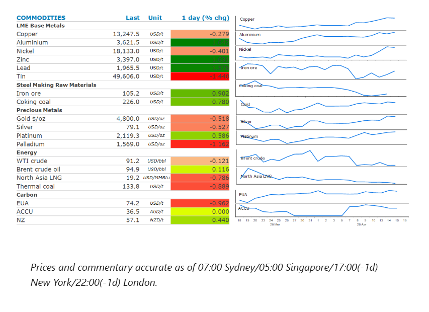
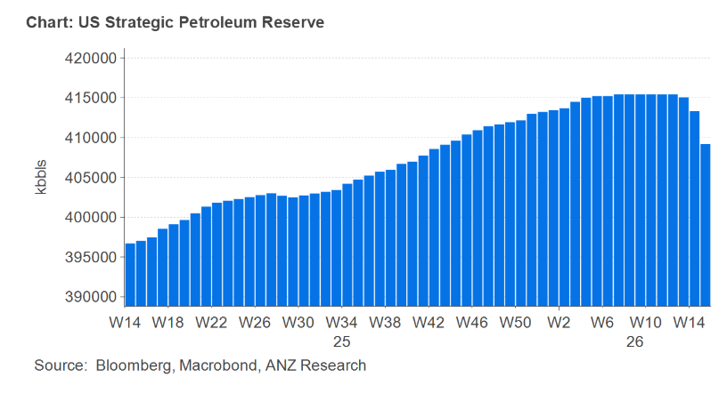

# Markets stabilise amid US-Iran peace talks

**Date:** April 16, 2026  
**Publisher:** Breakwave Advisors | **Category:** Market Insights  
**Original URL:** [https://www.breakwaveadvisors.com/insights/2026/4/16/markets-stabilise-amid-us-iran-peace-talks](https://www.breakwaveadvisors.com/insights/2026/4/16/markets-stabilise-amid-us-iran-peace-talks)  

---

Energy markets were relatively subdued as they contemplate the impact of US-Iran peace talks. Improved risk appetite pushed industrial metals higher. Precious metals fell on concerns that rising inflation will keep rates high.

*By*[*Daniel Hynes*](https://www.linkedin.com/in/dahynes/)

> **Figure 1: Στιγμιότυπο Οθόνης 2026 04 16 101402**  
> [Local Asset](file:///C:/Users/Dell/Github/Shipping/corpus/03-breakwave/insights/2026/assets/2026-04-16_markets-stabilise-amid-us-iran-peace-talks_img_cea3cf84ceb9ceb3cebcceb9cf8ccf84cf85_35530e03b599.png)

### Market Commentary

**Crude oil**prices fluctuated on the prospect of fresh peace talks between the US and Iran. The two parties are reported to be considering extending their ceasefire by another two weeks to allow for more time to negotiate a peace agreement, according to a Bloomberg report. Mediators are said to be pushing for a compromise on outstanding issues including the reopening of the Strait of Hormuz and Iran’s nuclear enrichment program. Trump also downplayed the prospect of renewed fighting, saying that the near seven-week conflict is “close to over”.

Nevertheless, the impact of the disruptions to oil supplies continues to emerge. Energy Information Administration’s weekly inventory report showed widespread drawdowns. Commercial crude oil inventories fell 913kbbl last week. However, product stockpiles recorded even bigger falls. Gasoline stockpiles fell 6,328kbbl while distillate fuel oil was down 3,122kbbl. Heightened demand also pushed US exports of crude oil and products to their highest level ever. Oil importers in Asia are feeling a deeper crunch, with Japan launching a second release from its national stockpile from early May. Meanwhile, refiners in the region may choose to reduce their operations, which will tighten supplies of jet fuel and diesel. Signs of tightness have been relatively scarce, despite the market experiencing the biggest supply disruption its ever seen. This has left investors unsure about how to price-in the impact of the Middle East conflict. Even so, the oil market doesn’t need a worst-case escalation to justify higher pricing. Tight balances are sufficient to sustain the price of Brent near or[**above recent threshold levels**](../pdfs/2026-04-16_markets-stabilise-amid-us-iran-peace-talks_elevated-oil-prices-to-persist_322887cbcc5b.pdf). The longer the conflict drags on, the more persistent these price dynamics are likely to be.

**European natural gas**prices extended recent losses as optimism over a potential peace deal between the US and Iran boosted sentiment across the energy complex. Compounding the selloff has been the unwind of large net long positions recently accumulated by investment funds.**North Asia LNG**prices also pushed lower, although traders remain mindful that supplies remain severely constrained while the Strait of Hormuz is closed. Asian LNG imports have fallen to their lowest level since 2020. China’s 30 day move average for LNG imports on 14 April was 108kt, 32% lower than a year ago.

**Copper**failed to benefit from increased risk appetite across markets, ending the session down 0.3%. Nevertheless, the prospect of an end to the Middle East conflict has eased concerns of slowing economic growth and a hit to demand. In fact, signs have emerged of stronger demand in China. Imports of copper ore and concentrate imports rose 6.6% y/y to 7.5mt in March, suggesting strong demand from domestic smelters despite unfavourable treatment charges. Chinese fabricators have also stepped-up purchases after domestic prices fell below CNY100,000/t in recent weeks. This has led to copper inventories in China recording their biggest weekly drop this year, according to Mysteel Global.

**Gold**edged lower as concerns over higher energy prices leading to rising inflation offset hopes of an end to the conflict. Fed member Austan Goolsbee said higher energy prices may push back rate cuts. Traders have subsequently increased bets that central banks will hold interest rates steady for longer.

### Chart of the Day

The US has started releasing oil from its strategic petroleum reserve as promised. As part of the International Energy Agency’s plan to help soften the blow of the hit to Persian Gulf oil supplies, the US agreed to release 172mbbls. However, as of 10 April, they have only withdrawn 6mbbls. This highlights the difficulties in getting large amounts of oil from stockpiles into the market quickly.

> **Figure 2: Στιγμιότυπο Οθόνης 2026 04 16 101427**  
> **Interactive Data & Source:** [Linkedin](https://www.linkedin.com/newsletters/commodities-wrap-6692196755876012032/?fbclid=IwAR3kiXJqZdxmp9ZcRwBNI7FsBySI-XSC0pfPur1qzjt7OZp7PTE59Tsl1QI) | [Local Asset](file:///C:/Users/Dell/Github/Shipping/corpus/03-breakwave/insights/2026/assets/2026-04-16_markets-stabilise-amid-us-iran-peace-talks_img_cea3cf84ceb9ceb3cebcceb9cf8ccf84cf85_6355117d46fe.png)

Data source:[Commodities Wrap](https://www.linkedin.com/newsletters/commodities-wrap-6692196755876012032/?fbclid=IwAR3kiXJqZdxmp9ZcRwBNI7FsBySI-XSC0pfPur1qzjt7OZp7PTE59Tsl1QI)

---

**Tags:** Oil, Shipping, Markets  
