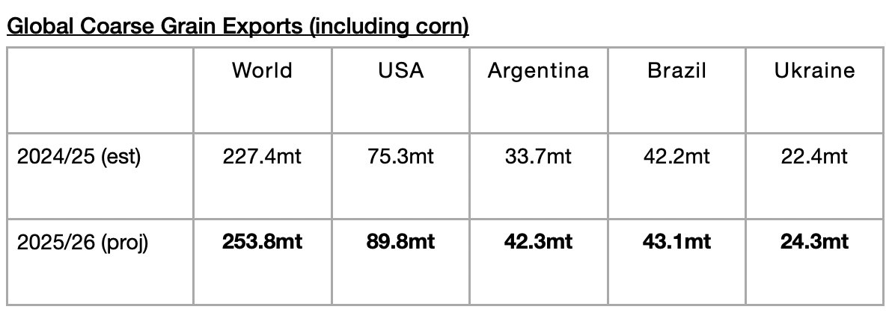
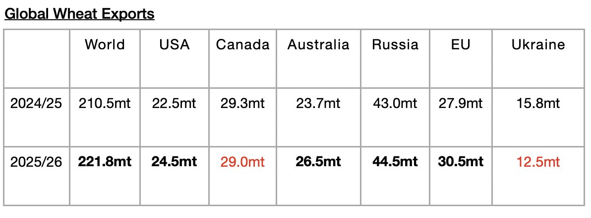
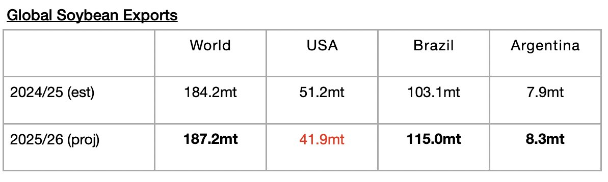
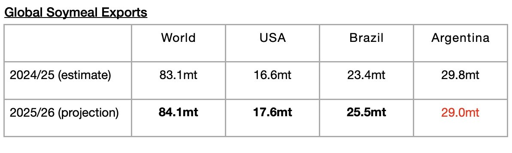

# Global Grain Trade Forecast Raised Yet Again

**Date:** April 17, 2026  
**Publisher:** Breakwave Advisors | **Category:** Market Insights  
**Original URL:** [https://www.breakwaveadvisors.com/insights/2026/4/17/global-grain-trade-forecast-raised-yet-again](https://www.breakwaveadvisors.com/insights/2026/4/17/global-grain-trade-forecast-raised-yet-again)  

---

*By*[*Jeffrey Landsberg*](https://www.linkedin.com/in/jeffrey-landsberg-70ab957/)

As we discussed in Commodore Research's most recent Weekly Executive Report, global coarse grain, wheat, soybean, and soymeal exports collectively are now expected to total 747 million tons. This is 500,000 tons more than was predicted in March and would mark a year-on-year increase of 41.8 million tons (6%). Significant is that the forecast has been raised yet again. Each of the last eight months have seen the forecast raised, and the forecast is now 26.8 million tons higher than when the forecast was first released in May and 41.8 million tons more than was shipped during last year’s grain season. That is a lot of cargoes (roughly 535 more cargoes than were first forecast in May, and roughly 835 more cargoes than were shipped during last year’s grain season). This constant upward revision is a major reason why Commodore has continued to stress our bullishness for the dry bulk market this year.

As we have discussed often, we have been stressing that a return of growth in grain trade (and growth in all major dry bulk commodity trade) has been needed considering that the dry bulk fleet continues to grow by a moderate amount (we are expecting a net addition of at least another 375 vessels) this year. The growth in global grain trade should not be taken for granted. In the 2024/25 season, a year-on-year contraction of 5.2 million tons (-1%) occurred.

The USDA is now forecasting that global coarse grain exports in 2025/26 will total 253.8 million tons. This would mark a year-on-year increase of 26.4 million tons (12%) from the 2024/25 season. Coarse grain exports will remain the global grain market’s largest cargo by volume. A large year-on-year increase in coarse grain exports is expected from the United States. A moderate year-on-year increase is expected from Argentina. Small year-on-year increases are expected from Ukraine and Brazil.

> **Figure 1: Chart 1**  
> [Local Asset](file:///C:/Users/Dell/Github/Shipping/corpus/03-breakwave/insights/2026/assets/2026-04-17_global-grain-trade-forecast-raised-yet-again_img_chart1_2445e71ff219.jpg)

Global wheat exports are expected to total 221.8 million tons. This would mark a year-on-year increase of 11.3 million tons (5%) from the 2024/25 season. Moderate increases are expected from the European Union and Australia. Small increases are expected from the United States and Russia.

> **Figure 2: Chart 2**  
> [Local Asset](file:///C:/Users/Dell/Github/Shipping/corpus/03-breakwave/insights/2026/assets/2026-04-17_global-grain-trade-forecast-raised-yet-again_img_chart2_32327c5ab120.jpg)

Global soybean exports are expected to total 187.2 million tons. This would mark a year-on-year increase of 3 million tons (2%) from the 2024/25 season. A large increase in soybean exports is expected from Brazil and a small increase is expected from Argentina. A large decline is expected from the United States..

> **Figure 3: Chart 3**  
> [Local Asset](file:///C:/Users/Dell/Github/Shipping/corpus/03-breakwave/insights/2026/assets/2026-04-17_global-grain-trade-forecast-raised-yet-again_img_chart3_5dba5786634e.jpg)

Global soymeal exports are expected to total 84.1 million tons. This would mark a year-on-year increase of 1 million tons (1%). Small increases in exports are expected from the United States and Brazil. A small drop is expected from Argentina.

> **Figure 4: Chart 4**  
> [Local Asset](file:///C:/Users/Dell/Github/Shipping/corpus/03-breakwave/insights/2026/assets/2026-04-17_global-grain-trade-forecast-raised-yet-again_img_chart4_2dee685cb361.jpg)

---

**Tags:** Commodities, Markets, Economy  
