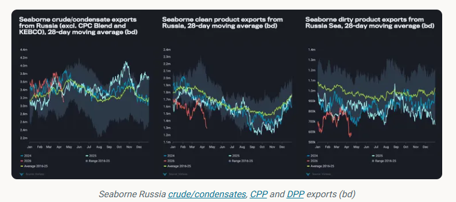
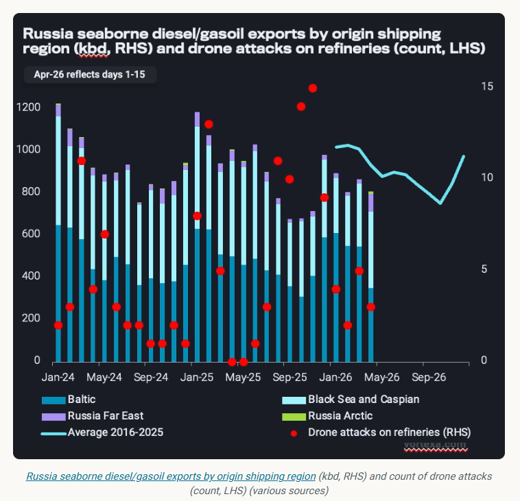
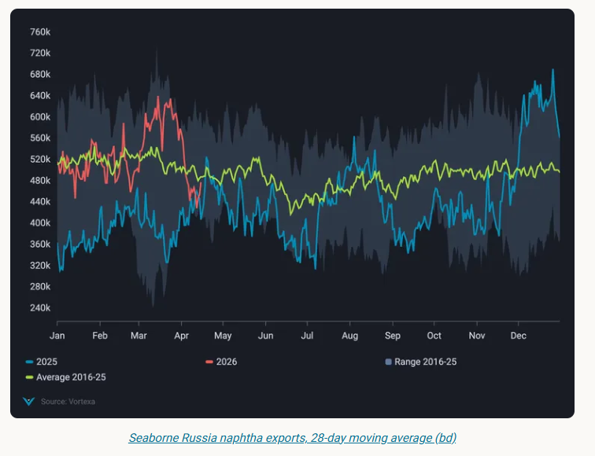

# Spring port strikes cast shadow over Russian oil exports

**Date:** April 20, 2026  
**Publisher:** Breakwave Advisors | **Category:** Market Insights  
**Original URL:** [https://www.breakwaveadvisors.com/insights/2026/4/20/spring-port-strikes-cast-shadow-over-russian-oil-exports](https://www.breakwaveadvisors.com/insights/2026/4/20/spring-port-strikes-cast-shadow-over-russian-oil-exports)  

---

Loading delays signal Russia's vulnerability to port infrastructure damage, amid weaker refinery runs and signs of ample surplus crude barrels.

*By*[*Anna Zhminko*](https://www.linkedin.com/in/anna-zhminko/)

March and April saw significant disruptions in Russian oil infrastructure due to Ukrainian aerial strikes in the Baltic and Black Sea.

As a result, total seaborne crude/condensate exports fell by 800kbd from March 23 (start of the attacks) until April 15, observed on a 28-day moving average basis. This is 400kbd below the 2016-2025 seasonal average.

Seaborne clean refined product exports declined by 400kbd in the same comparison period, while dirty petroleum exports declined by 200kbd.

This is aligned with ongoing strikes on Russian refineries, setting the stage for persistent export constraints.

> **Figure 1: Στιγμιότυπο Οθόνης 2026 04 20 095649**  
> **Interactive Data & Source:** [Analytics Vortexa](https://analytics.vortexa.com/Flows?dateRange=2024-01-01T00%3A00%3A00.000Z__2026-04-15T23%3A59%3A59.999Z&filtersEnabled=%5B%22p%22%2C%22o%22%2C%22d%22%2C%22d_r%22%2C%22v%22%2C%22intra_d%22%2C%22sts_o%22%2C%22c_o%22%2C%22w%22%2C%22sts%22%2C%22v_o%22%5D&from=%5B%22b996521be9c996db3560ca234a56286ac38f798d34be229437555fab4f12a6a5%22%5D&geoBreakdownDestinationGlobal=shipping_region_v2&geoBreakdownOriginGlobal=shipping_region_v2&metric=bpd&page=Flows&products=%5B%22deda35eb9ca56b54e74f0ff370423f9a8c61cf6a3796fcb18eaeeb32a8c290bb%22%5D&tabId=ad323d12-d124-4404-8607-9ebb6fc38f82&timeSeriesChartView=seasonal&timeSeriesPercentageEnabled=1&timeSeriesProperty=origin_shipping_region_v2&timeSeriesSeasonalToggle=1&tsSeasonalMovingAvg=1&tsSeasonalMovingAvgWindow=28d&v=3) | [Local Asset](file:///C:/Users/Dell/Github/Shipping/corpus/03-breakwave/insights/2026/assets/2026-04-20_spring-port-strikes-cast-shadow-over-russian-oil-exports_img_cea3cf84ceb9ceb3cebcceb9cf8ccf84cf85_12b219aa1bcf.png)

## Production Capacity Underpins Diesel Weakness

Russian[seaborne diesel/gasoil exports](https://analytics.vortexa.com/Flows?dateRange=2024-01-01T00%3A00%3A00.000Z__2026-04-15T23%3A59%3A59.999Z&filtersEnabled=%5B%22p%22%2C%22o%22%2C%22d%22%2C%22d_r%22%2C%22v%22%2C%22intra_d%22%2C%22sts_o%22%2C%22c_o%22%2C%22w%22%2C%22sts%22%2C%22v_o%22%5D&from=%5B%22b996521be9c996db3560ca234a56286ac38f798d34be229437555fab4f12a6a5%22%5D&geoBreakdownDestinationGlobal=shipping_region_v2&geoBreakdownOriginGlobal=shipping_region_v2&metric=bpd&page=Flows&products=%5B%22deda35eb9ca56b54e74f0ff370423f9a8c61cf6a3796fcb18eaeeb32a8c290bb%22%5D&tabId=ad323d12-d124-4404-8607-9ebb6fc38f82&timeSeriesChartView=seasonal&timeSeriesPercentageEnabled=1&timeSeriesProperty=origin_shipping_region_v2&timeSeriesSeasonalToggle=1&tsSeasonalMovingAvg=1&tsSeasonalMovingAvgWindow=28d&v=3)have been on a downward trend against the seasonal average since the start of this year (see below), averaging 200kbd below year-ago levels in the first three months of 2026.

Continuous exhaustion of the refining system is a significant contributor to limited exports thus far this year, with seasonal spring maintenance further weighing down on volumes available for export.

Among others, Saratov (140kbd), Kirishi (85kbd) and Nizhny Novgorod (340kbd) refineries declared outages due to strikes over the last few weeks, tightening fuel availability (Argus).

> **Figure 2: Στιγμιότυπο Οθόνης 2026 04 20 095704**  
> **Interactive Data & Source:** [Analytics Vortexa](https://analytics.vortexa.com/Flows?dateRange=last-12-months&filtersEnabled=%5B%22p%22%2C%22o%22%2C%22d%22%2C%22d_r%22%2C%22v%22%2C%22intra_d%22%2C%22sts_o%22%2C%22c_o%22%2C%22w%22%2C%22sts%22%2C%22v_o%22%5D&frequency=week&from=%5B%22b996521be9c996db3560ca234a56286ac38f798d34be229437555fab4f12a6a5%22%5D&geoBreakdownDestinationGlobal=shipping_region_v2&geoBreakdownOriginGlobal=port&maxEventFilter=1776470399999&metric=bpd&minEventFilter=1774224000000&originGlobalXFilter=%5B%224534ce5267a46804d8316be144cece8ab555fc94fd90d812ff15cc751668e535%22%5D&page=Flows&products=%5B%22b68cbb746f8b9098c50e2ba36bcad83001a53bd362e9031fb49085d02c36659c%22%5D&productsBreakdown=group_product&productsExcluded=%5B%22364ccbb996c944055b479810a8e74863267885dc1b01407cb0f00ab26dafe1e1%22%2C%22cbb5acffa542aad31d26712a8cdfd9884301aa7658ac95c40f86ddb31bc29d9b%22%5D&productsXFilter=%5B%22deda35eb9ca56b54e74f0ff370423f9a8c61cf6a3796fcb18eaeeb32a8c290bb%22%5D&tabId=ad323d12-d124-4404-8607-9ebb6fc38f82&timeSeriesPercentageEnabled=1&timeSeriesProperty=origin_port&v=3) | [Local Asset](file:///C:/Users/Dell/Github/Shipping/corpus/03-breakwave/insights/2026/assets/2026-04-20_spring-port-strikes-cast-shadow-over-russian-oil-exports_img_cea3cf84ceb9ceb3cebcceb9cf8ccf84cf85_4d3f34e360dd.png)

Any other disruption to port terminals would place another obstacle to already-limited diesel sendout.[Weekly diesel/gasoil exports from Primorsk](https://analytics.vortexa.com/Flows?dateRange=last-12-months&filtersEnabled=%5B%22p%22%2C%22o%22%2C%22d%22%2C%22d_r%22%2C%22v%22%2C%22intra_d%22%2C%22sts_o%22%2C%22c_o%22%2C%22w%22%2C%22sts%22%2C%22v_o%22%5D&frequency=week&from=%5B%22b996521be9c996db3560ca234a56286ac38f798d34be229437555fab4f12a6a5%22%5D&geoBreakdownDestinationGlobal=shipping_region_v2&geoBreakdownOriginGlobal=port&maxEventFilter=1776470399999&metric=bpd&minEventFilter=1774224000000&originGlobalXFilter=%5B%224534ce5267a46804d8316be144cece8ab555fc94fd90d812ff15cc751668e535%22%5D&page=Flows&products=%5B%22b68cbb746f8b9098c50e2ba36bcad83001a53bd362e9031fb49085d02c36659c%22%5D&productsBreakdown=group_product&productsExcluded=%5B%22364ccbb996c944055b479810a8e74863267885dc1b01407cb0f00ab26dafe1e1%22%2C%22cbb5acffa542aad31d26712a8cdfd9884301aa7658ac95c40f86ddb31bc29d9b%22%5D&productsXFilter=%5B%22deda35eb9ca56b54e74f0ff370423f9a8c61cf6a3796fcb18eaeeb32a8c290bb%22%5D&tabId=ad323d12-d124-4404-8607-9ebb6fc38f82&timeSeriesPercentageEnabled=1&timeSeriesProperty=origin_port&v=3)still average 300kbd lower than in the weeks preceding the strikes (w/c March 23).

## Novatek Ust-Luga Damage Could Dampen Naphtha Exports Further

On the naphtha side, damage to Ust-Luga Novatek 9Mt/y gas processing facility has significantly reduced[Russian naphtha sendout](https://analytics.vortexa.com/Flows?dateRange=2024-01-01T00%3A00%3A00.000Z__2026-04-15T23%3A59%3A59.999Z&filtersEnabled=%5B%22p%22%2C%22o%22%2C%22d%22%2C%22d_r%22%2C%22v%22%2C%22intra_d%22%2C%22sts_o%22%2C%22c_o%22%2C%22w%22%2C%22sts%22%2C%22v_o%22%5D&frequency=day&from=%5B%22b996521be9c996db3560ca234a56286ac38f798d34be229437555fab4f12a6a5%22%5D&geoBreakdownDestinationGlobal=shipping_region_v2&geoBreakdownOriginGlobal=shipping_region_v2&metric=bpd&page=Flows&products=%5B%223e4db72ef7027de928ce55703a213a546fd86d2debe6f2e9c85f3a5f9d53e8dd%22%5D&tabId=ad323d12-d124-4404-8607-9ebb6fc38f82&timeSeriesChartView=seasonal&timeSeriesPercentageEnabled=1&tsSeasonalMovingAvg=1&tsSeasonalMovingAvgWindow=28d&v=3), as seaborne exports declined by nearly 40%, or 240kbd, March 23 to April 15 on a 28-day moving average basis.

Ust-Luga exported 60% (260kbd) of Russian naphtha volumes last year, of which more than half were supplied by Novatek.

> **Figure 3: Στιγμιότυπο Οθόνης 2026 04 20 095715**  
> **Interactive Data & Source:** [Analytics Vortexa](https://analytics.vortexa.com/Flows?dateRange=2024-01-01T00%3A00%3A00.000Z__2026-04-15T23%3A59%3A59.999Z&filtersEnabled=%5B%22p%22%2C%22o%22%2C%22d%22%2C%22d_r%22%2C%22v%22%2C%22intra_d%22%2C%22sts_o%22%2C%22c_o%22%2C%22w%22%2C%22sts%22%2C%22v_t%22%2C%22c%22%2C%22v_o%22%2C%22sh%22%2C%22co%22%5D&frequency=day&from=%5B%22b996521be9c996db3560ca234a56286ac38f798d34be229437555fab4f12a6a5%22%5D&geoBreakdownOriginGlobal=shipping_region_v2&metric=bpd&page=Flows&products=%5B%2254af755a090118dcf9b0724c9a4e9f14745c26165385ffa7f1445bc768f06f11%22%5D&productsExcluded=%5B%22bb70cf56200f5b72ba69a90bda2c6b47ba29da23945c6f1994cfd4c2ef2fe0ff%22%2C%22578b0722570521d64e6a1527e1fb88ddb1a064cc15afe1d6023d2a0b6d66be6b%22%5D&sortDirection=asc&sortField=unloading_start&tabId=d8180133-fa1c-4341-aeb4-622067f2084f&timeSeriesChartView=seasonal&timeSeriesPercentageEnabled=1&timeSeriesProperty=origin_port&tsSeasonalMovingAvg=1&tsSeasonalMovingAvgWindow=28d&v=3) | [Local Asset](file:///C:/Users/Dell/Github/Shipping/corpus/03-breakwave/insights/2026/assets/2026-04-20_spring-port-strikes-cast-shadow-over-russian-oil-exports_img_cea3cf84ceb9ceb3cebcceb9cf8ccf84cf85_b7e19b50b929.png)

Referencing the period from late August to November 2025, when Novatek complex reduced operations following Ukrainian strikes, we could expect total Russian naphtha exports to remain subdued at 300-350kbd in the coming weeks.

## Crude Exports Remain Limited in Spite of Refinery Problems

Counterintuitively,[Russia’s crude/condensate exports](https://analytics.vortexa.com/Flows?dateRange=2024-01-01T00%3A00%3A00.000Z__2026-04-15T23%3A59%3A59.999Z&filtersEnabled=%5B%22p%22%2C%22o%22%2C%22d%22%2C%22d_r%22%2C%22v%22%2C%22intra_d%22%2C%22sts_o%22%2C%22c_o%22%2C%22w%22%2C%22sts%22%2C%22v_t%22%2C%22c%22%2C%22v_o%22%2C%22sh%22%2C%22co%22%5D&frequency=day&from=%5B%22b996521be9c996db3560ca234a56286ac38f798d34be229437555fab4f12a6a5%22%5D&geoBreakdownOriginGlobal=shipping_region_v2&metric=bpd&page=Flows&products=%5B%2254af755a090118dcf9b0724c9a4e9f14745c26165385ffa7f1445bc768f06f11%22%5D&productsExcluded=%5B%22bb70cf56200f5b72ba69a90bda2c6b47ba29da23945c6f1994cfd4c2ef2fe0ff%22%2C%22578b0722570521d64e6a1527e1fb88ddb1a064cc15afe1d6023d2a0b6d66be6b%22%5D&sortDirection=asc&sortField=unloading_start&tabId=d8180133-fa1c-4341-aeb4-622067f2084f&timeSeriesChartView=seasonal&timeSeriesPercentageEnabled=1&timeSeriesProperty=origin_port&tsSeasonalMovingAvg=1&tsSeasonalMovingAvgWindow=28d&v=3)do not reflect a challenged refining landscape – in which case, surplus crude barrels would be loaded for export amid lower refining runs. Russia’s April refinery runs are assessed 300kbd lower y-o-y, at 4.8mbd (Argus).

A key factor is constrained crude exports from the Baltic and Black Sea ports after Ukrainian strikes. While[crude exports from Primorsk](https://analytics.vortexa.com/Flows?dateRange=2024-01-01T00%3A00%3A00.000Z__2026-04-15T23%3A59%3A59.999Z&filtersEnabled=%5B%22p%22%2C%22o%22%2C%22d%22%2C%22d_r%22%2C%22v%22%2C%22intra_d%22%2C%22sts_o%22%2C%22c_o%22%2C%22w%22%2C%22sts%22%2C%22v_t%22%2C%22c%22%2C%22v_o%22%2C%22sh%22%2C%22co%22%5D&frequency=week&from=%5B%22b996521be9c996db3560ca234a56286ac38f798d34be229437555fab4f12a6a5%22%5D&geoBreakdownOriginGlobal=port&metric=bpd&originGlobalXFilter=%5B%224534ce5267a46804d8316be144cece8ab555fc94fd90d812ff15cc751668e535%22%5D&page=Flows&products=%5B%2254af755a090118dcf9b0724c9a4e9f14745c26165385ffa7f1445bc768f06f11%22%5D&productsExcluded=%5B%22bb70cf56200f5b72ba69a90bda2c6b47ba29da23945c6f1994cfd4c2ef2fe0ff%22%2C%22578b0722570521d64e6a1527e1fb88ddb1a064cc15afe1d6023d2a0b6d66be6b%22%5D&sortDirection=asc&sortField=unloading_start&tabId=d8180133-fa1c-4341-aeb4-622067f2084f&timeSeriesPercentageEnabled=1&timeSeriesProperty=origin_port&tsSeasonalMovingAvg=1&tsSeasonalMovingAvgWindow=28d&v=3)remained more-or-less stable following the strikes at ~900kbd average (compared to 930kbd in 2025),[Ust-Luga crude exports](https://analytics.vortexa.com/Flows?dateRange=2024-01-01T00%3A00%3A00.000Z__2026-04-15T23%3A59%3A59.999Z&filtersEnabled=%5B%22p%22%2C%22o%22%2C%22d%22%2C%22d_r%22%2C%22v%22%2C%22intra_d%22%2C%22sts_o%22%2C%22c_o%22%2C%22w%22%2C%22sts%22%2C%22v_t%22%2C%22c%22%2C%22v_o%22%2C%22sh%22%2C%22co%22%5D&frequency=week&from=%5B%22b996521be9c996db3560ca234a56286ac38f798d34be229437555fab4f12a6a5%22%5D&geoBreakdownOriginGlobal=port&metric=bpd&originGlobalXFilter=%5B%22631d9d9b86c53b5c86180d423ad2817a66db3939053ad3873cfa181b4c1b81a3%22%5D&page=Flows&products=%5B%2254af755a090118dcf9b0724c9a4e9f14745c26165385ffa7f1445bc768f06f11%22%5D&productsExcluded=%5B%22bb70cf56200f5b72ba69a90bda2c6b47ba29da23945c6f1994cfd4c2ef2fe0ff%22%2C%22578b0722570521d64e6a1527e1fb88ddb1a064cc15afe1d6023d2a0b6d66be6b%22%5D&sortDirection=asc&sortField=unloading_start&tabId=d8180133-fa1c-4341-aeb4-622067f2084f&timeSeriesPercentageEnabled=1&timeSeriesProperty=origin_port&tsSeasonalMovingAvg=1&tsSeasonalMovingAvgWindow=28d&v=3)remain below pre-strike levels with a 200kbd deficit (compared to 500kbd in 2025). The scope of damage at the Transneft Baltic Ust-Luga loading terminal remains unclear.

Novorossiysk in the Black Sea also experienced strike disruptions at the start of April, leading to a 60% fall in[crude/condensate exports (excl. CPC, KEBCO)](https://analytics.vortexa.com/Flows?dateRange=2024-01-01T00%3A00%3A00.000Z__2026-04-15T23%3A59%3A59.999Z&filtersEnabled=%5B%22p%22%2C%22o%22%2C%22d%22%2C%22d_r%22%2C%22v%22%2C%22intra_d%22%2C%22sts_o%22%2C%22c_o%22%2C%22w%22%2C%22sts%22%2C%22v_t%22%2C%22c%22%2C%22v_o%22%2C%22sh%22%2C%22co%22%5D&frequency=week&from=%5B%22b996521be9c996db3560ca234a56286ac38f798d34be229437555fab4f12a6a5%22%5D&geoBreakdownOriginGlobal=port&metric=bpd&originGlobalXFilter=%5B%2270a33d32b536f72a3c4ef4a210121388b348d946af128f02b1f60ec0f2fb3d3b%22%5D&page=Flows&products=%5B%2254af755a090118dcf9b0724c9a4e9f14745c26165385ffa7f1445bc768f06f11%22%5D&productsExcluded=%5B%22bb70cf56200f5b72ba69a90bda2c6b47ba29da23945c6f1994cfd4c2ef2fe0ff%22%2C%22578b0722570521d64e6a1527e1fb88ddb1a064cc15afe1d6023d2a0b6d66be6b%22%5D&sortDirection=asc&sortField=unloading_start&tabId=d8180133-fa1c-4341-aeb4-622067f2084f&timeSeriesPercentageEnabled=1&timeSeriesProperty=origin_port&tsSeasonalMovingAvg=1&tsSeasonalMovingAvgWindow=28d&v=3)in the week of April 6, compared to the March average of ~550kbd.

Despite the timeline and the extent of the inflicted damage remaining opaque, loading delays amid signs of ample surplus crude volumes in Russia signal immediate vulnerability of port infrastructure to Ukrainian drone attacks.

This, in turn, limits Russia’s ability to further capitalise on opportunistic high oil prices amid tightened global balances as demand for Russia’s medium-sour barrels remains very strong, particularly from Asian buyers.

Data Source:[Vortexa](https://www.vortexa.com//oil-gas-data-traders-analysts-data-scientists?gclid=Cj0KCQjw8_qRBhCXARIsAE2AtRZKOvMnbilZ_6_91d7huSFFy71pWLrnPwGwOHVzXsmsG-1a1mZnQw8aAt89EALw_wcB&hsa_acc=1782073842&hsa_ad=548425387665&hsa_cam=14746637662&hsa_grp=125038601902&hsa_kw=&hsa_mt=&hsa_net=adwords&hsa_src=g&hsa_tgt=dsa-1431852288425&hsa_ver=3&utm_campaign=%5BCD%5D%20-%20DSA%20-%20EMEA&utm_medium=cpc&utm_medium=ppc&utm_source=google&utm_source=adwords&utm_term=)

---

**Tags:** Shipping, Crude, Markets  
