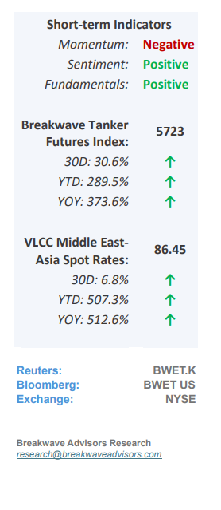
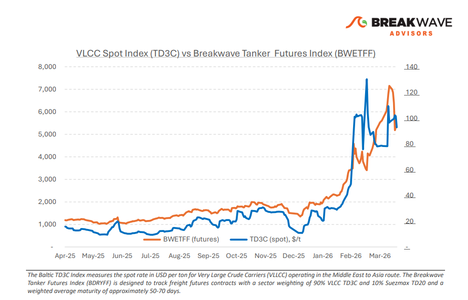
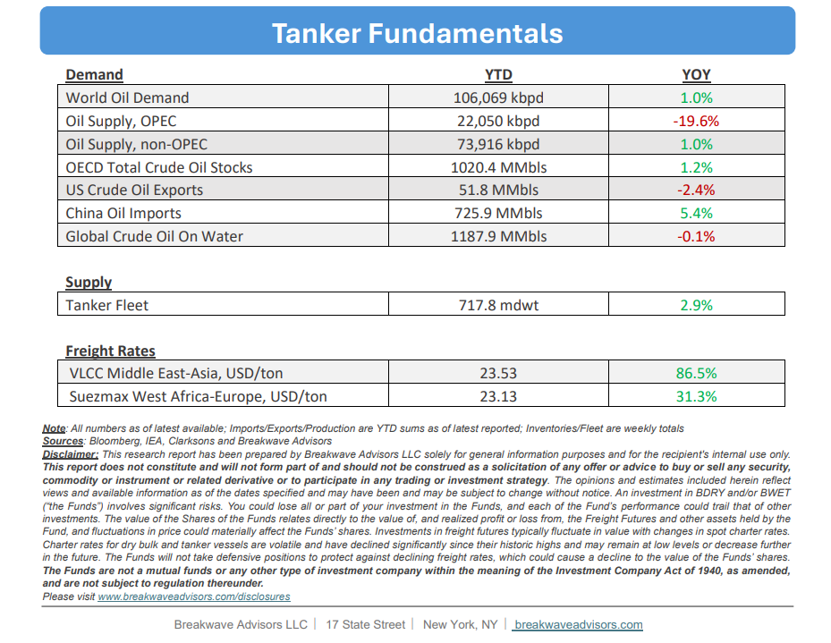

# Breakwave Bi-Weekly Tanker Report - April 21, 2026

**Date:** April 21, 2026  
**Publisher:** Breakwave Advisors | **Category:** Market Insights  
**Original URL:** [https://www.breakwaveadvisors.com/insights/4212026wetreportapril11lkiu2026](https://www.breakwaveadvisors.com/insights/4212026wetreportapril11lkiu2026)  

---

•**Straits Still Shut as Negotiations Continue**– Headlines remain mixed and confidence in a near term resolution is fragile, keeping transit through the Strait of Hormuz effectively constrained. Against this backdrop, AG fixing remains largely stalled. While some enquiry persists, uncertainty around transit risk continues to limit participation and stems are slow to progress. The real impact is now being felt in the Atlantic. A surge in ballasters from the East has driven a sharp rebalancing, with VLCCs already the most exposed segment seeing an unprecedented shift in positioning. Ballasters into the Atlantic hit record levels in early April, pushing the West tonnage list to a one year high. This growing oversupply is now firmly weighing on freight. Freight indicators reflect this divergence. Rates on the West Africa to China and U.S. Gulf to China routes remain under pressure amid rising vessel availability, while the Middle East Gulf to China route is relatively firmer, still reflecting elevated month on month levels due to restricted access and ongoing geopolitical risk. The next 48 hours are likely to be decisive. A breakthrough potentially supported by broader participation in talks could extend the ceasefire and ease immediate transit concerns. However, current signals point to rising downside risk. Owners are reluctant to commit vessels through the Strait, while charterers continue to prioritize optionality. Even if a temporary resolution is achieved, the market has already shifted materially. A return to normalized conditions will depend on sustained confidence in safe transit, something that for now remains elusive.

> **Figure 1: Cea3cf84ceb9ceb3cebcceb9cf8ccf84cf85**  
> [Local Asset](file:///C:/Users/Dell/Github/Shipping/corpus/03-breakwave/insights/2026/assets/2026-04-21_4212026wetreportapril11lkiu2026_img_cea3cf84ceb9ceb3cebcceb9cf8ccf84cf85_d67d88a0a180.png)

•**We now Expect Oil Prices to Remain ~$100/bbl for the Rest of the Year**– Following a sustained period of diminished oil exports through the Strait of Hormuz, market indicators suggest a significant inventory drawdown throughout the summer months, likely reducing commercial stockpiles to critical levels and necessitating a sustained risk premium on global crude prices. Unlike previous instances of headline-driven volatility, this upward price adjustment is expected to be gradual and rooted primarily in tightening fundamentals rather than speculative reactions to geopolitical news. Given the protracted timeline required for inventory replenishment, a fundamental tightening of the market appears imminent, even in the event of a cessation of Middle Eastern hostilities, surpassing current market expectations. While the fluid nature of global events continues to shape near-term outlooks, the prevailing risks remain skewed toward the upside, particularly as the global economy demonstrates enhanced resilience to higher energy costs. Supported by rising disposable incomes and several years of suppressed pricing, developed markets are increasingly capable of absorbing a $100 per barrel threshold without triggering a substantial economic slowdown, suggesting that the broader impact on demand will be notably less severe than in historical cycles.

•**Our Long-term View**– The tanker market has been recovering from a long period of staggered rates as the growth in new vessel supply shrunk while oil demand remained elevated in line with the global economy. The recent rapid increase in freight rates has led to significant new vessel ordering, with the orderbook now standing at above average levels, and although in the near term such a supply/demand misbalance is small, we expect a meaningful negative balance to develop longer term leading to a potential downcycle.

> **Figure 2: Στιγμιότυπο Οθόνης 2026 04 20 225029**  
> [Local Asset](file:///C:/Users/Dell/Github/Shipping/corpus/03-breakwave/insights/2026/assets/2026-04-21_4212026wetreportapril11lkiu2026_img_cea3cf84ceb9ceb3cebcceb9cf8ccf84cf85_8a53610da334.png)

> **Figure 3: Στιγμιότυπο Οθόνης 2026 04 21 105727**  
> [Local Asset](file:///C:/Users/Dell/Github/Shipping/corpus/03-breakwave/insights/2026/assets/2026-04-21_4212026wetreportapril11lkiu2026_img_cea3cf84ceb9ceb3cebcceb9cf8ccf84cf85_69a9357b4b56.png)

### Subscribe:
