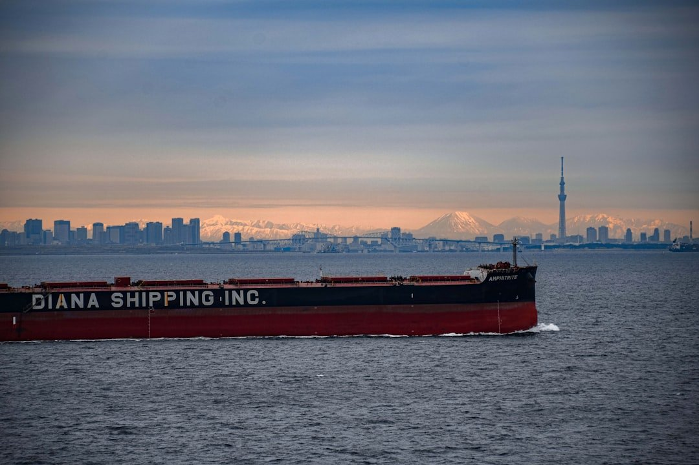

# The dry bulk sector is exhibiting a fundamentally different dynamic

**Date:** April 21, 2026  
**Publisher:** Breakwave Advisors | **Category:** Market Insights  
**Original URL:** [https://www.breakwaveadvisors.com/insights/2026/4/21/the-dry-bulk-sector-is-exhibiting-a-fundamentally-different-dynamic](https://www.breakwaveadvisors.com/insights/2026/4/21/the-dry-bulk-sector-is-exhibiting-a-fundamentally-different-dynamic)  

---

> **Figure 1: Byeirini Diamantara&dimitris Roumeliotis**  
> *ByEirini Diamantara&Dimitris Roumeliotis*  
> **Interactive Data & Source:** [Linkedin](https://www.linkedin.com/in/eirini-diamantara-58b269105/) | [Local Asset](file:///C:/Users/Dell/Github/Shipping/corpus/03-breakwave/insights/2026/assets/2026-04-21_the-dry-bulk-sector-is-exhibiting-a-fundamentally-different-dynamic_img_unsplash-image-7eqbnp3m_be8e30552186.jpg)

Even though Iran and the US formally agreed to keep the Strait of Hormuz open, the reality on the water tells a different story. Iranian forces have reasserted tight control over transit, while the ongoing US naval blockade continues to intercept and deter vessels, with ships being turned back or even seized during passage attempts . The result is a clear disconnect between political statements and operational reality: rather than a functioning corridor, the Strait remains effectively constrained, with both sides’ actions reinforcing a de facto closure despite the official narrative of reopening. What is particularly notable in the current environment is that, in contrast to the volatility seen in energy markets, the dry bulk sector is exhibiting a fundamentally different dynamic—one driven less by geopolitics and more by underlying demand resilience. The Baltic Dry Index’s climb to 2,484 points, marking nine consecutive daily gains and the highest level since December 2025, reflects more than just a cyclical rebound. It signals tightening conditions, especially in the Capesize segment, where strong Brazilian iron ore exports and firm Chinese demand are combining with constrained vessel availability to push rates higher. At the same time, the synchronized strengthening across all major indices reinforces the depth of this recovery, with the BDI reaching its highest level since 8/12/2025 (2,694 points), the BCI since 10/12/2025 (4,284 points), and the BSI since 09/12/2025 (1,419 points), highlighting a broad-based tightening across vessel classes rather than an isolated segment-driven rally.

China once again sits at the center of this recovery narrative. The 11% year-on-year increase in iron ore imports is reflected in total volumes rising from 345 million tonnes to 353.5 million tonnes, a +2.5% increase, further strengthening its already dominant position and lifting its share of global imports from 73.7% to 74.4%. On the supply side, Australia continues to lead, increasing exports from 258 million tonnes in 2025 to 267 million tonnes in 2026, a +3.5% rise, with its global share moving from 55.2% to 56.3%. Brazil followed with a more modest increase from 98 million to 98.4 million tonnes, broadly maintaining its 21% share. These figures confirm that the iron ore trade remains not only stable but structurally anchored, with incremental growth reinforcing existing trade patterns rather than reshaping them. Coal trade flows, however, reveal a more differentiated picture. Indonesia, the largest exporter, saw volumes decline sharply from 143 million tonnes to 132.8 million tonnes, a -7.1% drop, reducing its global share from 37.2% to 34.6%. In contrast, Australia increased exports from 90 million to 94.7 million tonnes, a +5.2% rise, lifting its share from 23.4% to 24.7%. On the demand side, China reduced imports significantly from 103 million tonnes to 88.3 million tonnes, a -14.3% contraction, lowering its share from 26.7% to 23%. India also recorded a decline from 74 million to 69.7 million tonnes (-5.8%), while Japan moved in the opposite direction, increasing imports from 42.4 million to 45.7 million tonnes (+7.8%), signaling stronger resilience in non-Chinese demand pockets.

Overall, the market appears to be transitioning into a more structurally driven phase. The easing, but not disappearance, of geopolitical risk provides some short-term visibility, yet it is the steady, differentiated growth in commodity flows, combined with tightening fleet dynamics, that is increasingly shaping a more resilient and fundamentally supported outlook for the dry bulk sector.

Data source:[Xclusiv Shipbrokers Inc.](https://www.linkedin.com/company/xclusiv-shipbrokers-inc/)

---

**Tags:** Drybulk, Shipping, Markets  
