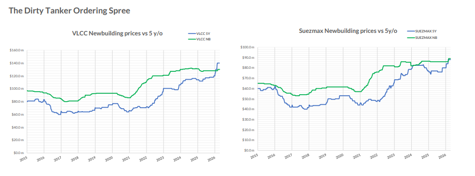

# US–Iran Negotiations and the Case for Crude Tanker Capacity

**Date:** April 22, 2026  
**Publisher:** Breakwave Advisors | **Category:** Market Insights  
**Original URL:** [https://www.breakwaveadvisors.com/insights/2026/4/22/usiran-negotiations-and-the-case-for-crude-tanker-capacity](https://www.breakwaveadvisors.com/insights/2026/4/22/usiran-negotiations-and-the-case-for-crude-tanker-capacity)  

---

As US–Iran nuclear negotiations move through their latest round, the shipping market is watching closely. A credible deal that reopens Iranian crude exports would add significant volume to global flows, but the route and insurance landscape would take time to normalise, and Hormuz-related risk is not about to disappear overnight. Against that backdrop, Allied QuantumSea Research has identified a clear new trend in newbuilding activity: owners are not waiting. They are placing orders now, concentrating firmly on large crude-carrying capacity, and accepting pricing that reflects the urgency of securing the right slots at the right yards.

The data behind this trend points to something more striking. For the first time in at least ten years, the market value of a five-year-old VLCC has surpassed the price of a newbuilding. In the Suezmax segment, the two are now almost equal. With the ordering spree seen in March now extending into April, the pressure this creates on newbuilding prices is real, and it is pointing upward.

> **Figure 1: Στιγμιότυπο Οθόνης 2026 04 22 135328**  
> **Interactive Data & Source:** [Allied-shipbroking](https://www.allied-shipbroking.gr/) | [Local Asset](file:///C:/Users/Dell/Github/Shipping/corpus/03-breakwave/insights/2026/assets/2026-04-22_usiran-negotiations-and-the-case-for-crude-tanker-capacity_img_cea3cf84ceb9ceb3cebcceb9cf8ccf84cf85_e7c4c27edb96.png)

Allied QuantumSea Research recorded 92 newbuilding contracts across dry bulk and tanker segments in March, comprising 67 tankers and 25 bulkers. Based on disclosed firm pricing, this equated to approximately $3.64bn of invested capital. More than 70% of that capital was directed toward VLCCs and Suezmaxes alone, a concentration that defines the month and sets the tone for what has followed.

Within tankers, Suezmaxes led in unit volume with 25 vessels, followed by 17 VLCCs. MRs contributed 18 units but accounted for only 2.5% of disclosed capital. Aframax was present at the margin. The financial weight of the month sat entirely with crude. VLCCs absorbed 38% of disclosed investment, Suezmaxes 33%—together, 71% of total capital.

### VLCC Orders by Value, Suezmax by Volume

VLCC orders were heavily concentrated in Chinese yards, both in unit count and capital. Suezmax orders were more evenly split, with China leading in units and South Korea in value. This contrast, Chinese yards dominating VLCC ordering volumes, Korean yards commanding the premium end of Suezmax, has held through March and into the April flow, where Mercuria and JP Morgan placed VLCC business at DSIC while Harry Vafias turned to Hanwha Ocean.

A notable share of VLCC and Suezmax contracts was described as scrubber-fitted, with some units carrying LNG-ready or ammonia-ready wording. Advantage's two LNG dual-fuel-ready VLCCs at DSIC are the clearest example. This momentum points to the trend that owners are not simply adding new units, but they are also investing in the green future of shipping, which also helps explain the pricing levels they are willing to accept.

### VLCC Ordering Spree Continues to April

Singapore-listed Yangzijiang Maritime Development (YZJ Maritime) has entered the VLCC market, ordering eight 319,000-dwt newbuildings at a large Chinese shipyard for delivery between 2028 and 2030. No price was disclosed, though industry sources estimate $123m–$125m per unit, or $985m–$1bn in total.

JP Morgan is believed to have made its debut in VLCC ownership, contracting two firm 307,000-dwt crude carriers with options for two more at DSIC, at approximately $123m each for 2029 delivery, following Swiss trader Mercuria and Turkey's Advantage Tankers into the same yard.

Mercuria has signed for up to four VLCCs and two LR2s at DSIC, also for 2029 delivery, at $123m and $75m respectively, a total of around $642m. The scrubber-fitted VLCCs represent a major commitment for a trader with no owned VLCCs currently in service. Mercuria also has a 300,000-dwt VLCC due from Shanghai Waigaoqiao in early 2028, ordered in 2024 at a reported $120m.

Advantage Tankers has broken with its tradition of ordering at South Korean yards, contracting two VLCCs at DSIC. Price has not emerged, though industry sources estimate $123m for a standard unit, with LNG dual-fuel capability adding $19m–$20m.

Harry Vafias' tanker arm Stealth Maritime has contracted two VLCC newbuildings at Hanwha Ocean, marking its return to the sector for the first time since 2008. The Okpo-based yard disclosed a contract for two VLCCs worth KRW 393.3bn ($261m), or $130.5m per vessel, identifying the buyer only as an Oceania-based owner.

### Takeaways

The dirty tanker market has delivered a concentrated and purposeful ordering surge. VLCCs and Suezmaxes defined March in capital terms and have continued to lead in April. Pricing shows clear structure, Chinese yards lower, Korean yards at a premium, and that structure is holding even as reported transaction levels push upward.

All eyes now turn to the Strait of Hormuz as the ceasefire reaches its expiry on April 22. With the truce on the brink, Iran reimposing control over the waterway, vessels coming under fire mid-passage, and the US naval blockade of Iranian ports still in place, the passage question for shipowners is anything but resolved. An estimated 230 loaded oil tankers remain waiting inside the Gulf. What happens after April 22 will define the next chapter, for crude flows, for freight markets, and for the owners who have just committed billions to VLCC and Suezmax capacity.

Data Source:[Allied](https://www.allied-shipbroking.gr/)

---

**Tags:** Markers, Geopolitics, Shipping  
