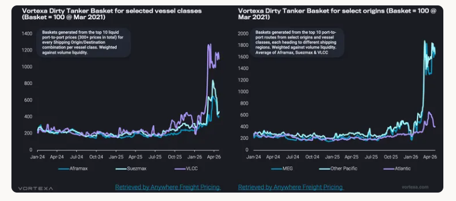
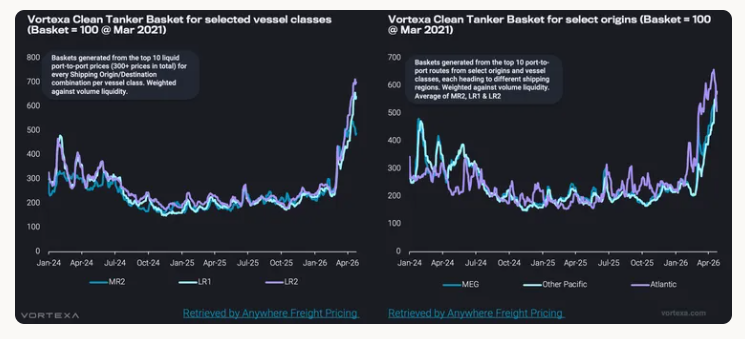

# Tanker freight behaviour diverges after the conflict shock

**Date:** April 27, 2026  
**Publisher:** Breakwave Advisors | **Category:** Market Insights  
**Original URL:** [https://www.breakwaveadvisors.com/insights/2026/4/27/tanker-freight-behaviour-diverges-after-the-conflict-shock](https://www.breakwaveadvisors.com/insights/2026/4/27/tanker-freight-behaviour-diverges-after-the-conflict-shock)  

---

Conflict risk lifted tanker freight sharply, but crude and clean markets have responded differently as Hormuz exposure reshaped pricing.

*By*[*Wanying Zhang*](https://www.linkedin.com/in/wanying-zhang/)

The conflict has triggered a sharp repricing across tanker freight, but the response has not been uniform. Crude and clean tankers both rallied as disruption risk centred on the Middle East Gulf forced charterers and owners to reassess exposure to the Strait of Hormuz.

However, the underlying drivers are now diverging. Dirty freight is increasingly showing the characteristics of a disruption led rally that is becoming more selective, while clean freight continues to look more structurally supported by tighter effective vessel supply and a deeper reshuffling of trade flows.

## Crude Rally Fragments As Atlantic Tonnage Rebuilds

> **Figure 1: Στιγμιότυπο Οθόνης 2026 04 27 103035**  
> **Interactive Data & Source:** [Analytics Vortexa](https://analytics.vortexa.com/FleetDistribution?dateRange=2025-04-01T00%3A00%3A00.000Z__2026-04-22T23%3A59%3A59.999Z&filtersEnabled=%5B%22l%22%2C%22v%22%2C%22l_c%22%2C%22o%22%2C%22d%22%2C%22v_v_st%22%2C%22v_f%22%2C%22v_o%22%2C%22v_c%22%2C%22v_a%22%2C%22d_r%22%5D&location=%5B%22b18ac6665f23d0eaca2015d3e7924f668f606b26489ae055ec4e7916dfd8cc03%22%2C%222d91e099e0a197afc110e4d642a60384f410327eab54755d57730f737efd70e1%22%2C%2267be333ea46a3cd312e207b05e2c5c4502a9353e39ec81642a93e3b23cc3c10a%22%5D&page=FleetDistribution&tabId=902380a1-4268-41b8-84ef-653092e5787b&to=%5B%2267be333ea46a3cd312e207b05e2c5c4502a9353e39ec81642a93e3b23cc3c10a%22%5D&v=3&vesselClasses=%5B%22oil_vlcc%22%5D&voyageStatus=%5B%22ballast%22%5D) | [Local Asset](file:///C:/Users/Dell/Github/Shipping/corpus/03-breakwave/insights/2026/assets/2026-04-27_tanker-freight-behaviour-diverges-after-the-conflict-shock_img_cea3cf84ceb9ceb3cebcceb9cf8ccf84cf85_6a918d4d8aa8.png)

Crude tanker freight reacted first and most aggressively. The VLCC market was the natural focal point, given its central role in lifting mainstream crude exports from the Middle East Gulf. As geopolitical risk intensified, owners priced in a stronger risk premium and charterers moved quickly to secure Gulf cargoes. This created a sharp repricing in Middle East Gulf linked earnings, with VLCCs bearing the most direct impact from any perceived threat to Hormuz transits.

That strength then spilled into Suezmax and Aframax markets. Buyers and traders seeking replacement crude cargoes turned increasingly to the Atlantic basin, lifting demand for smaller crude tankers. Elevated time spreads also reinforced the need for prompt loaders, while limited VLCC availability encouraged some charterers to split stems or secure smaller parcels on Suezmaxes and Aframaxes. In effect, disruption at the top of the crude tanker market cascaded down the fleet, tightening availability and pushing dirty freight higher across vessel classes.

However, that support on rates for Suezmax and Aframax was short lived. Suezmax and Aframax rates have already corrected back towards pre conflict levels, exposing the limits of the initial rally. Once the first wave of urgent fixing passed, demand for smaller crude tankers softened. At the same time, Atlantic basin availability loosened as more ships ballasted into the region in search of employment. LR2s switching into dirty trading added further competition at the margin, increasing the supply of Aframax equivalent tonnage. The result is that the earlier tightness in smaller crude tanker segments has faded quickly, leaving rates vulnerable to correction.

The crude tanker basket shows a clear regional split in how freight has priced. The strongest gains are concentrated on routes loading from the Middle East Gulf and Pacific, where freight continues to carry a clear risk premium linked to Hormuz uncertainty, potential delays and tighter forward availability. Atlantic originated crude freight has edged higher, but the increase has been marginal compared with the stronger repricing seen out of the Middle East Gulf. Demand for alternative Atlantic barrels has offered some support, but this has been largely absorbed by a sizeable build in ballast tonnage. With more[VLCCs repositioning towards Atlantic](https://analytics.vortexa.com/FleetDistribution?dateRange=2025-04-01T00%3A00%3A00.000Z__2026-04-22T23%3A59%3A59.999Z&filtersEnabled=%5B%22l%22%2C%22v%22%2C%22l_c%22%2C%22o%22%2C%22d%22%2C%22v_v_st%22%2C%22v_f%22%2C%22v_o%22%2C%22v_c%22%2C%22v_a%22%2C%22d_r%22%5D&location=%5B%22b18ac6665f23d0eaca2015d3e7924f668f606b26489ae055ec4e7916dfd8cc03%22%2C%222d91e099e0a197afc110e4d642a60384f410327eab54755d57730f737efd70e1%22%2C%2267be333ea46a3cd312e207b05e2c5c4502a9353e39ec81642a93e3b23cc3c10a%22%5D&page=FleetDistribution&tabId=902380a1-4268-41b8-84ef-653092e5787b&to=%5B%2267be333ea46a3cd312e207b05e2c5c4502a9353e39ec81642a93e3b23cc3c10a%22%5D&v=3&vesselClasses=%5B%22oil_vlcc%22%5D&voyageStatus=%5B%22ballast%22%5D)employment, vessel availability has improved in the basin, limiting owners’ ability to push rates meaningfully higher.

## Clean Freight Stays Resilient As Longer Haul Employment Tightens Supply

> **Figure 2: Στιγμιότυπο Οθόνης 2026 04 27 103046**  
> **Interactive Data & Source:** [Analytics Vortexa](https://analytics.vortexa.com/VoyagesFlows?filtersEnabled=%5B%22v_v_st%22%2C%22v%22%2C%22l_c%22%2C%22o%22%2C%22d%22%2C%22v_or%22%2C%22v_de%22%2C%22d_r%22%2C%22intra_d%22%2C%22v_a%22%2C%22v_r%22%2C%22v_cg_st%22%2C%22l%22%2C%22v_l_st%22%2C%22v_co_st%22%5D&location=%5B%22715b6aab56723cb55c3ddbdc12a2851b379919010f119cf98765d4debbdb793d%22%5D&locationStatusExcluded=%5B%22berth%22%5D&page=VoyagesFlows&sortOrder=start_date&tabId=be28de2d-c215-4f6c-ab47-8f8bbca95da5&timeSeriesBreakdown=vessel-class-coarse&timeSeriesFrequency=day&to=%5B%2267be333ea46a3cd312e207b05e2c5c4502a9353e39ec81642a93e3b23cc3c10a%22%5D&tsAnalysisSeasonalEnabled=0&tsSeasonalYearMin=2017&vesselClasses=%5B%22oil_handymax_mr2%22%2C%22oil_panamax_lr1%22%2C%22oil_aframax_lr2%22%5D&voyageFrom=%5B%22715b6aab56723cb55c3ddbdc12a2851b379919010f119cf98765d4debbdb793d%22%5D&voyageStatus=%5B%22ballast%22%5D) | [Local Asset](file:///C:/Users/Dell/Github/Shipping/corpus/03-breakwave/insights/2026/assets/2026-04-27_tanker-freight-behaviour-diverges-after-the-conflict-shock_img_cea3cf84ceb9ceb3cebcceb9cf8ccf84cf85_8a004ce70bc0.png)

Clean freight has followed a different trajectory. Rates have also moved sharply higher across vessel classes, but unlike crude freight, the clean market has shown far less correction. The key difference is that clean tanker strength is not being sustained by disruption risk alone. It is being reinforced by a more structural tightening in effective vessel availability.

The clean market has seen a major shift in fleet deployment. Record ballast repositioning of[MRs, LR1s and LR2s from the Pacific into the Atlantic](https://analytics.vortexa.com/VoyagesFlows?filtersEnabled=%5B%22v_v_st%22%2C%22v%22%2C%22l_c%22%2C%22o%22%2C%22d%22%2C%22v_or%22%2C%22v_de%22%2C%22d_r%22%2C%22intra_d%22%2C%22v_a%22%2C%22v_r%22%2C%22v_cg_st%22%2C%22l%22%2C%22v_l_st%22%2C%22v_co_st%22%5D&location=%5B%22715b6aab56723cb55c3ddbdc12a2851b379919010f119cf98765d4debbdb793d%22%5D&locationStatusExcluded=%5B%22berth%22%5D&page=VoyagesFlows&sortOrder=start_date&tabId=be28de2d-c215-4f6c-ab47-8f8bbca95da5&timeSeriesBreakdown=vessel-class-coarse&timeSeriesFrequency=day&to=%5B%2267be333ea46a3cd312e207b05e2c5c4502a9353e39ec81642a93e3b23cc3c10a%22%5D&tsAnalysisSeasonalEnabled=0&tsSeasonalYearMin=2017&vesselClasses=%5B%22oil_handymax_mr2%22%2C%22oil_panamax_lr1%22%2C%22oil_aframax_lr2%22%5D&voyageFrom=%5B%22715b6aab56723cb55c3ddbdc12a2851b379919010f119cf98765d4debbdb793d%22%5D&voyageStatus=%5B%22ballast%22%5D)reflects a clear reallocation of employment. As Asian refiners cut runs and Pacific clean demand weakens, owners have increasingly looked towards the Atlantic basin, where product tanker fundamentals remain stronger. The US Gulf becomes more important sources of long haul product exports, drawing more tonnage into employment that keeps vessels occupied for longer.

Clean tanker availability has also been tightened by[LR2s switching into dirty trading](https://analytics.vortexa.com/FleetDistribution?dateRange=2022-10-01T00%3A00%3A00.000Z__2026-04-22T23%3A59%3A59.999Z&filtersEnabled=%5B%22l%22%2C%22v%22%2C%22l_c%22%2C%22o%22%2C%22d%22%2C%22v_v_st%22%2C%22v_f%22%2C%22v_o%22%2C%22v_c%22%2C%22d_r%22%5D&hiddenSeries=%5B%22laden%22%2C%22ballast%22%5D&latestProducts=%5B%2254af755a090118dcf9b0724c9a4e9f14745c26165385ffa7f1445bc768f06f11%22%2C%225de0b00094e0fd7542c10f9f8a71b4008d55750f21dc905cda9b0f7f5f76bc08%22%5D&latestProductsExcluded=%5B%22b68cbb746f8b9098c50e2ba36bcad83001a53bd362e9031fb49085d02c36659c%22%5D&page=FleetDistribution&tabId=f018f085-ca2e-47d8-a127-17ecd2098ecd&v=3&vesselClasses=%5B%22oil_lr2%22%5D&voyageStatus=%5B%22laden%22%2C%22ballast%22%5D). That crossover reduced the supply of coated tonnage available for clean cargoes just as long haul product flows were increasing fleet utilisation. However, the incentive for further LR2 switching is now weaker, as LR2 clean earnings have moved above Aframax returns. However, this does not materially undermine the clean freight outlook. On longer routes, larger clean tankers retain a clear cost advantage through economies of scale. As long as Atlantic basin exports remain firm and long haul replacement demand continues, LR2s should remain commercially attractive in clean trading. The market may see less incremental switching into dirty, but the earlier loss of coated tonnage has already tightened the supply base.

A regional breakdown in clean tankers shows a different pattern from crude. Both Pacific and Atlantic originated freight moved higher, but the Atlantic was the early outperformer, supported by a stronger concentration of replacement product demand as buyers turned to the US Gulf for barrels away from the Middle East Gulf. Combined with longer haul employment out of the US Gulf and Europe, this tightened effective vessel availability and pushed Atlantic earnings above Pacific levels for a period. More recently, however, that outperformance has started to unwind. The earlier rally drew in additional tonnage, while softer enquiry began to ease the tightness that had underpinned the basin. With Pacific freight still supported by lingering Hormuz related risk, the spread has narrowed and in some cases reversed.

## Reopening Hormuz May Ease Risk, But Not Reset Freight

For crude tankers, particularly VLCCs, a recovery in Strait of Hormuz transits would bring cargoes back into a market where the tonnage is available, but not necessarily easy to secure. Total non sanctioned VLCC ballast is around[26% above the pre conflict average](https://analytics.vortexa.com/FleetDistribution?dateRange=2023-01-01T00%3A00%3A00.000Z__2026-04-20T23%3A59%3A59.999Z&filtersEnabled=%5B%22l%22%2C%22v%22%2C%22l_c%22%2C%22o%22%2C%22d%22%2C%22v_v_st%22%2C%22v_f%22%2C%22v_o%22%2C%22v_c%22%2C%22v_a%22%2C%22d_r%22%2C%22v_r%22%5D&hiddenSeries=%5B%22total%22%5D&page=FleetDistribution&tabId=6d6786fd-2c6f-4237-8b24-f893d33132a6&v=3&vesselClasses=%5B%22oil_vlcc%22%5D&vesselRiskLevelExcluded=%5B%22sanctioned%22%5D&voyageStatus=%5B%22ballast%22%5D), suggesting there is enough vessel supply in the system to absorb a return of Middle East Gulf crude volumes. However, much of the[available tonnage](https://analytics.vortexa.com/Map?latestProducts=%5B%2254af755a090118dcf9b0724c9a4e9f14745c26165385ffa7f1445bc768f06f11%22%5D&location=%5B%22b18ac6665f23d0eaca2015d3e7924f668f606b26489ae055ec4e7916dfd8cc03%22%2C%22707da622480cd2158abeb3c2803f7f848d46fdc1357c2fdca974a56ed38d52a2%22%5D&metric=t&page=Map&tabId=9905f624-0cb4-4836-ae5f-1b471fde7505&toExcluded=%5B%226ac49669e238276d51719480fddfee2e18cf265f43678ed995071d363ee943f5%22%2C%222d92cc08f22524dba59f6a7e340f132a9da0ce9573cca968eb8e3752ef17a963%22%5D&v=3&vesselClasses=%5B%22oil_vlcc%22%5D&view=table&voyageStatus=%5B%22ballast%22%5D)is controlled by a relatively concentrated group of owners, which gives them greater control over how quickly vessels are released into the market. If cargo availability improves, that concentration can help owners resist downward pressure on rates, keeping freight supported even without an outright shortage of ships.

The clean market appears more resilient because the supply cushion is much thinner. Total non sanctioned LR ballast is only around[11% above the pre conflict average](https://analytics.vortexa.com/FleetDistribution?coatingToggle=inc&dateRange=2023-01-01T00%3A00%3A00.000Z__2026-04-22T23%3A59%3A59.999Z&filtersEnabled=%5B%22l%22%2C%22v%22%2C%22l_c%22%2C%22o%22%2C%22d%22%2C%22v_v_st%22%2C%22v_f%22%2C%22v_o%22%2C%22v_c%22%2C%22v_a%22%2C%22d_r%22%2C%22v_r%22%5D&hiddenSeries=%5B%22total%22%5D&latestProducts=%5B%22b68cbb746f8b9098c50e2ba36bcad83001a53bd362e9031fb49085d02c36659c%22%5D&page=FleetDistribution&tabId=ab173d2f-1069-47dd-a944-82b20560108f&v=3&vesselClasses=%5B%22oil_panamax_lr1%22%2C%22oil_aframax_lr2%22%5D&vesselRiskLevelExcluded=%5B%22sanctioned%22%5D&voyageStatus=%5B%22ballast%22%5D), compared with a much larger buffer in VLCCs. More importantly, LR ballast in the Pacific remains around[18% below pre conflict levels](https://analytics.vortexa.com/FleetDistribution?coatingToggle=inc&dateRange=2023-01-01T00%3A00%3A00.000Z__2026-04-22T23%3A59%3A59.999Z&filtersEnabled=%5B%22l%22%2C%22v%22%2C%22l_c%22%2C%22o%22%2C%22d%22%2C%22v_v_st%22%2C%22v_f%22%2C%22v_o%22%2C%22v_c%22%2C%22v_a%22%2C%22d_r%22%2C%22v_r%22%5D&hiddenSeries=%5B%22total%22%5D&latestProducts=%5B%22b68cbb746f8b9098c50e2ba36bcad83001a53bd362e9031fb49085d02c36659c%22%5D&location=%5B%225600764fc92f8cce630f3994e7af4d900945d54b29f6e4a07fde0c5e17f7d738%22%2C%22707da622480cd2158abeb3c2803f7f848d46fdc1357c2fdca974a56ed38d52a2%22%2C%22c56bf8ab81234d14aa80e726005799856278c3e6d25840a4af612c73327816d0%22%2C%22b18ac6665f23d0eaca2015d3e7924f668f606b26489ae055ec4e7916dfd8cc03%22%2C%22734f9879cc670d61403e6ae75ebdfe08e198041617aeb5623991148fd45943b4%22%5D&page=FleetDistribution&tabId=f467aef0-effa-4bfb-b28e-370a5874a8e8&v=3&vesselClasses=%5B%22oil_aframax_lr2%22%2C%22oil_panamax_lr1%22%5D&vesselRiskLevelExcluded=%5B%22sanctioned%22%5D&voyageStatus=%5B%22ballast%22%5D), leaving the region short of readily available tonnage if Gulf product flows recover. This means that even if a reopening of Hormuz removes part of the risk premium, clean freight is unlikely to correct sharply. With Pacific LR availability still tight and Atlantic employment continuing to absorb tonnage, the clean market would remain supported.

Data Source:[Vortexa](https://www.vortexa.com//oil-gas-data-traders-analysts-data-scientists?gclid=Cj0KCQjw8_qRBhCXARIsAE2AtRZKOvMnbilZ_6_91d7huSFFy71pWLrnPwGwOHVzXsmsG-1a1mZnQw8aAt89EALw_wcB&hsa_acc=1782073842&hsa_ad=548425387665&hsa_cam=14746637662&hsa_grp=125038601902&hsa_kw=&hsa_mt=&hsa_net=adwords&hsa_src=g&hsa_tgt=dsa-1431852288425&hsa_ver=3&utm_campaign=%5BCD%5D%20-%20DSA%20-%20EMEA&utm_medium=cpc&utm_medium=ppc&utm_source=google&utm_source=adwords&utm_term=)

---

**Tags:** Shipping, Crude, Markets  
