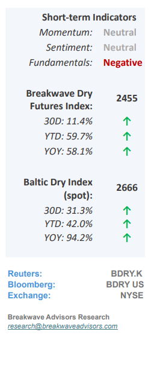
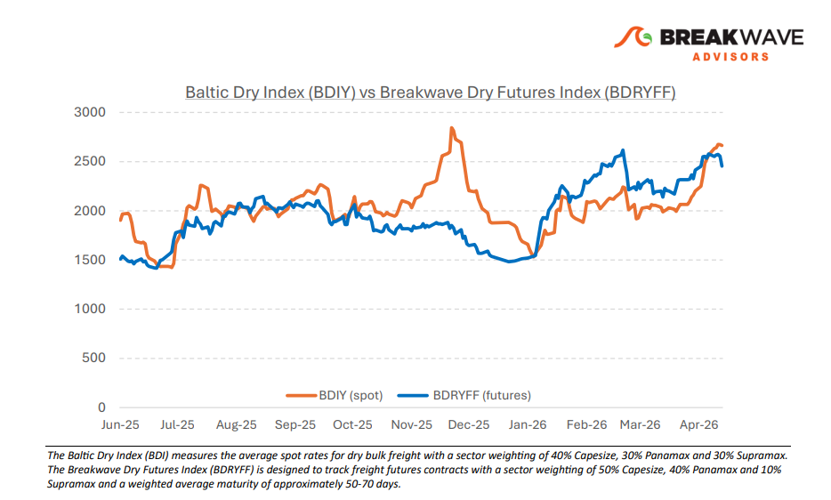
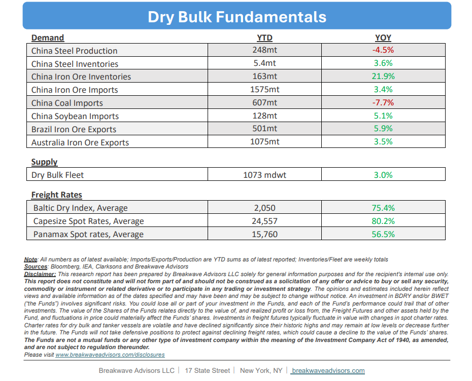

# Breakwave Bi-Weekly Dry Bulk Report - April 28, 2026

**Date:** April 28, 2026  
**Publisher:** Breakwave Advisors | **Category:** Market Insights  
**Original URL:** [https://www.breakwaveadvisors.com/insights/4282026db-report2026april28987](https://www.breakwaveadvisors.com/insights/4282026db-report2026april28987)  

---

•**Capesize Spot Rate Volatility Collapses to Multi-year Lows –**Despite maintaining healthy absolute price levels across all asset classes, the dry bulk shipping sector, historically one of the most volatile commodity markets, is currently experiencing a**significant collapse in volatility**to levels not seen since 2018. Mirroring the behavior of iron ore, which has traded within an unusually tight range for over a year now, dry bulk spot rates and freight futures have lost the characteristic "spark" of outsized daily movements. This period of**relative tranquility**is particularly striking given the backdrop of an unprecedented global energy shock and extreme volatility in neighboring tanker markets. We attribute this uncharacteristic stability primarily to a**highly evolved freight futures market**, where**well-hedged**participant portfolios have established an equilibrium that currently dominates market sentiment through year-end. However, we believe that this perceived isolation from broader macroeconomic forces is misleading: economic risks are currently at their highest since the pandemic, particularly as emerging markets and vulnerable Asian economies face an impending shock. While the dry bulk market remains deceptively calm,**we do not share the prevailing optimism**that the sector can remain insulated from these intensifying global economic headwinds**despite misleading commodity price****signals**that mainly have to do with supply issues rather than promising demand.

> **Figure 1: Cea3cf84ceb9ceb3cebcceb9cf8ccf84cf85**  
> [Local Asset](file:///C:/Users/Dell/Github/Shipping/corpus/03-breakwave/insights/2026/assets/2026-04-28_4282026db-report2026april28987_img_cea3cf84ceb9ceb3cebcceb9cf8ccf84cf85_94556fbec277.png)

•**Macro Risks Dominate, We Now Expect a Significant 2H Asia Slowdown**– The current**unprecedented oil supply crisis**has yet to manifest fully within the real economy; however, its impending impact suggests a period of significant volatility and decelerating growth across several global regions. While the United States remains relatively insulated due to its robust technology sector, reduced reliance on energy imports, and comprehensive domestic oil infrastructure,**Asian economies**—excluding China— are increasingly**vulnerable**to a substantial economic shock that could precipitate an outright recession. China maintains a degree of isolation through its vast strategic reserves and proactive export bans on oil products designed to prioritize domestic stability. Conversely, Europe is expected to face considerable headwinds from elevated energy costs, likely resulting in stagnant economic growth. This**broader slowdown is particularly concerning**for the dry bulk shipping sector, as the anticipated growth in iron ore demand within nonChinese Asian markets was expected to drive overall performance this year especially given the anticipated negative contribution from coal trade. Given these factors, we**maintain a cautious outlook**on demand growth for economically sensitive dry bulk shipping in the second half of the year. We caution against extrapolating current high spot rates into the future, as the freight futures market may be overestimating their resilience in the face of cooling global demand.

•**Our Long-term View**– The last few years have been characterized by increased geopolitical uncertainty. Going forward, we expect such events to continue to affect global trade and have a meaningful impact on effective vessel supply. Combined with the potential for a multi-year cyclical rebound in China’s economic activity following the recent economic turmoil, dry bulk shipping should experience higher volatility on top of a secular tightness driven by stable bulk commodity demand and rather steady fleet growth.

> **Figure 2: Στιγμιότυπο Οθόνης 2026 04 28 093630**  
> [Local Asset](file:///C:/Users/Dell/Github/Shipping/corpus/03-breakwave/insights/2026/assets/2026-04-28_4282026db-report2026april28987_img_cea3cf84ceb9ceb3cebcceb9cf8ccf84cf85_1d4175ae2592.png)

> **Figure 3: Στιγμιότυπο Οθόνης 2026 04 28 111903**  
> [Local Asset](file:///C:/Users/Dell/Github/Shipping/corpus/03-breakwave/insights/2026/assets/2026-04-28_4282026db-report2026april28987_img_cea3cf84ceb9ceb3cebcceb9cf8ccf84cf85_f8303da8d16e.png)

### Subscribe:
