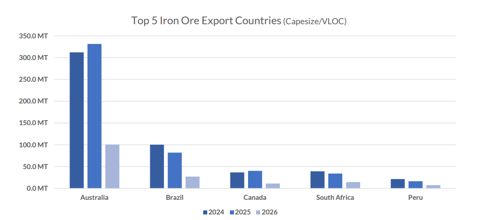
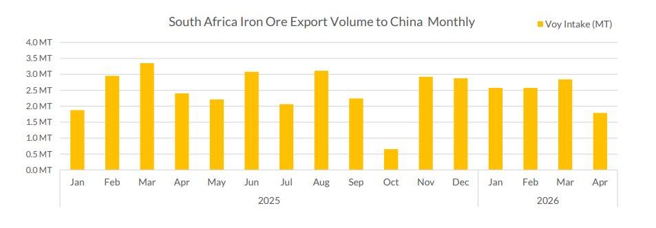

# The Simandou Effect — The Story So Far

**Date:** April 29, 2026  
**Publisher:** Breakwave Advisors | **Category:** Market Insights  
**Original URL:** [https://www.breakwaveadvisors.com/insights/2026/4/29/the-simandou-effect-the-story-so-far](https://www.breakwaveadvisors.com/insights/2026/4/29/the-simandou-effect-the-story-so-far)  

---

This edition of Allied Quantumsea Research tracks the evolution of iron ore market dynamics since Simandou first moved from prospect to reality in late 2025. The first commercial shipment of iron ore from Guinea’s Simandou deposit departed for China in early December 2025, marking the start of a significant shift in global raw material supply for steel production. The inaugural cargo arrived at Majishan port in Zhejiang province on January 17, 2026, after a 46-day voyage from Guinea, carrying approximately 200,000 metric tons of iron ore at 65% iron content.

> **Figure 1: Στιγμιότυπο Οθόνης 2026 04 29 104406**  
> **Interactive Data & Source:** [Allied-shipbroking](https://www.allied-shipbroking.gr/) | [Local Asset](file:///C:/Users/Dell/Github/Shipping/corpus/03-breakwave/insights/2026/assets/2026-04-29_the-simandou-effect-the-story-so-far_img_cea3cf84ceb9ceb3cebcceb9cf8ccf84cf85_c7f81dfdc964.png)

### February Setback: The Fatal Accident & Production Halt

On February 14, 2026, Rio Tinto suspended production at its Simandou iron ore mine in Guinea following the death of a contractor at the SimFer site. Operations were halted for one month to allow for investigations, counselling, and ongoing support. The incident was a sobering reminder that the ramp-up, barely underway, was already being tested by operational realities. Despite the setback, Rio Tinto’s overall targets remain unchanged: 5–6 million tonnes of ore from Simandou in 2026, scaling to 60 million tonnes per year by 2028.

### March: Shipments Pick Up Despite Setback

By early March, the market was watching cumulative volumes closely. Rio Tinto had loaded a fifth cargo from Simandou, bringing total shipments to around 1 million tonnes. A sixth vessel was loading at Morebaya port and a seventh was on its way. The vessels that had departed by that point were: the Winning Youth (Dec 2), the Great Sui (Dec 20), the Winning Spirit (Jan 13), the Heng Sheng (Jan 27), and the RTM Cartier (Feb 5).

Also in March: Guinea's National Transitional Council adopted two key laws under the Simandou 2040 socio-economic development program: a Planning Law (2026–2040) and Program Law (2026–2030), creating a legal framework for public investment around the Simandou corridor. The initiative includes 122 megaprojects and 36 reforms expected to mobilize more than $200 billion in investment over 15 years.

March also brought news from a wider African supply picture. On March 26, 2026, the DRC signed a memorandum of understanding with China, listing the MIFOR iron ore project as a flagship with priority support. The mine is estimated to hold 15–20 billion tonnes of resources at over 60% grade — roughly 2.5 times the scale of Simandou, with an initial annual production target of 50 million tonnes.

### April: Simfer's First Full Shipment & Rio Q1 Results

SimFer shipped 600,000 tonnes to China during Q1, with first sales realised in April 2026. As of end-Q1, 2.1 million tonnes of crushed ore had been stockpiled at the mine gate ready for loading, with ore being crushed using temporary crushing facilities. First ore through permanent crushing facilities is expected in the second half of 2026.

Rio Tinto’s Q1 2026 production report (released April 20) confirmed the first full SimFer shipment of high-grade Simandou product was successfully delivered to China. Pilbara iron ore also performed strongly, achieving its second-highest Q1 production since 2018, though tropical cyclones disrupted Pilbara shipments by approximately 8 million tonnes, with around half expected to be recovered. By late April, Simandou’s shipment pace was accelerating: Kallanish reported on April 22 that, since the first ore shipment in late November 2025, Morebaya port had cumulatively shipped nearly 1.6 million tonnes as of end-Q1 2026.

### What’s Next

Simandou is expected to export around 16 million tonnes in 2026, with volumes rising progressively thereafter. The ramp-up is likely to be uneven, however, with infrastructure bottlenecks and logistical complexities driving a phased and non-linear increase in output. For now, Simandou cannot yet displace Australian or Brazilian market share in China at a level that would significantly move global tonne-miles. The near-term competitive pressure is more likely to fall on Australia: Beijing maintains closer long-term alignment with Brazil through the BRICS framework, while Canberra sits more firmly in the US orbit.

Although Simandou offers a significant pillar in the Capesize freight market, the prospects there are shadowed by the challenges for the Chinese seaborne iron ore market already softened into early 2026, with sentiment turning more cautious as elevated portside inventories weigh on spot activity. While imports rose during the traditional pre-lunar new year restocking cycle, the build-up in port stocks has dampened near-term buying interest and restocking has largely been completed.

### All Eyes on African Iron Ore Shipments to China

> **Figure 2: Στιγμιότυπο Οθόνης 2026 04 29 104516**  
> **Interactive Data & Source:** [Allied-shipbroking](https://www.allied-shipbroking.gr/) | [Local Asset](file:///C:/Users/Dell/Github/Shipping/corpus/03-breakwave/insights/2026/assets/2026-04-29_the-simandou-effect-the-story-so-far_img_cea3cf84ceb9ceb3cebcceb9cf8ccf84cf85_018b40f3d2e7.png)

Initial volumes will be modest, but the growth trajectory could be significant. Australia is not going anywhere as China's dominant iron ore supplier, yet the arrival of credible alternatives will fundamentally shift the commercial dynamic, giving Chinese buyers a stronger hand at the negotiating table than they have had in years.

The more immediate concern is what happens to Chinese iron ore import demand in the near term. After setting a fresh record in 2025, imports are expected to pull back this year as steel production weakens and domestic demand remains subdued, before finding their footing again in 2027. The range of outcomes around this base case, however, is wide.

The wildcard remains China’s own iron ore sector. Beijing’s ambition to grow domestic output and cut import dependence has repeatedly run into operational reality: production slipped to 983.7 million tonnes in 2025, nearly 6% below the prior year. We see no catalyst for a reversal in 2026 and forecast output falling further to around 950 million tonnes, squeezed by grade deterioration and the difficulty of competing against competitively priced seaborne material. Until crude steel production shows a genuine recovery, domestic mine output will set the tone for where iron ore prices move from here.

Data Source:[Allied](https://www.allied-shipbroking.gr/)

---

**Tags:** Drybulk, Shipping, Markets  
