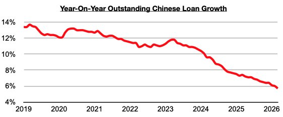
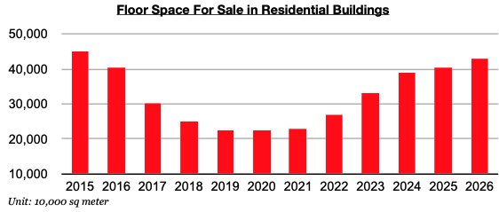
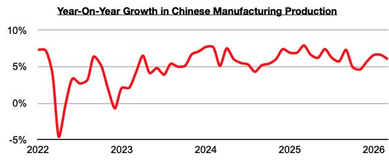

# Outstanding Loan Growth in China Hits Another New Low

**Date:** April 30, 2026  
**Publisher:** Breakwave Advisors | **Category:** Market Insights  
**Original URL:** [https://www.breakwaveadvisors.com/insights/2026/4/30/outstanding-loan-growth-in-china-hits-another-new-low](https://www.breakwaveadvisors.com/insights/2026/4/30/outstanding-loan-growth-in-china-hits-another-new-low)  

---

*By*[*Jeffrey Landsberg*](https://www.linkedin.com/in/jeffrey-landsberg-70ab957/)

As we discussed in Commodore Research's most recent Weekly China Report, outstanding loan growth in China in March fell to 5.7%. This has marked yet another record low.

> **Figure 1: Chart 1**  
> [Local Asset](file:///C:/Users/Dell/Github/Shipping/corpus/03-breakwave/insights/2026/assets/2026-04-30_outstanding-loan-growth-in-china-hits-another-new-low_img_chart1_789d3dade4b2.jpg)

As we have discussed often in our work, with China's housing market remaining inundated with a huge amount of excess supply already available, Chinese banks are continuing to have difficulty in actually having lendees to lend to in the construction market.

> **Figure 2: Chart 2**  
> [Local Asset](file:///C:/Users/Dell/Github/Shipping/corpus/03-breakwave/insights/2026/assets/2026-04-30_outstanding-loan-growth-in-china-hits-another-new-low_img_chart2_90af880431f3.jpg)

As we have also discussed often, manufacturing production (which is less capital intensive and requires less lending than construction) has fared better and continues to help support China’s steel market and offset the weakness in demand/construction for new homes. China’s manufacturing production most recently grew year-on-year by 6%.

> **Figure 3: Chart 3**  
> [Local Asset](file:///C:/Users/Dell/Github/Shipping/corpus/03-breakwave/insights/2026/assets/2026-04-30_outstanding-loan-growth-in-china-hits-another-new-low_img_chart3_667b08f203f4.jpg)

---

**Tags:** Markets, China, Economy  
