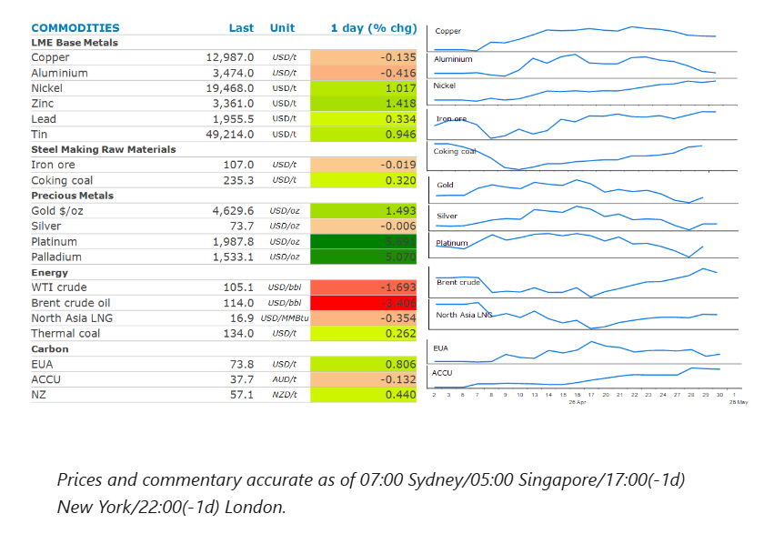
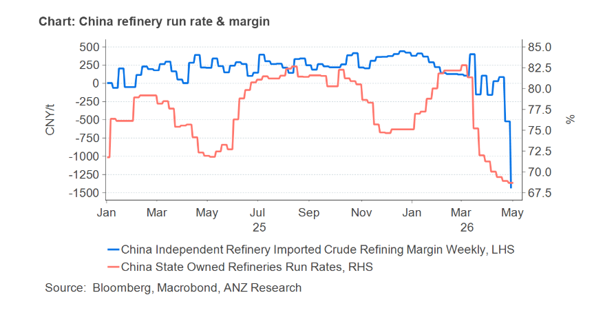

# Oil's rally takes a pause as Hormuz stalemate persists

**Date:** May 01, 2026  
**Publisher:** Breakwave Advisors | **Category:** Market Insights  
**Original URL:** [https://www.breakwaveadvisors.com/insights/2026/5/1/oils-rally-takes-a-pause-as-hormuz-stalemate-persists](https://www.breakwaveadvisors.com/insights/2026/5/1/oils-rally-takes-a-pause-as-hormuz-stalemate-persists)  

---

*By*[*Daniel Hynes*](https://www.linkedin.com/in/dahynes/)

Energy markets were unchanged. Industrial metals were steady despite positive economic data in China. Precious metals gained amid a softer USD.

> **Figure 1: Στιγμιότυπο Οθόνης 2026 05 01 110620**  
> **Interactive Data & Source:** [Linkedin](https://www.linkedin.com/newsletters/commodities-wrap-6692196755876012032/?fbclid=IwAR3kiXJqZdxmp9ZcRwBNI7FsBySI-XSC0pfPur1qzjt7OZp7PTE59Tsl1QI) | [Local Asset](file:///C:/Users/Dell/Github/Shipping/corpus/03-breakwave/insights/2026/assets/2026-05-01_oils-rally-takes-a-pause-as-hormuz-stalemate-persists_img_cea3cf84ceb9ceb3cebcceb9cf8ccf84cf85_7b21d60a5cef.png)

### Market Commentary

The rally in**crude oil**prices paused as the market contemplated a protracted conflict in the Middle East. Dated Brent, the benchmark for the spot physical market eased back below USD123/bbl, while front-month futures fell to USD114/bbl ahead of the expiry of the June contract. This was in line with the next lower-priced July contract. The gap between the paper and physical markets is narrowing as tightness begins to materialise for the first time since the conflict began. US crude oil exports surged last week to a record high as buyers tapped American producers to replace lost barrels from the Middle East. The drawdown of product inventories such as gasoline and distillate also accelerated.

The market is concerned that the ongoing closure of the Strait of Hormuz will extend production shut-ins at Persian Gulf producers. Iran’s new supreme leader, Mojtaba Khamenei, gave a rare statement yesterday, vowing not to give up the country’s nuclear or missile technologies. He also siglnalled that Iran will keep control of the Strait of Hormuz. The US is also ramping up pressure on Iran through its blockade of Iranian ports. Despite the move helping push oil prices to a record high, President Trump said he’s sticking with the blockade. Moreover, there are concerns that the US is preparing for renewed hostilities. Axios reported that Trump has been recently briefed on options including some short and powerful strikes, as well as military action to seize control of the Strait of Hormuz.

**Global gas**markets were also steady as traders contemplate the next move by the US in the Middle East. European benchmark futures moved between gains and losses, while North Asia LNG prices edged lower. The closure of the strait has cut off a fifth of global liquified natural gas supplies. The saving grace has been that disruptions have occurred during the quiet shoulder season. Asian consumers have also cut back demand. China’s imports of LNG are expected to be around 3.5mt in April about 30% lower from a year earlier, according to Kpler. That may change if disruptions remain in place in a couple of months when refuelling for the upcoming heating season is normally in full swing. Stockpiles are also being utilised, which has increased drawdowns. LNG stockpiles held by Japanese power generators fell 2.7% w/w to 2.16mt on 26 April.

**Copper**held steady, as signs of stronger demand in China were offset by concerns of the economic impact of the Middle East conflict. Manufacturing activity in China continues to grow, with the official manufacturing PMI in expansionary territory with a 50.3 reading for April. And in further evidence of resilience among factories, the private gauge of activity at export-oriented firms improved far more than forecast in April to reach its highest level since December 2020. The RatingDog China manufacturing PMI jumped to 52.2 for April from 50.8 in March. This followed data released earlier this week that showed China’s fixed asset investment rebounded to 1.7% y/y year-to-date in Q1 2026, reversing the contraction of 3.8% in 2025. Nevertheless, pessimism about efforts to end the Middle East conflict is growing. This is ultimately weighing on sentiment across the metals sector.

**Gold**rebounded after the USD fell against major currencies following speculation that Japan may be intervening in the foreign exchange market.

### Chart of the Day

China banned its refined oil product exports to secure domestic supply last month. Refinery margins have deteriorated following the export ban, leading to a buildup of domestic inventories for oil products. Unfavourable margins will see oil imports fall amid weak demand from refineries.

> **Figure 2: Στιγμιότυπο Οθόνης 2026 05 01 110809**  
> **Interactive Data & Source:** [Linkedin](https://www.linkedin.com/newsletters/commodities-wrap-6692196755876012032/?fbclid=IwAR3kiXJqZdxmp9ZcRwBNI7FsBySI-XSC0pfPur1qzjt7OZp7PTE59Tsl1QI) | [Local Asset](file:///C:/Users/Dell/Github/Shipping/corpus/03-breakwave/insights/2026/assets/2026-05-01_oils-rally-takes-a-pause-as-hormuz-stalemate-persists_img_cea3cf84ceb9ceb3cebcceb9cf8ccf84cf85_bcf19d85c4b8.png)

Data source:[Commodities Wrap](https://www.linkedin.com/newsletters/commodities-wrap-6692196755876012032/?fbclid=IwAR3kiXJqZdxmp9ZcRwBNI7FsBySI-XSC0pfPur1qzjt7OZp7PTE59Tsl1QI)

---

**Tags:** Oil, Shipping, Markets  
