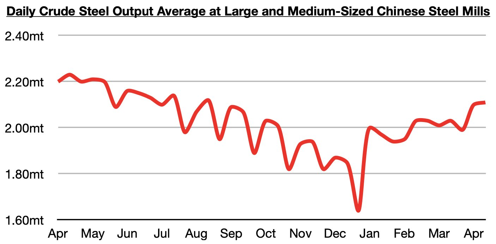

# Global Iron Ore Production Continues to Drive China's Iron Ore Import Volume

**Date:** May 04, 2026  
**Publisher:** Breakwave Advisors | **Category:** Market Insights  
**Original URL:** [https://www.breakwaveadvisors.com/insights/2026/5/4/global-iron-ore-production-continues-to-drive-chinas-iron-ore-import-volume](https://www.breakwaveadvisors.com/insights/2026/5/4/global-iron-ore-production-continues-to-drive-chinas-iron-ore-import-volume)  

---

*By*[*Jeffrey Landsberg*](https://www.linkedin.com/in/jeffrey-landsberg-70ab957/)

As we discussed in Commodore Research's most recent Weekly China Report, steel production at large and medium-sized mills in China most recently averaged 2.11 million tons during April 11 - April 20. This is up by 1% from early April but is down year-on-year by 5%. Compared to December’s recent low of 1.64 million tons, this most recent level is up by 29%, but nevertheless production is still down on a year-on-year basis.

> **Figure 1: Chart**  
> [Local Asset](file:///C:/Users/Dell/Github/Shipping/corpus/03-breakwave/insights/2026/assets/2026-05-04_global-iron-ore-production-continues-to-drive-chinas-iron-ore-import-volume_img_chart_6d53e615b8bf.jpg)

Remaining very significant is while that China's steel production has remained in a year-on-year contraction since September, China's iron ore imports have stayed strong as we have been predicting. China's iron ore imports have grown year-on-year during each of the last ten months. As we have continued to stress in our Weekly China Reports and Weekly Executive Reports,**it is global iron ore production that drives China's iron ore import volume, and not steel production or even iron ore port stockpiles.**We remain bullish for China's iron ore import prospects.

---

**Tags:** Ironore, China, Drybulk  
