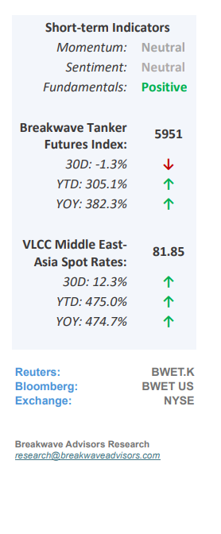
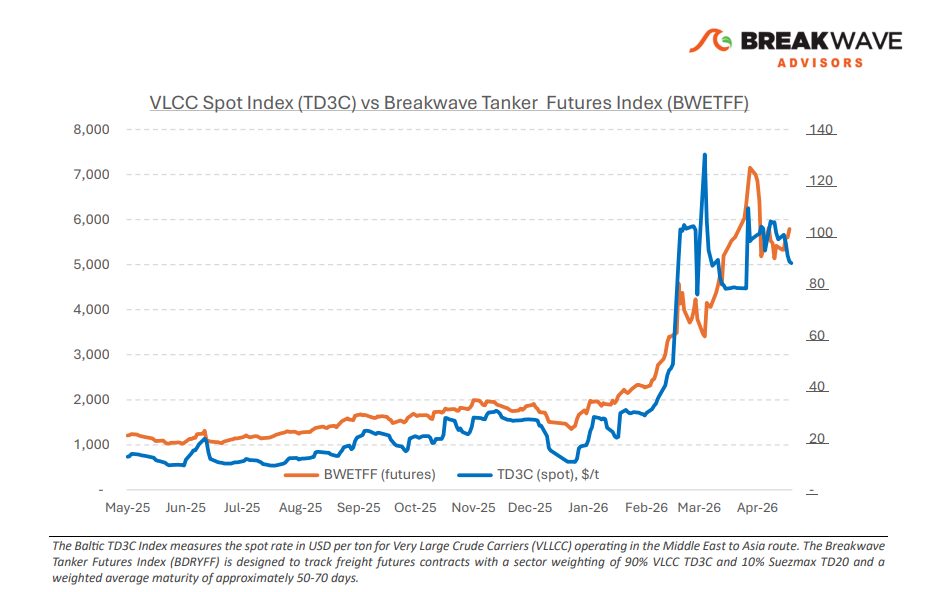
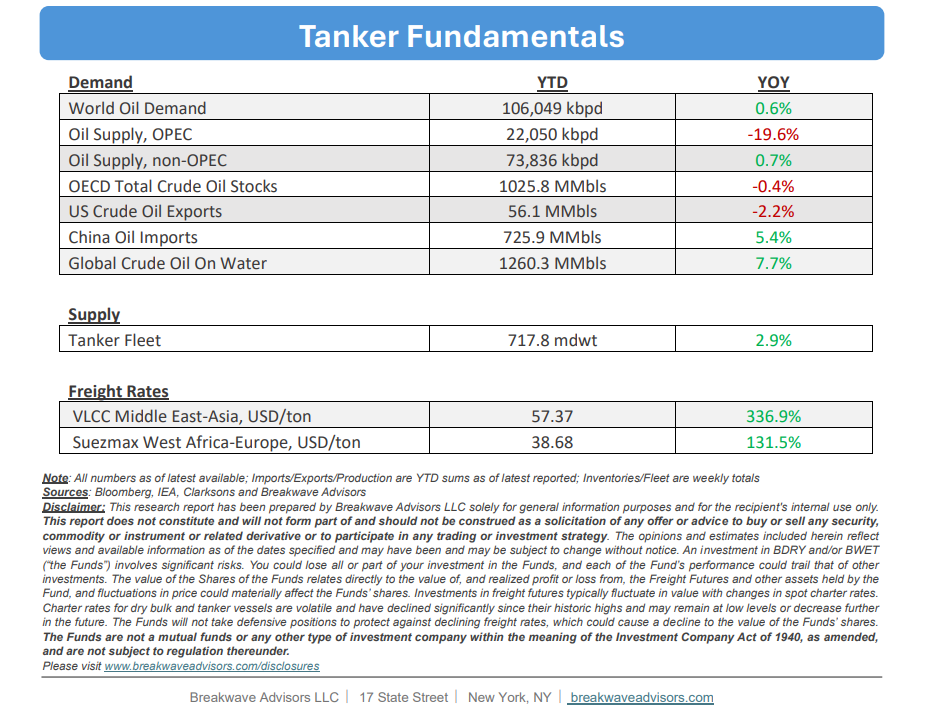

# Breakwave Bi-Weekly Tanker Report - May 5, 2026

**Date:** May 05, 2026  
**Publisher:** Breakwave Advisors | **Category:** Market Insights  
**Original URL:** [https://www.breakwaveadvisors.com/insights/552026wetreportmayhh487](https://www.breakwaveadvisors.com/insights/552026wetreportmayhh487)  

---

•**VLCC Atlantic Support vs AG Uncertainty**– Since the onset of the geopolitical disruption, what initially appeared to be a short-term reaction in the VLCC market is now developing into a more meaningful shift, with a**clearer divide**emerging between the**AG and the Atlantic.**In the Middle East, transit risk through the Strait of Hormuz remains the key issue. Recent headlines around a U.S. “freedom of navigation” plan aimed at releasing vessels effectively trapped in the region have added further uncertainty, particularly given Iran’s opposition. While this has yet to lead to any resolution, it reinforces that**conditions remain unstable**. The risk to normal transit is still elevated, and fixing activity reflects this. Enquiry persists, but stems are slow to progress, and overall participation remains cautious, with Western owners especially reluctant to commit tonnage through the Strait. A clear sign of this shift is the**widening gap**between traditional**Ras Tanura**liftings and alternative**Oman**loadings. The Gulf of Oman/East trial route has now been in play for several weeks and is increasingly being treated as a viable option rather than a temporary workaround. Furthermore, it continues to trade at a discount to standard AG routes, reflecting both operational differences and the market’s pricing of transit risk. At the same time, the Atlantic basin is stepping in more aggressively. What began as a defensive repositioning of tonnage has turned into a**sustained westward shift**, with ballasters moving out of the East in volume. This has lifted tonnage availability across the Atlantic and is now weighing on freight. West Africa and US Gulf to China routes remain under pressure as vessel supply builds faster than cargo demand. For now, the VLCC market is being**driven less**by traditional**supply-demand**fundamentals and**more by access and risk**, with the Atlantic absorbing the displacement and the AG constrained by ongoing uncertainty.

> **Figure 1: Cea3cf84ceb9ceb3cebcceb9cf8ccf84cf85**  
> [Local Asset](file:///C:/Users/Dell/Github/Shipping/corpus/03-breakwave/insights/2026/assets/2026-05-05_552026wetreportmayhh487_img_cea3cf84ceb9ceb3cebcceb9cf8ccf84cf85_f7f4b8b9b053.png)

•**Oil Prices Firmly Above $90/bbl for the Rest of the Year**– As the closure of the Strait of Hormuz to commercial traffic persists, the resulting structural oil deficit is driving substantial global**inventory**drawdowns that threaten to reach**historically****low levels**within the coming months, regardless of potential diplomatic breakthroughs. The market is currently operating on borrowed time; each day without a resolution exacerbates future supply constraints, leaving few viable mechanisms to bridge the gap. In the absence of an immediate normalization of trade routes and a rapid surge in production,**demand destruction**remains the most probable**rebalancing**force. However, given the unprecedented magnitude of this deficit relative to historical norms, a comprehensive market correction appears unlikely without a significant and**sustained escalation in oil prices**beyond current valuations.

•**Our Long-term View**– The tanker market has been recovering from a long period of staggered rates as the growth in new vessel supply shrunk while oil demand remained elevated in line with the global economy. The recent rapid increase in freight rates has led to significant new vessel ordering, with the orderbook now standing at above average levels, and although in the near term such a supply/demand misbalance is small, we expect a meaningful negative balance to develop longer term leading to a potential downcycle.

> **Figure 2: Στιγμιότυπο Οθόνης 2026 05 05 081530**  
> [Local Asset](file:///C:/Users/Dell/Github/Shipping/corpus/03-breakwave/insights/2026/assets/2026-05-05_552026wetreportmayhh487_img_cea3cf84ceb9ceb3cebcceb9cf8ccf84cf85_7d8104fb2212.png)

> **Figure 3: Στιγμιότυπο Οθόνης 2026 05 05 104649**  
> [Local Asset](file:///C:/Users/Dell/Github/Shipping/corpus/03-breakwave/insights/2026/assets/2026-05-05_552026wetreportmayhh487_img_cea3cf84ceb9ceb3cebcceb9cf8ccf84cf85_876eaa3a5d50.png)

### Subscribe:
