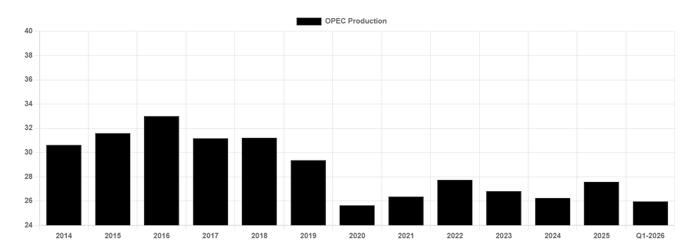

# OPEXIT

**Date:** May 05, 2026  
**Publisher:** Breakwave Advisors | **Category:** Market Insights  
**Original URL:** [https://www.breakwaveadvisors.com/insights/2026/5/5/opexit](https://www.breakwaveadvisors.com/insights/2026/5/5/opexit)  

---

> **Figure 1: Products Tanker**  
> **Interactive Data & Source:** [Gibsons Co](https://www.gibsons.co.uk/market-reports) | [Local Asset](file:///C:/Users/Dell/Github/Shipping/corpus/03-breakwave/insights/2026/assets/2026-05-05_opexit_img_products-tanker_ac4a0785a905.jpg)

Last week, the United Arab Emirates (UAE) confirmed its exit from OPEC. Whilst an exit had been mooted before, the timing of the announcement surprised many given the ongoing Middle East war. With Hormuz effectively closed, and oil production shut in across the region, Abu Dhabi’s announcement will not impact oil markets today. However, in the long term, oil prices, production and tanker demand could all feel the impact.

In isolation, one country leaving OPEC does little to change the outlook. Questions are being asked as to whether the influence of the group has been reduced, yet OPEC will still control around 30% of global oil supply (48% with OPEC+ members), enough to influence supply and with that, pricing. The key question however is; do other notable members follow suit or is this an isolated exit?

In the current market, OPEC quotas are largely irrelevant. However, just a few months ago, the oil market outlook looked very different with OPEC staring at a substantial market surplus following the unwinding of production cuts and rising Atlantic supplies. By 2027, members would have been forced to either cut production or accept lower oil prices; something which could have caused substantial friction amongst members. Instead, oil balances have been flipped entirely, with the market potentially staring at a historic deficit amid rapidly depleting inventories. On a temporary basis, these market dynamics give the UAE, OPEC and producers in the Atlantic scope to continue ramping up production independently, reducing the need for coordinated production policy. As such, it may be a few years before we see the leaner OPEC’s ability and willingness to balance the market being tested.

So, what does this all mean for tankers? Firstly, the UAE will export more. In February, the Emirates 3.4mbd, yet it is widely reported that the country’s production capacity is now as high as 4.8mbd, rising to 5mbd by next year. As such, the country could export around 1.5mbd more once the War ends, subject to the condition of fields and export infrastructure. In the short term, the market can probably absorb those additional volumes alongside increases elsewhere, yet on a long-term basis, supply and demand will need to find a balance meaning that OPEC, or someone else, will need to make way. If the remainder of OPEC are unwilling, the burden will fall on higher cost producers with flexible production i.e. the United States. Lower US output at the expense of higher Middle East exports would ultimately limit the growth in tonne miles given shorter voyages to Asia, yet there would still be tonne mile gain. In an extreme scenario where OPEC fully disbands, oil markets could become more volatile, with output decisions being driven by the production economics and strategies of individual producers, rather than at government level.

With the impact of the decision today being masked by war, the tanker markets will have to wait and see what the real impact is. Yet ultimately, we expect the burden of balancing oil markets to ultimately fall to either US shale, or OPEC, as has been the case for the past decade.

## OPEC Crude Production (Mbd)

> **Figure 2: Στιγμιότυπο Οθόνης 2026 05 05 105944**  
> **Interactive Data & Source:** [Gibsons Co](https://www.gibsons.co.uk/market-reports) | [Local Asset](file:///C:/Users/Dell/Github/Shipping/corpus/03-breakwave/insights/2026/assets/2026-05-05_opexit_img_cea3cf84ceb9ceb3cebcceb9cf8ccf84cf85_278c1ec3a85d.png)

Data source:[Gibson Shipbrokers](https://www.gibsons.co.uk/market-reports)

---

**Tags:** Crude, Markets, Tankers  
