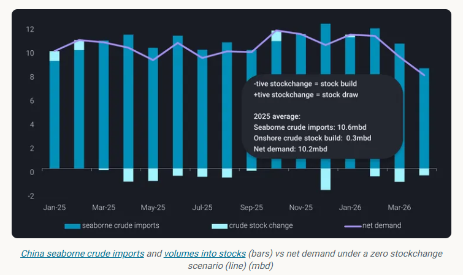
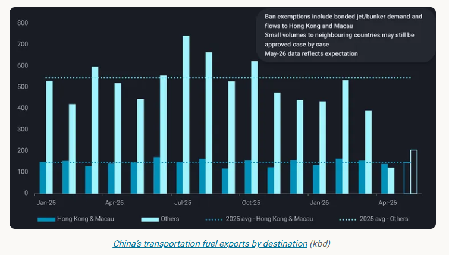
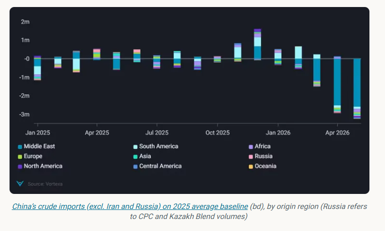
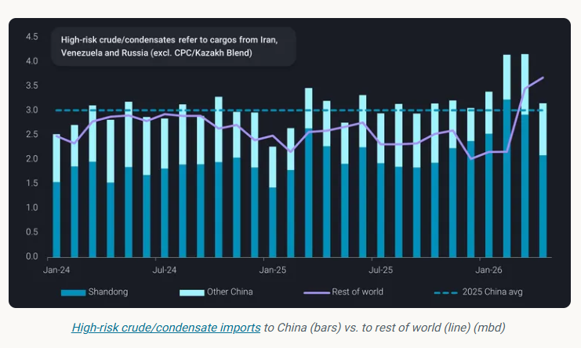

# Import loss, stock build: How China absorbs the Hormuz shock

**Date:** May 06, 2026  
**Publisher:** Breakwave Advisors | **Category:** Market Insights  
**Original URL:** [https://www.breakwaveadvisors.com/insights/2026/5/6/import-loss-stock-build-how-china-absorbs-the-hormuz-shock](https://www.breakwaveadvisors.com/insights/2026/5/6/import-loss-stock-build-how-china-absorbs-the-hormuz-shock)  

---

China’s crude market is doing something that, at first glance, doesn’t quite add up.

*By*[*Emma Li*](https://www.linkedin.com/in/emma-li-73003443/)

As Hormuz-linked disruptions began to feed through in April—reflecting the typical four-week lag in Middle Eastern flows—seaborne crude imports fell sharply to around 8.4mbd, the lowest level since September 2022. This compares with an average of 11.1mbd in the first quarter and roughly 10.6mbd across 2025.

And yet, instead of drawing down inventories, China kept building them. Aboveground crude stocks extended to a record 1.24 billion barrels, with builds still running at around 580kbd in April. Combined with the near 52mb accumulated since end-February, the signal is clear: refiners have adjusted faster—and more aggressively—than the supply shock itself.

This is not a demand story. It is a supply management story.

> **Figure 1: Στιγμιότυπο Οθόνης 2026 05 06 120118**  
> **Interactive Data & Source:** [Analytics Vortexa](https://analytics.vortexa.com/InsightsHubPage?articleId=2pIpt5cQPr3vVqzdz6GaVZ&articleType=article&authorFilters=%5B%22mMo3A9IJjPQ7ExzLLqLIu%22%5D&categoryFilters=%5B%22webinar%22%2C%22report%22%2C%22article%22%2C%22highlight%22%2C%22briefing%22%5D&page=InsightsHubPage&tabId=40173c18-c403-400d-85fa-180fff870c86) | [Local Asset](file:///C:/Users/Dell/Github/Shipping/corpus/03-breakwave/insights/2026/assets/2026-05-06_import-loss-stock-build-how-china-absorbs-the-hormuz-shock_img_cea3cf84ceb9ceb3cebcceb9cf8ccf84cf85_6d3367b40692.png)

## Runs, Not Imports, Are Doing the Heavy Lifting

As highlighted in our earlier work [[read more here](https://analytics.vortexa.com/InsightsHubPage?articleId=2pIpt5cQPr3vVqzdz6GaVZ&articleType=article&authorFilters=%5B%22mMo3A9IJjPQ7ExzLLqLIu%22%5D&categoryFilters=%5B%22webinar%22%2C%22report%22%2C%22article%22%2C%22highlight%22%2C%22briefing%22%5D&page=InsightsHubPage&tabId=40173c18-c403-400d-85fa-180fff870c86)], the adjustment began early. Refiners, particularly those heavily reliant on seaborne crude and with relatively thinner stock buffers, responded by cutting runs as early as early March, in some cases pulling forward seasonal maintenance.

At the same time, the system lost one of its key balancing mechanisms. Early in the year, strong refinery runs had allowed product inventories to build ahead of the Chinese New Year travel season. When demand softened after the holiday period, exports—particularly for transportation fuels—would help clear the surplus.

That loop was broken on March 12th – just one day before the end of CNY travel rush - when the state planner imposed curbs on seaborne transportation fuel exports.

Exports beyond Hong Kong and Macau dropped to around 390kbd in March, down from roughly 600kbd a year earlier, before collapsing further to just 120kbd in April—a 77% year-on-year decline. With exports constrained, product inventories began to accumulate, especially at state-owned refiners that kept up runs, which are now seeking approvals to release additional barrels.

There may be a rebound in fuel exports in May, but it is unlikely to reflect stronger refinery runs. More likely, it is simply the system trying to clear excess stock.

> **Figure 2: This Is the Key Point the Market Continues to Underestimate: The**  
> *This is the key point the market continues to underestimate: the issue is not a shortage of crude, but a shortage of therightcrude.*  
> **Interactive Data & Source:** [Analytics Vortexa](https://analytics.vortexa.com/Flows?dateRange=2025-01-01T00%3A00%3A00.000Z__2026-05-05T23%3A59%3A59.999Z&filtersEnabled=%5B%22p%22%2C%22o%22%2C%22d%22%2C%22d_r%22%2C%22v%22%2C%22intra_d%22%2C%22sts_o%22%2C%22c_o%22%2C%22w%22%2C%22sts%22%5D&frequency=day&from=%5B%22d308ddc557e774187ad6c7da81b39db990def9a39e6c88e79cb163b6bdd6e8e5%22%5D&metric=bpd&movementEvent=cargo_on_water_state&page=Flows&products=%5B%2254af755a090118dcf9b0724c9a4e9f14745c26165385ffa7f1445bc768f06f11%22%5D&sortDirection=asc&sortField=vessel_name&tabId=1406e560-9add-4669-b558-663db2e441f7&timeSeriesBaselineEnd=2025-12-31T23%3A59%3A59.999Z&timeSeriesBaselineStart=2025-01-01T00%3A00%3A00.000Z&timeSeriesChartView=seasonal&timeSeriesProperty=destination_country&tsAnalysisTotalToggle=1&v=3&vesselClassChartView=count) | [Local Asset](file:///C:/Users/Dell/Github/Shipping/corpus/03-breakwave/insights/2026/assets/2026-05-06_import-loss-stock-build-how-china-absorbs-the-hormuz-shock_img_cea3cf84ceb9ceb3cebcceb9cf8ccf84cf85_6205d01feb2a.png)

Refinery runs in China are likely to decline further into May, as seasonal maintenance peaks in Q2. This means that onshore crude stock builds are also expected to reverse soon, as refiners will start to draw on inventories to offset continued import shortfalls.

This is where the policy signal becomes important.

Despite strong export margins, China is unlikely to encourage refiners to ramp up runs or draw down crude inventories aggressively. The priority remains domestic supply security, not export optimisation.

With Hormuz transit unlikely to normalise in the near term, this stance is unlikely to shift. Any recovery in exports will therefore be incremental and controlled, rather than structural.

## The Real Constraint Is Not Volume—it’s Quality

At the same time, China is facing a structural shortfall of around 2.5mbd in non-Iranian Middle Eastern crude in April and May, relative to a 2025 baseline.

In theory, long-haul barrels from the Atlantic Basin could help fill the gap. In practice, they are not.

Flows from the Atlantic Basin are declining alongside refinery run cuts, and some Chinese majors have even resold May-loading cargoes to other Asian buyers. More importantly, these barrels—particularly from West Africa or Canada—sit at the lighter or heavier ends of the spectrum. They are not designed to replace the medium-sour grades that dominate Middle Eastern supply.

> **Figure 3: Στιγμιότυπο Οθόνης 2026 05 06 120236**  
> **Interactive Data & Source:** [Analytics Vortexa](https://analytics.vortexa.com/Flows?dateRange=2025-01-01T00%3A00%3A00.000Z__2026-05-05T23%3A59%3A59.999Z&filtersEnabled=%5B%22p%22%2C%22o%22%2C%22d%22%2C%22d_r%22%2C%22v%22%2C%22intra_d%22%2C%22sts_o%22%2C%22c_o%22%2C%22w%22%2C%22sts%22%5D&frequency=day&from=%5B%22d308ddc557e774187ad6c7da81b39db990def9a39e6c88e79cb163b6bdd6e8e5%22%5D&metric=bpd&movementEvent=cargo_on_water_state&page=Flows&products=%5B%2254af755a090118dcf9b0724c9a4e9f14745c26165385ffa7f1445bc768f06f11%22%5D&sortDirection=asc&sortField=vessel_name&tabId=1406e560-9add-4669-b558-663db2e441f7&timeSeriesBaselineEnd=2025-12-31T23%3A59%3A59.999Z&timeSeriesBaselineStart=2025-01-01T00%3A00%3A00.000Z&timeSeriesChartView=seasonal&timeSeriesProperty=destination_country&tsAnalysisTotalToggle=1&v=3&vesselClassChartView=count) | [Local Asset](file:///C:/Users/Dell/Github/Shipping/corpus/03-breakwave/insights/2026/assets/2026-05-06_import-loss-stock-build-how-china-absorbs-the-hormuz-shock_img_cea3cf84ceb9ceb3cebcceb9cf8ccf84cf85_9b9c2f012ef1.png)

## China’s Hidden Buffer: Domestic and Non-Seaborne Supply

This is also where China’s relative resilience becomes clear.

Domestic crude production has quietly reached record levels, near 4.5mbd in the first quarter. These barrels are broadly comparable in quality to Middle Eastern grades—closer to Basrah than Arab Light—and therefore much more useful in the current environment than many import alternatives.

Layered on top of this are pipeline inflows from Russia and Kazakhstan, as well as national reserves (SPR) largely built on Middle Eastern or Russian crude.

Together, these sources provide a structural buffer that many other Asian importers simply do not have.

In other words, China is not just absorbing the shock—it is better positioned to do so.

## Sanctions Waivers Are Temporarily Reshuffling Flows, Not Adding Supply

Sanctions waivers have added another layer of complexity to an already fragmented market—but their impact is often overstated.

China’s decision to issue additional crude import quotas to private refiners, shortly after imposing fuel export curbs, can be read as an implicit signal to sustain high-risk crude intake. Yet, imports still declined in April. This reflects both the halt in Venezuelan flows following US intervention and intensifying competition for Russian barrels under sanctions waivers.

The key point is that waivers are not increasing supply—they are redistributing it.

Russian barrels, freed up by waivers, are now being absorbed by a broader group of Asian buyers. This has reduced availability for Shandong teapots, which remain sensitive to price and are generally reluctant to pay the premiums attached to waiver-eligible cargoes. Even so, China still imported over 1.4mbd of seaborne Russian crude in April, only slightly below India’s 1.6mbd.

Iranian barrels, by contrast, remain largely within the Chinese system, particularly among teapot refiners. Imports held above 1.6mbd in April, easing from March’s peak as refiners showed limited urgency to absorb the sizable volumes[already on the water](https://analytics.vortexa.com/Flows?dateRange=2025-01-01T00%3A00%3A00.000Z__2026-05-05T23%3A59%3A59.999Z&filtersEnabled=%5B%22p%22%2C%22o%22%2C%22d%22%2C%22d_r%22%2C%22v%22%2C%22intra_d%22%2C%22sts_o%22%2C%22c_o%22%2C%22w%22%2C%22sts%22%5D&frequency=day&from=%5B%22d308ddc557e774187ad6c7da81b39db990def9a39e6c88e79cb163b6bdd6e8e5%22%5D&metric=bpd&movementEvent=cargo_on_water_state&page=Flows&products=%5B%2254af755a090118dcf9b0724c9a4e9f14745c26165385ffa7f1445bc768f06f11%22%5D&sortDirection=asc&sortField=vessel_name&tabId=1406e560-9add-4669-b558-663db2e441f7&timeSeriesBaselineEnd=2025-12-31T23%3A59%3A59.999Z&timeSeriesBaselineStart=2025-01-01T00%3A00%3A00.000Z&timeSeriesChartView=seasonal&timeSeriesProperty=destination_country&tsAnalysisTotalToggle=1&v=3&vesselClassChartView=count).

That said, China’s demand for high-risk crude is unlikely to weaken materially. Iranian imports are expected to remain above the 1.3–1.4mbd range seen on average in 2025, as designated refiners continue to process sanctioned barrels rather than reduce utilisation. Near-term imports may soften somewhat, reflecting seasonally weaker domestic fuel demand ahead of the autumn peak.

More importantly, supply resilience remains high. Based on Vortexa estimates, at least 105mb of Iranian crude is already positioned outside the US blockade as of May 1st, equivalent to roughly 65 days of China’s demand at April import rates—even in a scenario where outbound Iranian flows are fully disrupted.

> **Figure 4: Στιγμιότυπο Οθόνης 2026 05 06 120328**  
> **Interactive Data & Source:** [Vortexa](https://www.vortexa.com//oil-gas-data-traders-analysts-data-scientists?gclid=Cj0KCQjw8_qRBhCXARIsAE2AtRZKOvMnbilZ_6_91d7huSFFy71pWLrnPwGwOHVzXsmsG-1a1mZnQw8aAt89EALw_wcB&hsa_acc=1782073842&hsa_ad=548425387665&hsa_cam=14746637662&hsa_grp=125038601902&hsa_kw=&hsa_mt=&hsa_net=adwords&hsa_src=g&hsa_tgt=dsa-1431852288425&hsa_ver=3&utm_campaign=%5BCD%5D%20-%20DSA%20-%20EMEA&utm_medium=cpc&utm_medium=ppc&utm_source=google&utm_source=adwords&utm_term=) | [Local Asset](file:///C:/Users/Dell/Github/Shipping/corpus/03-breakwave/insights/2026/assets/2026-05-06_import-loss-stock-build-how-china-absorbs-the-hormuz-shock_img_cea3cf84ceb9ceb3cebcceb9cf8ccf84cf85_034ef6f3d6e1.png)

## A Market That Bends, But Does Not Break

Taken together, the picture is one of a system under stress—but still functioning.

China is not aggressively chasing alternative barrels to replace lost imports. In reality, only the “right” barrels—those that match refinery configurations—justify paying a premium. Instead, the adjustment is happening internally: refiners are cutting runs, building stocks—while large-scale stock releases have yet to materialise—managing exports, and leaning more heavily on domestic output and non-seaborne supply.

This is a slower, more controlled response, but also a more resilient one.

In a market where availability—not price—is the binding constraint, that distinction matters more than ever.

Data Source:[Vortexa](https://www.vortexa.com//oil-gas-data-traders-analysts-data-scientists?gclid=Cj0KCQjw8_qRBhCXARIsAE2AtRZKOvMnbilZ_6_91d7huSFFy71pWLrnPwGwOHVzXsmsG-1a1mZnQw8aAt89EALw_wcB&hsa_acc=1782073842&hsa_ad=548425387665&hsa_cam=14746637662&hsa_grp=125038601902&hsa_kw=&hsa_mt=&hsa_net=adwords&hsa_src=g&hsa_tgt=dsa-1431852288425&hsa_ver=3&utm_campaign=%5BCD%5D%20-%20DSA%20-%20EMEA&utm_medium=cpc&utm_medium=ppc&utm_source=google&utm_source=adwords&utm_term=)

---

**Tags:** China, Crude, Markets  
