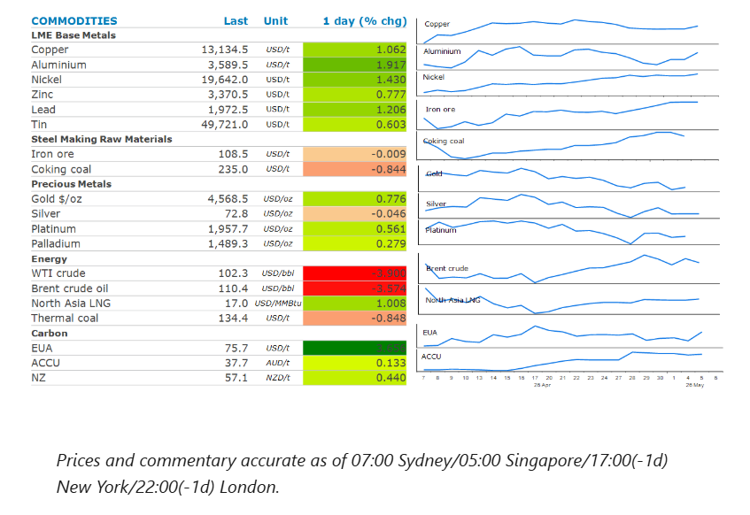
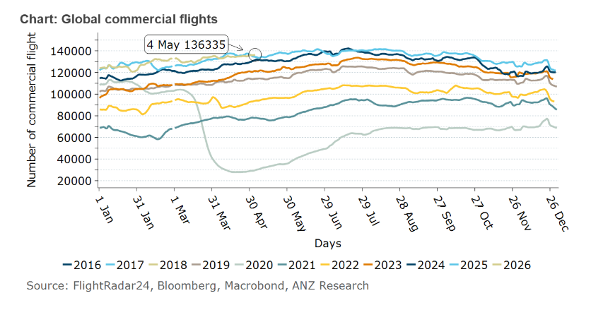

# Oil falls as ceasefire holds in the Middle East

**Date:** May 06, 2026  
**Publisher:** Breakwave Advisors | **Category:** Market Insights  
**Original URL:** [https://www.breakwaveadvisors.com/insights/2026/5/6/oil-falls-as-ceasefire-holds-in-the-middle-east](https://www.breakwaveadvisors.com/insights/2026/5/6/oil-falls-as-ceasefire-holds-in-the-middle-east)  

---

Energy markets pulled back as the ceasefire held in the Middle East. This stoked a risk-on tone which pushed precious and industrial metals higher.

*By*[*Daniel Hynes*](https://www.linkedin.com/in/dahynes/)

> **Figure 1: Στιγμιότυπο Οθόνης 2026 05 06 121657**  
> [Local Asset](file:///C:/Users/Dell/Github/Shipping/corpus/03-breakwave/insights/2026/assets/2026-05-06_oil-falls-as-ceasefire-holds-in-the-middle-east_img_cea3cf84ceb9ceb3cebcceb9cf8ccf84cf85_f8789ef91850.png)

### Market Commentary

**Crude oil**prices gave up some of this week’s gains as the Middle East ceasefire held. The US downplayed the prospect of a return to active military action in the aftermath of Iran’s recent attacks on the UAE, which included a strike on an oil terminal in the port of Fujairah. Joint Chiefs of Staff’s General Dan Caine said that that attacks didn’t constitute a breach of the ceasefire. This eased concerns that the attacks would impact more oil supply from the UAE. Exports from Fujairah, which sits outside the Strait of Hormuz, have been around 1.9mb/d in recent weeks.

There are no signs the Strait of Hormuz will reopen any time soon. Iran launched a new protocol for vessels transiting the strait, including requiring ships to receive an official email signalling approval. Iran’s President Pezeshkian labelled as unrealistic the US’ expectation that Iran would negotiate while subject to a naval blockade. The lack of oil flowing through the strait is likely to increase pressure on stockpiles. So far this hasn’t been fully reflected in visible stockpiles. This is particularly the case in the US, where commercial crude oil stocks stand at 456mbbl (week ending 24 April), which is 24mbbl higher than at the same period a year ago. The tapping of government reserves and the drawdown in oil held in tankers has[**buffered the impact**](../pdfs/2026-05-06_oil-falls-as-ceasefire-holds-in-the-middle-east_oil-market-bracing-for-impact_5aec0bb321e0.pdf). However, drawdowns are expected to accelerate in coming weeks. All eyes will be on this week’s EIA weekly inventory report for any sign of a sharp drawdown.

**North Asia LNG**prices edged up on uncertainty around shipping through the Strait of Hormuz. The conflict has impacted around 20% of global LNG supplies, leaving many consumers scrambling for additional cargoes ahead of the peak demand period. Petronet LNG Ltd, India’s largest LNG importer, received its first cargo in April following a deal with Exxon Mobil. However, with imports making up about half of India’s gas demand, more will be needed. Petronet’s main Dahej import terminal is running at only 53% utilisation, compared with normal levels of more than 90%.**European natural gas**benchmark futures failed to follow LNG prices higher. Instead, cooler temperatures across Europe eased concerns of stronger demand. This was aided by increased power output from solar and wind.

**Aluminium**led the base metals sector higher, as signs of the Middle East ceasefire holding eased concerns of the conflict weighing on economic growth. Aluminium prices are also being supported by ongoing disruptions to supply from the Persian Gulf. The region accounts for nearly 10% of global supply. Inventory held in London Metal Exchange warehouses has fallen 22% since the conflict escalated in late February. Copper also gained, after a sharp correction on the open of trading amid rising tensions in the Middle East.

The holding of the ceasefire buoyed sentiment in the precious metal sector.**Gold**managed to edge up, on the chances of a near-term resolution to the conflict. This helped temper concerns about surging inflation. Sentiment was also supported by the announcement that China will ease licensing rules for gold imports. This will lead to more ports being authorised to clear bullion.

### Chart of the Day

The massive disruption to Middle East oil supply has hit the jet fuel market hard. The region produces**medium‑ and heavy‑sour crude**— the barrels with the highest jet/diesel yield. Globally, around**20% of shipped jet fuel flows**via Hormuz have been disrupted. This has led to global airlines reducing schedules globally and cutting routes that cannot cover fuel costs. However, this has not resulted in a sizeable reduction in the number of flights conducted. Given this is a supply shortage issue and there is no substitute fuel in the short term, a fall in the number of flights is likely to be imminent.

> **Figure 2: Στιγμιότυπο Οθόνης 2026 05 06 121800**  
> **Interactive Data & Source:** [Linkedin](https://www.linkedin.com/newsletters/commodities-wrap-6692196755876012032/?fbclid=IwAR3kiXJqZdxmp9ZcRwBNI7FsBySI-XSC0pfPur1qzjt7OZp7PTE59Tsl1QI) | [Local Asset](file:///C:/Users/Dell/Github/Shipping/corpus/03-breakwave/insights/2026/assets/2026-05-06_oil-falls-as-ceasefire-holds-in-the-middle-east_img_cea3cf84ceb9ceb3cebcceb9cf8ccf84cf85_45881f90b1b3.png)

Data source:[Commodities Wrap](https://www.linkedin.com/newsletters/commodities-wrap-6692196755876012032/?fbclid=IwAR3kiXJqZdxmp9ZcRwBNI7FsBySI-XSC0pfPur1qzjt7OZp7PTE59Tsl1QI)

---

**Tags:** Crude, Commodities, Shipping  
