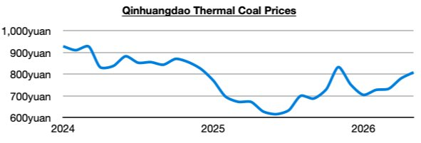
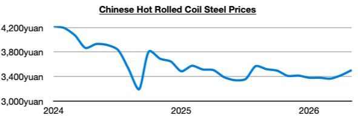

# Remaining Extremely Bullish China Supports Dry Bulk Bullishness

**Date:** May 08, 2026  
**Publisher:** Breakwave Advisors | **Category:** Market Insights  
**Original URL:** [https://www.breakwaveadvisors.com/insights/2026/5/8/remaining-extremely-bullish-china-supports-dry-bulk-bullishness](https://www.breakwaveadvisors.com/insights/2026/5/8/remaining-extremely-bullish-china-supports-dry-bulk-bullishness)  

---

*By*[*Jeffrey Landsberg*](https://www.linkedin.com/in/jeffrey-landsberg-70ab957/)

Overall dry bulk rates increased again last week, this time with only supramax rates falling (and only by a small amount). Also of note is that thermal coal prices ended last week setting another new 2026 high.

> **Figure 1: Chart 1**  
> [Local Asset](file:///C:/Users/Dell/Github/Shipping/corpus/03-breakwave/insights/2026/assets/2026-05-08_remaining-extremely-bullish-china-supports-dry-bulk-bullishness_img_chart1_8f7eebcb056d.jpg)

It remains not only thermal coal prices that are faring well in China (and globally). Iron ore and steel prices also continue to climb. In fact, steel prices in China ended last week at a new 2026 high.

> **Figure 2: Chart 2**  
> [Local Asset](file:///C:/Users/Dell/Github/Shipping/corpus/03-breakwave/insights/2026/assets/2026-05-08_remaining-extremely-bullish-china-supports-dry-bulk-bullishness_img_chart2_cbfced7090f9.jpg)

Overall, we remain bullish for the dry bulk market, and we remain much more bullish than most for China in general as we have been stressing in Commodore Research's Weekly Executive Reports and Weekly China Reports. India’s thermal coal demand is also finally experiencing a turnaround. India's thermal coal-derived electricity generation last month grew year-on-year by 2%. Previously, India’s thermal coal-derived generation had declined on a year-on-year basis in nine of the prior twelve months, which had marked the only time this decade that such an event had occurred. As we have been stressing in our weekly reports, the war in Iran has been drastically changing thermal coal demand in India (and globally). Indian thermal coal import prospects have suddenly become bullish again.

---

**Tags:** Drybulk, Markets, China  
