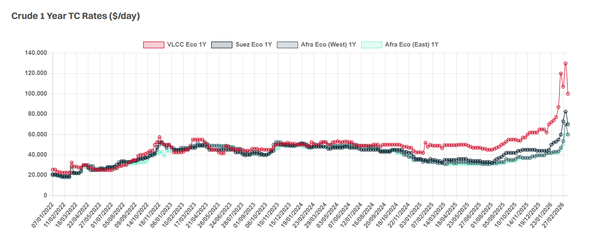

# VLCC Market

**Date:** May 08, 2026  
**Publisher:** Breakwave Advisors | **Category:** Market Insights  
**Original URL:** [https://www.breakwaveadvisors.com/insights/2026/5/8/vlcc-market](https://www.breakwaveadvisors.com/insights/2026/5/8/vlcc-market)  

---

> **Figure 1: Nissos Nikouria 4**  
> **Interactive Data & Source:** [Gibsons Co](https://www.gibsons.co.uk/market-reports) | [Local Asset](file:///C:/Users/Dell/Github/Shipping/corpus/03-breakwave/insights/2026/assets/2026-05-08_vlcc-market_img_nissos-nikouria-4_967132817018.jpg)

It has been something of a mixed bag on the spot market this week. VLCCs improved through the early part of the week, although momentum now feels to be levelling off heading into the weekend. Suezmaxes started the week on a softer footing but appear to have steadied once again, whilst Aframaxes have taken the biggest hit, with rates coming under the most pressure across the crude sectors. Despite the differing performances across the sizes, overall activity remains relatively subdued.

Against this backdrop, the disconnect between Owners’ and Charterers’ ideas on period business remains firmly in place. Owners continue to anchor offers at levels reflective of recent spot strength and elevated asset values, whilst Charterers are struggling to reconcile these numbers against weaker forward curves and softer market sentiment. As a result, meaningful TC activity remains difficult to conclude, with bid/offer gaps still proving challenging to bridge.

> **Figure 2: Στιγμιότυπο Οθόνης 2026 05 08 184239**  
> **Interactive Data & Source:** [Gibsons Co](https://www.gibsons.co.uk/market-reports) | [Local Asset](file:///C:/Users/Dell/Github/Shipping/corpus/03-breakwave/insights/2026/assets/2026-05-08_vlcc-market_img_cea3cf84ceb9ceb3cebcceb9cf8ccf84cf85_2b451577063f.png)

Data source:[Gibson Shipbrokers](https://www.gibsons.co.uk/market-reports)

---

**Tags:** Crude, Markets, Tankers  
