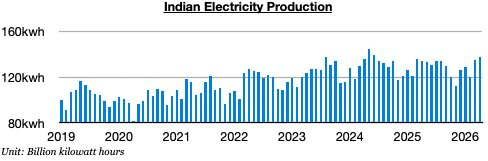
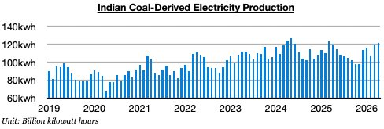
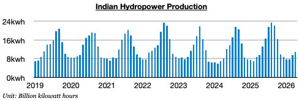

# Indian Thermal Coal Demand Growth Returns

**Date:** May 11, 2026  
**Publisher:** Breakwave Advisors | **Category:** Market Insights  
**Original URL:** [https://www.breakwaveadvisors.com/insights/2026/5/11/indian-thermal-coal-demand-growth-returns](https://www.breakwaveadvisors.com/insights/2026/5/11/indian-thermal-coal-demand-growth-returns)  

---

*By*[*Jeffrey Landsberg*](https://www.linkedin.com/in/jeffrey-landsberg-70ab957/)

As we discussed in Commodore Research's most recent Weekly Executive Report, India produced approximately 137.2 billion kilowatt hours of electricity in April. This is up month-on-month by 2.3 billion kilowatt hours (2%) and is up year-on-year by 3.5 billion kilowatt hours (3%). Previously, India’s total electricity production had contracted on a year-on-year basis during eight of the prior twelve months.

> **Figure 1: Chart 1**  
> [Local Asset](file:///C:/Users/Dell/Github/Shipping/corpus/03-breakwave/insights/2026/assets/2026-05-11_indian-thermal-coal-demand-growth-returns_img_chart1_ea3a107c0acc.jpg)

Coal-derived electricity generation totaled approximately 121.1 billion kilowatt hours. This is up month-on-month by 1.2 billion kilowatt hours (1%) and is up year-on-year by 2 billion kilowatt hours (2%). Previously, India’s coal-derived generation had declined on a year-on-year basis during nine of the prior twelve months, which had marked the**only time this decade**that such an event had occurred. As we have been stressing in our work, the war in Iran has been drastically changing thermal coal demand in India (and globally). Indian coal import prospects have suddenly become bullish again.

> **Figure 2: Chart 2**  
> [Local Asset](file:///C:/Users/Dell/Github/Shipping/corpus/03-breakwave/insights/2026/assets/2026-05-11_indian-thermal-coal-demand-growth-returns_img_chart2_71c52c6e08fc.jpg)

Hydropower output totaled approximately 10.9 billion kilowatt hours. This is up month-on-month by 1.4 million kilowatt hours (15%) and is up year-on-year by 1.3 billion kilowatt hours (14%). Hydropower output has grown on a year-on-year basis for twenty straight months.

> **Figure 3: Chart 3**  
> [Local Asset](file:///C:/Users/Dell/Github/Shipping/corpus/03-breakwave/insights/2026/assets/2026-05-11_indian-thermal-coal-demand-growth-returns_img_chart3_a396a8cb5e52.jpg)

---

**Tags:** Drybulk, Coal, Markets  
