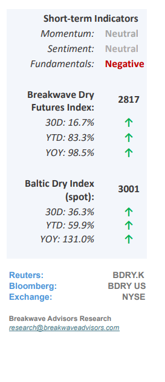
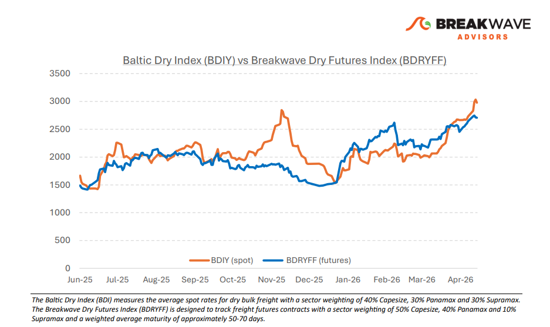
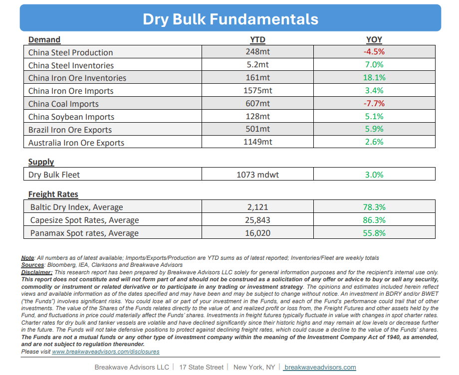

# Breakwave Bi-Weekly Dry Bulk Report - May 12, 2026

**Date:** May 12, 2026  
**Publisher:** Breakwave Advisors | **Category:** Market Insights  
**Original URL:** [https://www.breakwaveadvisors.com/insights/5122026db-report2026mayhh47](https://www.breakwaveadvisors.com/insights/5122026db-report2026mayhh47)  

---

•**Dry Bulk Spot Rates Approaching Seasonal All-Time Highs**– The dry bulk market remains**exceptionally resilient,**with robust global iron ore and bauxite volumes driving spot rates to near-record seasonal highs despite a rather uneventful coal market. While**geopolitical uncertainty and elevated oil prices**pose significant macroeconomic risks, freight rates have remained stable, avoiding the volatile spikes seen in previous cycles. However, we anticipate a**measurable economic slowdown**in Asia during the second half of the year, likely leading to softened regional steel demand. Given the typical lag in how high energy costs impact commodity consumption and industrial activity, we maintain that the current strength may eventually give way to a demand-driven soft patch. On the other hand, a swift resolution to the current Iran-US standoff could lead to a softening in oil prices which in turn would boost economic growth and reduce uncertainty for the oilsensitive Asian economies, leading to better outcomes for dry bulk shipping. With**iron ore volumes running some 4% above**last year’s levels, it is tough to argue against another year of robust Capesize rates, a conclusion that defies the cyclical nature of shipping.

> **Figure 1: Cea3cf84ceb9ceb3cebcceb9cf8ccf84cf85**  
> [Local Asset](file:///C:/Users/Dell/Github/Shipping/corpus/03-breakwave/insights/2026/assets/2026-05-12_5122026db-report2026mayhh47_img_cea3cf84ceb9ceb3cebcceb9cf8ccf84cf85_37621b08be4a.png)

•**Steel Mill Profitability Reaches 8-month Highs as Iron Ore Prices Jump**– Iron ore spot prices have climbed to their highest point since October 2024, bolstered by strengthening demand from Chinese steel mills. While product supply remains high and**inventories sit near record levels**, robust underlying demand has successfully countered oversupply concerns and signaled a stabilizing market. As the industry enters a**seasonally slower period,**sustained pockets of consumption will be critical in confirming a long-term recovery following years of thin profit margins. Consequently, these**consistent iron ore volumes**continue to serve as the primary catalyst for Capesize spot rate performance, a trend expected to persist in the near term.

•**Our Long-term View**– The last few years have been characterized by increased geopolitical uncertainty. Going forward, we expect such events to continue to affect global trade and have a meaningful impact on effective vessel supply. Combined with the potential for a multi-year cyclical rebound in China’s economic activity following the recent economic turmoil, dry bulk shipping should experience higher volatility on top of a secular tightness driven by stable bulk commodity demand and rather steady fleet growth.

> **Figure 2: Στιγμιότυπο Οθόνης 2026 05 12 084836**  
> [Local Asset](file:///C:/Users/Dell/Github/Shipping/corpus/03-breakwave/insights/2026/assets/2026-05-12_5122026db-report2026mayhh47_img_cea3cf84ceb9ceb3cebcceb9cf8ccf84cf85_1930f48e34eb.png)

> **Figure 3: Στιγμιότυπο Οθόνης 2026 05 12 112949**  
> [Local Asset](file:///C:/Users/Dell/Github/Shipping/corpus/03-breakwave/insights/2026/assets/2026-05-12_5122026db-report2026mayhh47_img_cea3cf84ceb9ceb3cebcceb9cf8ccf84cf85_825c0152538b.png)

### Subscribe:
