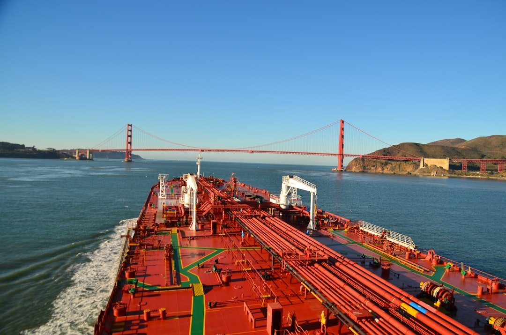
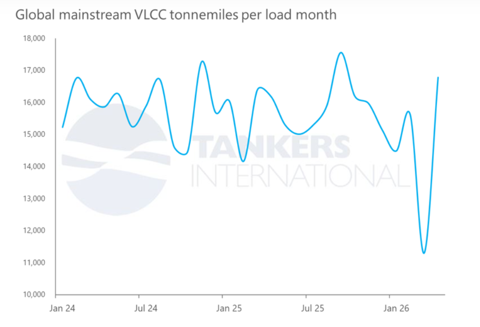

# Data Spotlight: Fewer cargoes, longer distances

**Date:** May 12, 2026  
**Publisher:** Breakwave Advisors | **Category:** Market Insights  
**Original URL:** [https://www.breakwaveadvisors.com/insights/2026/5/12/data-spotlight-fewer-cargoes-longer-distances](https://www.breakwaveadvisors.com/insights/2026/5/12/data-spotlight-fewer-cargoes-longer-distances)  

---

> **Figure 1: Unsplash Image Juqnquem V4**  
> **Interactive Data & Source:** [App Tankersinternational](http://app.tankersinternational.com/) | [Local Asset](file:///C:/Users/Dell/Github/Shipping/corpus/03-breakwave/insights/2026/assets/2026-05-12_data-spotlight-fewer-cargoes-longer-distances_img_unsplash-image-juqnquem-v4_7ffc30094c33.jpg)

The disruption to Middle East crude exports continues to reshape the VLCC market, but headline cargo losses only tell part of the story.

While global VLCC fixture volumes have declined amid restrictions to traditional Middle East crude flows, the impact on tonnemiles has been far more resilient. Our analysis of[April fixture activity](http://app.tankersinternational.com/)shows that mainstream global VLCC tonnemiles have recovered to levels comparable with the period before the conflict disrupted regional exports.

The explanation lies in changing trade patterns. As Middle East barrels have become inaccessible, Asian buyers are increasingly sourcing crude from the Atlantic Basin, particularly the US Gulf, West Africa and South America. These replacement trades require significantly longer voyages, keeping vessels employed for extended periods and materially increasing tonnemile demand despite lower overall cargo counts.

In practical terms, fewer cargoes are moving, but each cargo is travelling substantially further.

This shift has important implications for fleet utilisation and market fundamentals. Longer-haul Atlantic-to-East movements absorb tonnage more efficiently than traditional Middle East-to-Asia routes, tightening effective vessel supply even in an environment of lower global export volumes.

At the same time, operational inefficiencies and regional dislocation continue to restrict available capacity, further supporting utilisation across the VLCC fleet.

As long as Atlantic Basin crude continues to substitute for constrained Middle East supply, tonnemile demand is likely to remain structurally supportive for the VLCC sector. Even in the event of a resolution to the Middle East conflict, trade flows are unlikely to normalise immediately. Refining systems, crude sourcing strategies and freight economics will take time to recalibrate, meaning the current dislocation in trading patterns could persist well beyond any political settlement.

Moreover, a return to more traditional Middle East export flows would likely coincide with a recovery in overall cargo volumes, offsetting the impact of shorter voyage distances and ultimately returning the market to a more balanced but still fundamentally healthy tonnemile environment.

> **Figure 2: Στιγμιότυπο Οθόνης 2026 05 12 112046**  
> **Interactive Data & Source:** [Tankersinternational](https://tankersinternational.com/) | [Local Asset](file:///C:/Users/Dell/Github/Shipping/corpus/03-breakwave/insights/2026/assets/2026-05-12_data-spotlight-fewer-cargoes-longer-distances_img_cea3cf84ceb9ceb3cebcceb9cf8ccf84cf85_74e3699c8d0d.png)

Data Source:[Tankers International](https://tankersinternational.com/)

---

**Tags:** Tankers, Geopolitics, VLCC  
