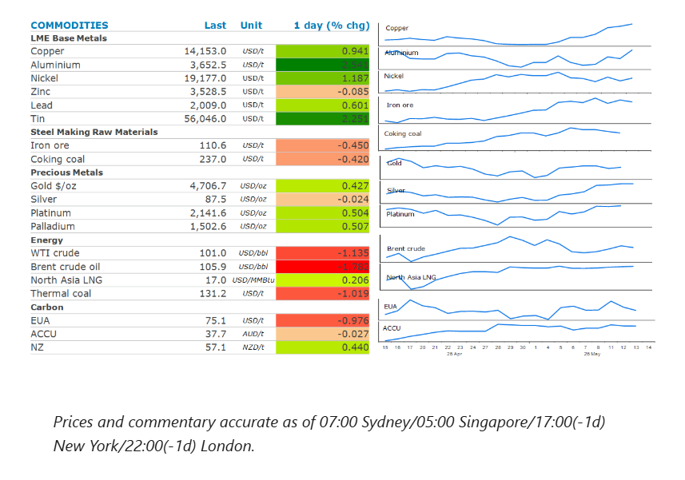
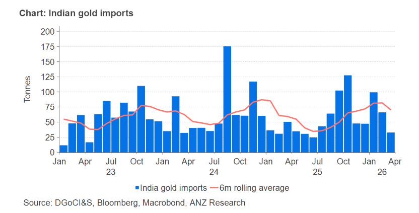

# Oil edges lower as market watches Trump-Xi meeting

**Date:** May 14, 2026  
**Publisher:** Breakwave Advisors | **Category:** Market Insights  
**Original URL:** [https://www.breakwaveadvisors.com/insights/2026/5/14/oil-edges-lower-as-market-watches-trump-xi-meeting](https://www.breakwaveadvisors.com/insights/2026/5/14/oil-edges-lower-as-market-watches-trump-xi-meeting)  

---

Energy fell as the market awaits the Trump-Xi meeting. Industrial metals extended gains on supply losses. Precious metals fell on higher US inflation.

*By*[*Daniel Hynes*](https://www.linkedin.com/in/dahynes/)

> **Figure 1: Στιγμιότυπο Οθόνης 2026 05 14 110255**  
> **Interactive Data & Source:** [Linkedin](https://www.linkedin.com/newsletters/commodities-wrap-6692196755876012032/?fbclid=IwAR3kiXJqZdxmp9ZcRwBNI7FsBySI-XSC0pfPur1qzjt7OZp7PTE59Tsl1QI) | [Local Asset](file:///C:/Users/Dell/Github/Shipping/corpus/03-breakwave/insights/2026/assets/2026-05-14_oil-edges-lower-as-market-watches-trump-xi-meeting_img_cea3cf84ceb9ceb3cebcceb9cf8ccf84cf85_2744060d3ffa.png)

### Market Commentary

**Crude oil**prices dipped, as the market awaits a pivotal meeting between Trump and Xi. That is despite Trump downplaying the amount of attention the Middle East conflict would get during the summit. Xi said he would prioritise trade negotiations and that “we have Iran very much under control”. Prices eased earlier in the session after US government data showed that distillate inventories rose last week for the first time since March. While the build was relatively low at 190kbbl, it allayed fears the supply cushion is reaching its limit. Even so, the EIA weekly inventory report did show that crude oil stockpiles fell by 4,306kbbl last week. The US Strategic Petroleum Reserve saw another sharp drawdown, falling 8,605kbbl to 384.1mbbl.

The International Energy Agency (IEA) warned that around the world oil inventories are falling at a record pace. Global observed oil inventories declined at a rate of about 4mb/d in March and April. It also reported that as of 8 May, about 164mbbl of oil have been released from emergency stockpiles in IEA countries. The closure of the Strait of Hormuz continues to impact Persian Gulf producers. Saudi Arabia reported that its oil production fell 6.316mb/d in April, according to OPEC’s monthly market report. The output is now down 42% since February. Overall OPEC member output slumped 1.727mb/d to average 18.98mb/d.

**North Asia LNG**prices edged higher. Even so, supplies remain largely curtailed as a lack of progress on a peace deal between US and Iran leaves buyers concerned about the availability of supply.

**Aluminium**led the base metals sector higher, as further signs of tightness emerge. The Middle East conflict has seen about 9% of global primary aluminium output cut off from the international market. This has led to a scramble for available supplies. Orders for aluminium on the London Metal Exchange jumped by 27,750t to 47,025t on Wednesday.**Copper**extended gains as supply risks mount around the world. The disruption of sulphuric acid from the Persian Gulf has put at risk around 20% of global copper supply that is produced via acid‑intensive SX‑EW processes. Refined copper production fell 3% y/y to 1.05mt in April.

**Gold**extended recent losses as expectations of a rate hike by the Fed rise. This was compounded overnight by data that showed US wholesale inflation also accelerated in April. This saw yields on 10y US Treasuries rise to their highest since July, while traders raised their expectations of a hawkish Fed. Meanwhile, India, raised import tariffs on gold and silver to about 15% from 6%. The hike will prompt price increases for the precious metals, probably leading to a dip in consumer jewellery demand.

### Chart of the Day

India’s gold imports are likely to take a hit following the more than doubling of import tariffs. Although gold import volumes fell to 640t in 2025, higher gold prices meant that their total value still rose significantly. This has seen the trade deficit widened sharply to $333.2bn in FY26, up from $283.5bn the previous year. Even before the latest announcement, the industry had already been expecting restrictions due to delays in granting licences to importers. Indian banks, for example, did not import gold in April due to delays in issuing fresh licences. The duty increase is expected to add to existing pressures facing precious metals demand.

> **Figure 2: Στιγμιότυπο Οθόνης 2026 05 14 110343**  
> **Interactive Data & Source:** [Linkedin](https://www.linkedin.com/newsletters/commodities-wrap-6692196755876012032/?fbclid=IwAR3kiXJqZdxmp9ZcRwBNI7FsBySI-XSC0pfPur1qzjt7OZp7PTE59Tsl1QI) | [Local Asset](file:///C:/Users/Dell/Github/Shipping/corpus/03-breakwave/insights/2026/assets/2026-05-14_oil-edges-lower-as-market-watches-trump-xi-meeting_img_cea3cf84ceb9ceb3cebcceb9cf8ccf84cf85_7262a0430cab.png)

Data source:[Commodities Wrap](https://www.linkedin.com/newsletters/commodities-wrap-6692196755876012032/?fbclid=IwAR3kiXJqZdxmp9ZcRwBNI7FsBySI-XSC0pfPur1qzjt7OZp7PTE59Tsl1QI)

---

**Tags:** Markets, Shipping, Commodities  
