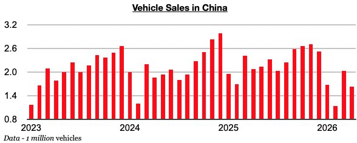
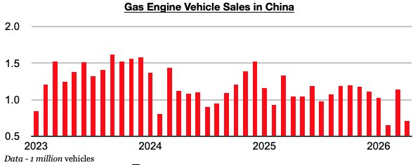
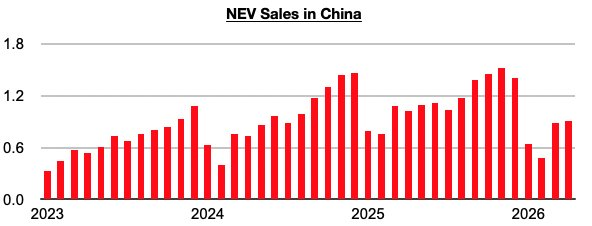
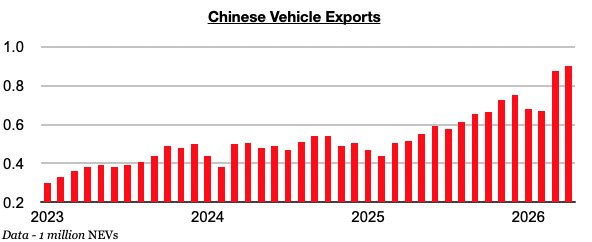
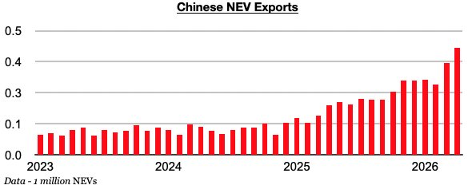

# China's Vehicle Export Growth Extremely Robust

**Date:** May 15, 2026  
**Publisher:** Breakwave Advisors | **Category:** Market Insights  
**Original URL:** [https://www.breakwaveadvisors.com/insights/2026/5/15/chinas-vehicle-export-growth-extremely-robust](https://www.breakwaveadvisors.com/insights/2026/5/15/chinas-vehicle-export-growth-extremely-robust)  

---

*By*[*Jeffrey Landsberg*](https://www.linkedin.com/in/jeffrey-landsberg-70ab957/)

In Commodore Research's recent Weekly China Reports, we have been stressing just how strong China's vehicle export growth has been and how this growth supports China’s manufacturing and its overall economy. Newly released data for April has been released and shows that not only have exports set another record, growth has climbed even higher. Vehicle sales in China, though, have now contracted on a year-on-year basis for six straight months, as weakness persists in the country.

> **Figure 1: Chart 1**  
> [Local Asset](file:///C:/Users/Dell/Github/Shipping/corpus/03-breakwave/insights/2026/assets/2026-05-15_chinas-vehicle-export-growth-extremely-robust_img_chart1_125737c7a232.jpg)

Sales of gasoline engine vehicles have been particularly weak, most recently contracting year-on-year last month by 32%. Gas-engine vehicle sales in China have now contracted on a year-on-year basis for seven straight months. Last month’s 32% contraction has marked the largest contraction seen during this period.

> **Figure 2: Chart 2**  
> [Local Asset](file:///C:/Users/Dell/Github/Shipping/corpus/03-breakwave/insights/2026/assets/2026-05-15_chinas-vehicle-export-growth-extremely-robust_img_chart2_0d8cedddc29b.jpg)

NEV sales in China totaled 914,000 vehicles, which has marked a year-on-year contraction of 11%. NEV buyers in China this year must pay a 5% purchase tax, which is putting a dent on NEV sales, but the year-on-year contraction in gas engine vehicle sales has been larger in recent months.

> **Figure 3: Chart 3**  
> [Local Asset](file:///C:/Users/Dell/Github/Shipping/corpus/03-breakwave/insights/2026/assets/2026-05-15_chinas-vehicle-export-growth-extremely-robust_img_chart3_b1af72ac9e61.jpg)

A record 901,000 vehicles were exported last month. Vehicle exports have now set new records during six of the last eight months, and most recently grew year-on-year by 74%. This has marked the strongest growth seen during this period.

> **Figure 4: Chart 4**  
> [Local Asset](file:///C:/Users/Dell/Github/Shipping/corpus/03-breakwave/insights/2026/assets/2026-05-15_chinas-vehicle-export-growth-extremely-robust_img_chart4_85d896706851.jpg)

The 901,000 vehicle exports included a record 430,000 NEVs exported. China’s NEV exports have now set new records during six of the last seven months, and most recently grew year-on-year by 115%. NEV exports have now grown by at least 100% for twelve straight months.

> **Figure 5: Chart 5**  
> [Local Asset](file:///C:/Users/Dell/Github/Shipping/corpus/03-breakwave/insights/2026/assets/2026-05-15_chinas-vehicle-export-growth-extremely-robust_img_chart5_cf1839bc4e30.jpg)

---

**Tags:** China, Markets, Economy  
