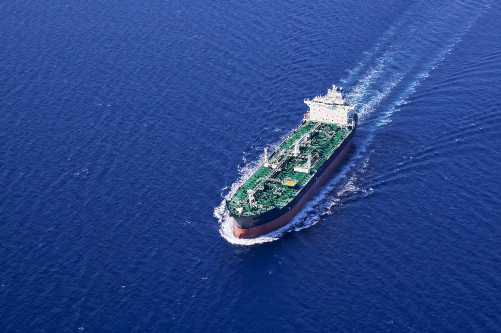
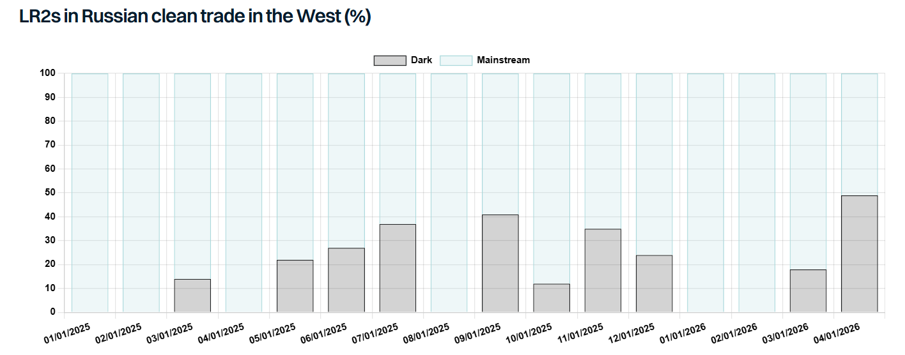

# EU keeps the pressure on

**Date:** May 18, 2026  
**Publisher:** Breakwave Advisors | **Category:** Market Insights  
**Original URL:** [https://www.breakwaveadvisors.com/insights/2026/5/18/eu-keeps-the-pressure-on](https://www.breakwaveadvisors.com/insights/2026/5/18/eu-keeps-the-pressure-on)  

---

> **Figure 1: Tankerrr 2 1 (1)**  
> **Interactive Data & Source:** [Gibsons Co](https://www.gibsons.co.uk/report/crude-clampdown/) | [Local Asset](file:///C:/Users/Dell/Github/Shipping/corpus/03-breakwave/insights/2026/assets/2026-05-18_eu-keeps-the-pressure-on_img_tankerrr-2-128129_89290ba50318.jpg)

Whilst the world’s attention remains firmly focused on Iran, the EU’s 20th sanctions package has perhaps undeservingly received little attention. Yet, the fact that the EU continues to push ahead with further sanctions amid an unprecedented energy crisis is a clear indication that the EU’s stance on Russia remains unchanged.

The latest package includes further restrictive measures across energy, shipping, trade, finance and anti-circumvention. In shipping, the package prohibited the provision of technical assistance, brokering services or financing related to certain icebreakers and LNG tankers linked to Russian trade. 46 additional vessels have been sanctioned, although around half had already been sanctioned by either the US or the UK. The “new” sanctions involved just 1 VLCC, 3 Suezmaxes, 12 Afra/LRs, 2 MRs and 6 small tankers.

Further restrictions have also been introduced on tanker sales. All tanker sales to third countries must now include mandatory contractual clauses prohibiting resale or transfer to Russia. Sellers are also required to conduct risk assessments related to possible retransfer to Russia, implement proportionate mitigation measures, and notify EU authorities upon any sales. In addition, contracts must include an obligation for buyers to pass these restrictions on in any subsequent resale. This could significantly narrow the market for compliant tanker disposals for EU owners, but enforcement mechanisms and related penalties remain unclear.

A new exemption has been introduced to facilitate the recycling of ageing dark fleet vessels. This is significant given that close to 65% of the dark/sanctioned tanker fleet above 25k dwt is now 20 years old or older and these units will have to be demolished at some point in the future. The derogation effectively allows sanctioned vessels to receive the services needed to physically reach recycling yards and be scrapped. However, the latest rules apply only to EU-sanctioned vessels, while many ships are sanctioned by multiple jurisdictions.

Separately, two Russian ports – Murmansk and Tuapse – have been added to the list of sanctioned ports. In another notable development here, the Karimun Oil Terminal in Indonesia has become the first third-country port to be sanctioned for facilitating circumvention of the price cap mechanism. Volumes handled there remain relatively modest. Still, this development potentially opens the door for other third-country ports to face similar restrictions in the future.

Perhaps most importantly, a full ban on maritime services related to Russian crude oil and petroleum products has now been agreed in principle. However, implementation has been deferred, pending coordination with the G7 and the wider Price Cap Coalition. There are two important elements here. Firstly, the proposed ban is not limited to crude oil only, it specifically mentions petroleum products. As discussed in one of our[**reports**](https://www.gibsons.co.uk/report/crude-clampdown/), the majority of Russian crude exports are already carried by dark/sanctioned tankers and as such the implications will be limited. The picture, however, is very different for clean trade, where the majority of cargoes are still transported by mainstream tonnage. Here, a full maritime ban could materially reduce Russia’s export capability, at least temporarily, until additional tonnage is brought into the trade.

Of course, tighter rules surrounding tanker sales into Russian trade could reduce the available pool of candidates, but they are unlikely to eliminate them completely given that sizeable fleets remain controlled by owners outside the G7/EU framework. More importantly, the fact that the EU has publicly signalled this measure gives Russia time to prepare. Given the current geopolitical backdrop and ongoing turmoil in oil markets, it appears unlikely that the G7 and wider Price Cap Coalition will reach agreement on implementing a full maritime ban any time soon.

> **Figure 2: Στιγμιότυπο Οθόνης 2026 05 18 101048**  
> **Interactive Data & Source:** [Gibsons Co](https://www.gibsons.co.uk/market-reports) | [Local Asset](file:///C:/Users/Dell/Github/Shipping/corpus/03-breakwave/insights/2026/assets/2026-05-18_eu-keeps-the-pressure-on_img_cea3cf84ceb9ceb3cebcceb9cf8ccf84cf85_c6ecad8912a5.png)

Data source:[Gibson Shipbrokers](https://www.gibsons.co.uk/market-reports)

---

**Tags:** Tankers, Markets, Shipping  
