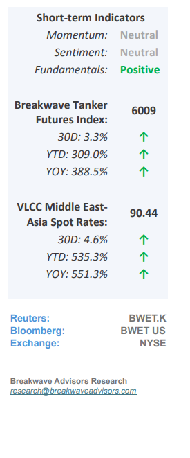
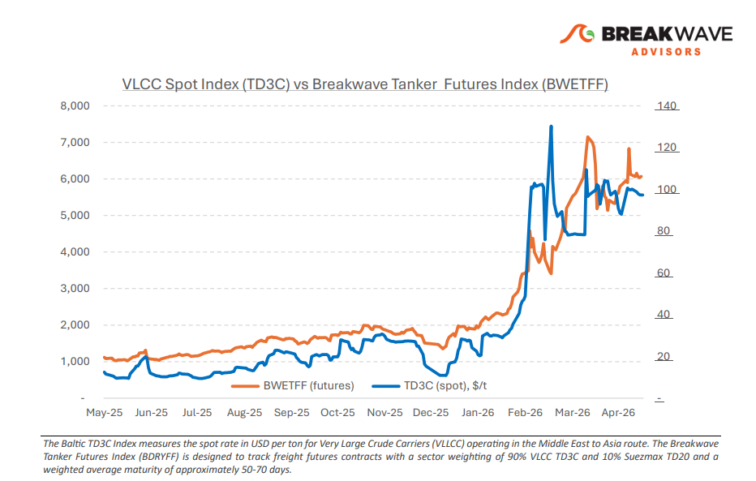
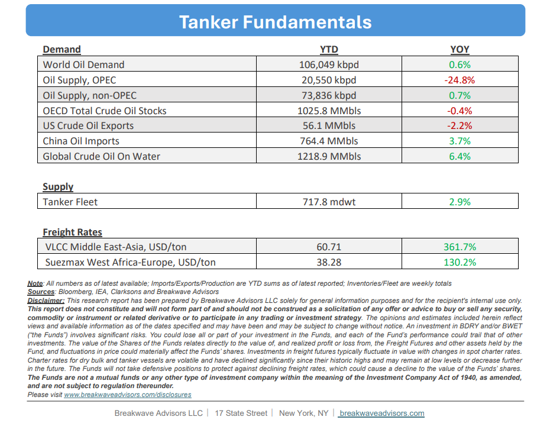

# Breakwave Bi-Weekly Tanker Report - May 19, 2026

**Date:** May 19, 2026  
**Publisher:** Breakwave Advisors | **Category:** Market Insights  
**Original URL:** [https://www.breakwaveadvisors.com/insights/5192026wetreportkju125](https://www.breakwaveadvisors.com/insights/5192026wetreportkju125)  

---

•**Uncertainty Remains**– The VLCC market is increasingly shaped by**geopolitical risk and regional access constraints**rather than underlying freight fundamentals, with what initially appeared to be a temporary reaction to Middle East disruption now evolving into a more**entrenched divergence**between the Arabian Gulf and the Atlantic basin. The widening gap between the two regions has become one of the clearest features of the VLCC current market. The Gulf of Oman/East trial route is gradually gaining broader operational acceptance, and its discount to standard AG routes is increasingly reflected in market pricing. The differential continues to capture both the**additional operational considerations**and the elevated transit sensitivity surrounding the Strait of Hormuz, reinforcing how regional risk exposure is influencing trading patterns and vessel positioning. At the same time, the Atlantic basin**continues to absorb displaced VLCC tonnage**from the East. Westward repositioning remains active, with ballast arrivals into West Africa and the US Gulf building faster than regional cargo demand. Vessel supply in the Atlantic is therefore expanding, while AG participation remains constrained by owner caution and transit risk. In the Arabian Gulf and Red Sea, sentiment remains cautious and closely tied to developments surrounding the US-Iran relationship.**Uncertainty around Hormuz transit remains elevated,**and Western owners continue to limit exposure through the Strait, contributing to an underlying tight tonnage position. Looking ahead, the AG VLCC market remains highly sensitive to developments around the Strait of Hormuz, while in the Atlantic, the key question remains whether cargo demand can absorb the expanding vessel list before further downside develops. Until clearer direction emerges,**owners are expected to remain cautious,**with positioning and risk management continuing to dominate trading decisions.

> **Figure 1: Cea3cf84ceb9ceb3cebcceb9cf8ccf84cf85**  
> [Local Asset](file:///C:/Users/Dell/Github/Shipping/corpus/03-breakwave/insights/2026/assets/2026-05-19_5192026wetreportkju125_img_cea3cf84ceb9ceb3cebcceb9cf8ccf84cf85_8d7c9e90184c.png)

•**Oil Prices to Move Past Recent Highs as Global Storage Hits New Lows**– The ongoing Strait of Hormuz (SOH) disruption represents a generational shift in global market dynamics,**shifting the previous surplus into a structural****deficit**that will likely persist for years. While historically high inventory levels initially cushioned the impact, three months of continuous depletion have severely eroded this safety margin. Consequently,**global oil prices are projected to remain above $90**per barrel absent a global recession, a threshold that will significantly elevate worldwide inflation expectations and interest rates. As entering the summer months accelerates this supply-demand imbalance, the resulting market strain is anticipated to trigger**widespread logistical disruptions, permanent demand destruction, and a heavily accelerated transition toward alternative energy investments.**

•**Our Long-term View**– The tanker market has been recovering from a long period of staggered rates as the growth in new vessel supply shrunk while oil demand remained elevated in line with the global economy. The recent rapid increase in freight rates has led to significant new vessel ordering, with the orderbook now standing at above average levels, and although in the near term such a supply/demand misbalance is small, we expect a meaningful negative balance to develop longer term leading to a potential downcycle.

> **Figure 2: Στιγμιότυπο Οθόνης 2026 05 19 085654**  
> [Local Asset](file:///C:/Users/Dell/Github/Shipping/corpus/03-breakwave/insights/2026/assets/2026-05-19_5192026wetreportkju125_img_cea3cf84ceb9ceb3cebcceb9cf8ccf84cf85_b21289ae4ca7.png)

> **Figure 3: Στιγμιότυπο Οθόνης 2026 05 19 122734**  
> [Local Asset](file:///C:/Users/Dell/Github/Shipping/corpus/03-breakwave/insights/2026/assets/2026-05-19_5192026wetreportkju125_img_cea3cf84ceb9ceb3cebcceb9cf8ccf84cf85_ee1028ec46a6.png)

### Subscribe:
