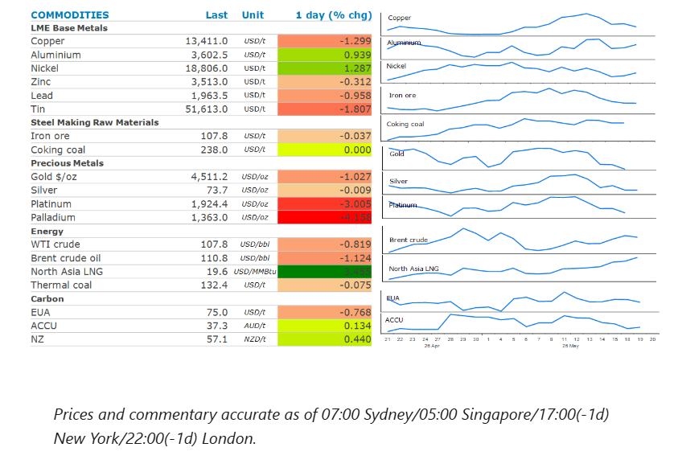
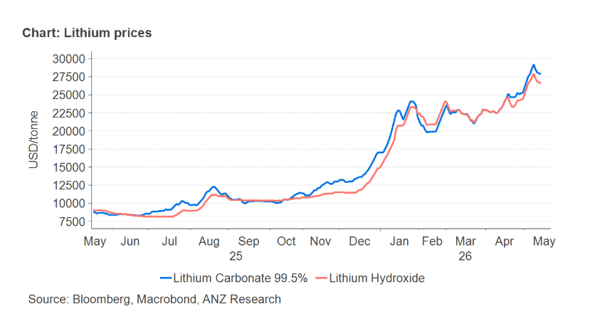

# Metals gain as supply issues mount

**Date:** May 20, 2026  
**Publisher:** Breakwave Advisors | **Category:** Market Insights  
**Original URL:** [https://www.breakwaveadvisors.com/insights/2026/5/20/metals-gain-as-supply-issues-mount](https://www.breakwaveadvisors.com/insights/2026/5/20/metals-gain-as-supply-issues-mount)  

---

Most sectors were lower on hopes that negotiations between Iran and the US would lead to a peace deal.

*By*[*Daniel Hynes*](https://www.linkedin.com/in/dahynes/)

> **Figure 1: Στιγμιότυπο Οθόνης 2026 05 20 164151**  
> **Interactive Data & Source:** [Linkedin](https://www.linkedin.com/newsletters/commodities-wrap-6692196755876012032/?fbclid=IwAR3kiXJqZdxmp9ZcRwBNI7FsBySI-XSC0pfPur1qzjt7OZp7PTE59Tsl1QI) | [Local Asset](file:///C:/Users/Dell/Github/Shipping/corpus/03-breakwave/insights/2026/assets/2026-05-20_metals-gain-as-supply-issues-mount_img_cea3cf84ceb9ceb3cebcceb9cf8ccf84cf85_8db38b736372.png)

### Market Commentary

**Crude oil**prices edged lower as traders weighed up the spectre of the US resuming military strikes on Iran against a possible peace deal. President Trump warned that if Iran didn’t agree to US peace terms, “we may have to give them another big hit”. However, Vice President Vance said the two sides had made a lot of progress in talks and neither side wants to see a resumption of the military campaign. Oil prices dipped on reports that NATO is discussing the possibility of helping ships pass through the Strait of Hormuz if the waterway is not reopened by early July. Even so, investors are increasingly pricing in an indefinite closure. A recent Goldman Sachs poll found that 43% of surveyed investors don’t expect shipping to return to normal until after July. In the meantime, pressure from the US and Iran continues to weigh on oil supplies. The US naval blockade of Iranian ports has left Iran’s Kharg Island oil terminal idle for at least 10 days. Media reported that the US has seized another Iran-linked vessel. Iran’s Supreme National Security Council is said to have established the Persian Gulf Strait Authority and reiterated that full transit would await resolution of its conflict with the US and Israel.

**Natural gas**prices in Europe and Asia rose, as the standoff between the US and Iran kept global supplies tight. The gains were aided by supply disruptions elsewhere. Two production trains at Malaysia’s Bintulu LNG plant have been taken offline due to operational issues. The plant has nine trains, with a total capacity of 30mt/y. Meanwhile, a planned labour strike at Inpex’s Ichthys LNG plant in Australia could impact output next week.

**Gold**remained under pressure, as concerns over inflation stoked expectations of a Fed rate hike. Higher energy prices have triggered a selloff in bonds, with yields on the 30y US Treasury rising to its highest level in almost two decades. According to CME Group’s FedWatch tool, traders’ expectations of a 25bp increase in rates for December were at a 41.7% probability.

**Nickel**prices climbed as concerns of further supply cuts emerged. Shanghai Metals Market reported that 10–15% of high-grade nickel pig iron capacity at the Weda Bay Industrial Park in Indonesia will be placed under maintenance in the coming months. Adding to this, Indonesia’s officials announced plans to tighten control over commodity exports, including coal and palm oil. Such government controls have led to dislocation of commodity markets in the past. Indonesia has cut nickel ore mining quotas this year to help revive prices, and it makes up around half of global supply.**Aluminium**gained as rising tension in the Middle East raised the prospect of ongoing disruption to supplies. Ongoing supply side issues in the**copper**market couldn’t help offsetting a wave of selling, amid a broad risk-off tone across markets. Chile’s state copper commission said it expected the country’s output to fall 2% to 5.3mt this year, weighed down by lower ore grades, maintenance and operational constraints.

**Iron ore**futures extended recent losses on concerns about weakening demand in China. This follows the release of economic data that showed investment in infrastructure resumed its decline in April, adding to concerns that higher energy prices will hit consumers across the world, leading to a hit on Chinese steel exports.

### Chart of the Day

Global lithium prices continue to push higher on constructive demand trends, underpinning momentum in China’s spot market. Tight inventories and rising feed-stock costs are also lifting chemical prices. Lithium carbonate prices in China have gained more than 60% this year and recently touched a three year high of CNY199,000/t (USD29,200/t). High energy prices triggered by the Middle East have boosted interest in clean-energy technology.

> **Figure 2: Στιγμιότυπο Οθόνης 2026 05 20 164248**  
> **Interactive Data & Source:** [Linkedin](https://www.linkedin.com/newsletters/commodities-wrap-6692196755876012032/?fbclid=IwAR3kiXJqZdxmp9ZcRwBNI7FsBySI-XSC0pfPur1qzjt7OZp7PTE59Tsl1QI) | [Local Asset](file:///C:/Users/Dell/Github/Shipping/corpus/03-breakwave/insights/2026/assets/2026-05-20_metals-gain-as-supply-issues-mount_img_cea3cf84ceb9ceb3cebcceb9cf8ccf84cf85_cb9a99734394.png)

Data source:[Commodities Wrap](https://www.linkedin.com/newsletters/commodities-wrap-6692196755876012032/?fbclid=IwAR3kiXJqZdxmp9ZcRwBNI7FsBySI-XSC0pfPur1qzjt7OZp7PTE59Tsl1QI)

---

**Tags:** Crude, Commodities, Shipping  
