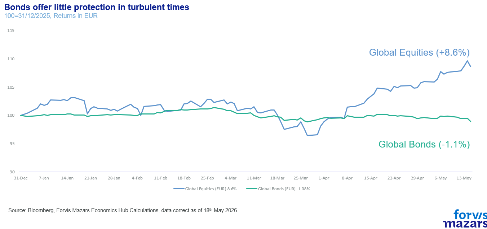
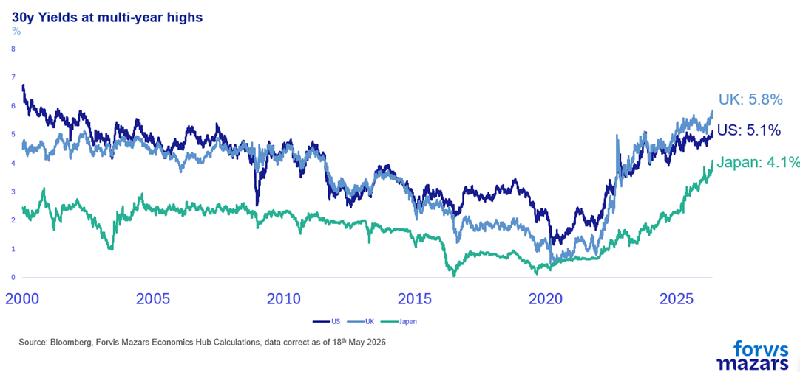
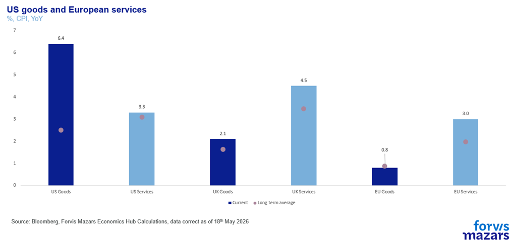
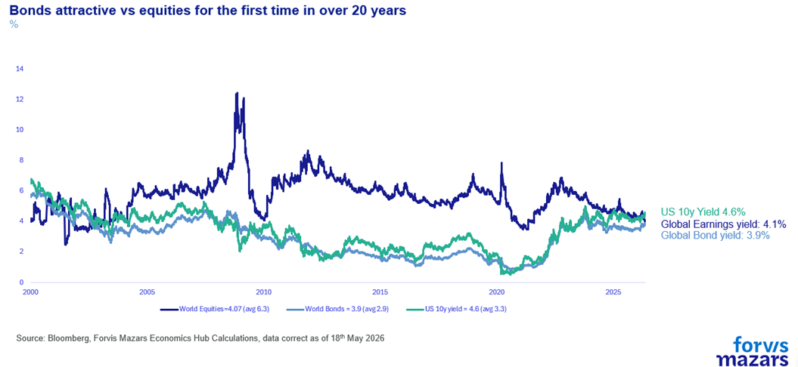
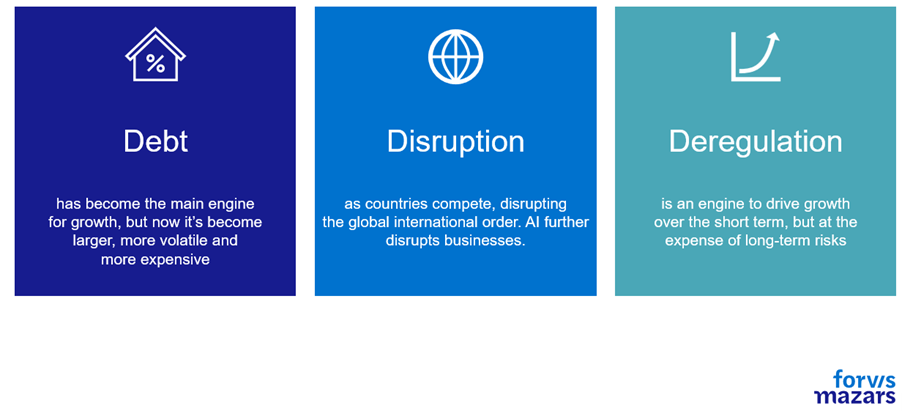

# Are we in a debt crisis?

**Date:** May 21, 2026  
**Publisher:** Breakwave Advisors | **Category:** Market Insights  
**Original URL:** [https://www.breakwaveadvisors.com/insights/2026/5/21/are-we-in-a-debt-crisis](https://www.breakwaveadvisors.com/insights/2026/5/21/are-we-in-a-debt-crisis)  

---

### The Three Things Investors Need to Know This Week:

1. **Equity markets remain near all-time highs, but bond market volatility is rising.**
2. **This is happening because bonds are more sensitive to inflation, and the closure of the Strait of Hormuz is beginning to cause rising prices across the globe.**
3. **Strategically and tactically the debt backdrop is not easy. But we feel that the asset class still serves its purpose, especially if debt exposure is approached with a critical eye.**

*By*[*George Lagarias*](https://www.linkedin.com/in/george-lagarias-mba-3baa769/)

Summary

Recently, bond markets have been volatile, with rising yields driven by inflation fears linked to the prolonged Strait of Hormuz closure and stronger-than-expected inflation data. Despite high global debt levels and tightening fiscal space, this is not a credit crisis. Instead, markets may be in a mid-cycle phase requiring policy adjustment. Bonds remain relevant for investors, but a deeper understanding of debt, from an investment and business perspective, is now a prerequisite.

——

Debt markets matter. They are the bricks and mortar on which the global economy is built. Small mom-and-pop stores, conglomerates, governments, they all run on debt. To observe that we live in a world constructed by debt would possibly be a waste of space in a financial publication. When equities move, it’s mostly investors who notice. When borrowing costs move, everyone notices.

Even as global equity markets remain at or near all-time highs, global debt markets have been convulsing in the past couple of weeks. Traders are now beginning to price in the possibility of higher inflation as the Strait of Hormuz remains shut.

> **Figure 1: Market Chart 1**  
> [Local Asset](file:///C:/Users/Dell/Github/Shipping/corpus/03-breakwave/insights/2026/assets/2026-05-21_are-we-in-a-debt-crisis_img_image002_080459469d92.png)

Borrowing costs have been moving higher, with US, UK and Japanese long bonds reaching multi-year levels.

> **Figure 2: Market Chart 2**  
> [Local Asset](file:///C:/Users/Dell/Github/Shipping/corpus/03-breakwave/insights/2026/assets/2026-05-21_are-we-in-a-debt-crisis_img_image003_fe0868f9c128.png)

As global inflation now becomes a threat, following nearly three months of the Strait of Hormuz closure, bond markets are, expectedly, convulsing. The situation got worse last week, as US producer prices rose by 6% for the year to April, more than 1% above expectations. US goods and European services inflation has been noticeably picking up in the past few months.

> **Figure 3: Market Chart 3**  
> [Local Asset](file:///C:/Users/Dell/Github/Shipping/corpus/03-breakwave/insights/2026/assets/2026-05-21_are-we-in-a-debt-crisis_img_image010_78b969c6f0d7.png)

Markets were hoping that the Xi-Trump meet would offer some resolution in Iran, and were disappointed when it didn’t.

With borrowing costs (yields) moving up, and prices down, some investors question how bonds offer protection at a period of uncertainty. Is the recent drawdown in bond prices proof that during the mature part of the debt cycle, fixed income doesn’t behave as predicted? Or is the recent pullback an opportunity for investors who want higher yields to buy good-quality fixed income?

We believe that historic return and volatility of bonds should be viewed with a healthy amount of scepticism, as they refer to different parts of the debt cycle which began in 1971. Having said that,**we also believe that we are not at the point where debt markets should not be trusted to deliver value to investors. And the increase in relative attractiveness of bonds versus equities should be seriously considered by investors.**

> **Figure 4: Market Chart 4**  
> [Local Asset](file:///C:/Users/Dell/Github/Shipping/corpus/03-breakwave/insights/2026/assets/2026-05-21_are-we-in-a-debt-crisis_img_image011_3806824f3d31.png)

We aren’t in a credit crisis to be sure. Credit crises don’t occur in a vacuum. They happen when institutions (central banks, governments etc, materially misbehave or fundamentally weaken, as Greece found out after announcing a 15% deficit in 2009, five times more than previously estimated.

But how worried should we be about bonds?

For the past few years, experts have observed that debt levels are very elevated. Former Fed Chair Jerome Powell intoned twice this year that the US debt trajectory (not the debt level) is unsustainable and needs addressing.

Our own 3D framework (Debt, Disruption, Deregulation) suggests that a significant amount of economic and political disruption comes from debt accumulation, limiting fiscal space.

> **Figure 5: Market Chart 5**  
> [Local Asset](file:///C:/Users/Dell/Github/Shipping/corpus/03-breakwave/insights/2026/assets/2026-05-21_are-we-in-a-debt-crisis_img_image012_26687962ad6c.png)

The global debt market’s size is at nearly $345tn. The bond market alone accounts for $145tn, almost as large as the global equity market ($160tn). Total debt (private and public) exceeds 300% of annual GDP globally. In the US, the world’s largest economy, annual debt interest payments of 4% mean that for every $6 of nominal GDP, $4, two-thirds, go towards debt repayment. At nearly $1tn for 2026, US interest payments have nearly tripled since 2020. In China, the world’s second-largest economy, public debt alone is set to double in a little over a decade. From 60% in 2019 to 126% by 2031. And we really have no idea what the levels of internal debt (provinces to central government) are, as credible numbers are not published.

Europe has decreed debt to be dangerous and maintained it at manageable levels, in aggregate. In doing so, it has also forgone growth, bowing out from the great global geoeconomic competition stage, leaving the US and China in a two-horse race. Even then, France and the UK have found themselves at the crosshairs of bond vigilantes as both countries struggle to maintain a balance between the promises made to their citizens and bondholder worries (most of whom are also citizens) that the debt might not be repaid fully in real (ex-inflation) terms – high inflation is considered a “soft” default.

So debt levels are high, and fiscal space is tight. But are we close to a major debt and credit crisis? We don’t believe so. Ray Dalio offers a good framework, his archetypal Big Debt Cycle:

1.**Early part of the cycle.**Debt grows roughly in line with incomes and is used to finance activities that yield economic growth. This is the boring, healthy phase.

2.**The bubble**. Debt grows materially faster than the incomes servicing it.

3.**The top**. Central bank tightens (or some external shock raises real funding costs), the marginal buyer disappears, and the most leveraged segments crack first.

4.**The deleveraging signal.**Debt-service obligations exceed the cash flows available to meet them, asset prices fall, and collateral values are significantly reduced**.**

5.**Policy response. Policy makers can**

a.**Deleverage in a deflationary way.**This means austerity, recessions and maybe depressions.

b.**Deleverage in an inflationary way.**Capital flight, currency drops, imported inflation.

c.**Deleverage in a balanced way, a “beautiful deleveraging”, achieving an optimum policy mix to reduce (not eradicate) economic pain.**

6.**Pushing on a string**. Late in the deleveraging, monetary policy loses the ability to influence the economy.

7.**Normalization.**Debt burdens have been worked down, risk-taking gradually returns, credit creation resumes on healthier collateral (a Gold Standard usually).

We believe we are possibly in the fifth part of the cycle, where debt requires robust policy responses, which is exactly what the Federal Reserve has previously alluded to (trajectory is unsustainable and requires addressing). Debt service crowding out spending, high structural deficits, stress in long-term bonds and a turn towards shorter term borrowing, weak currency versus gold are all tell-tale signs of this pivotal stage.

It is a very sensitive part of the cycle, where decisions need to be made. Europe’s decision to contain fiscal spending and America’s decision to borrow more and invest heavily in growth are really two sides of the same coin. Not quite deleveraging, but seeking not to expand present leverage, just going about it in different ways. There’s no evidence on how long this stage will last.

**Can countries maintain present leveraging levels, possibly perform some mild deleveraging and extend the period before harsher decisions need to be made? Or will bond vigilantes look beyond that, requiring sacrifices “hic and nunc” (here and now).**

**This is the question our era will likely eventually answer.**But we don’t believe it will necessarily be answered in the next few months, or even years.**This is crucial for businesses and investors. It informs them not to shun debt altogether, tactically or even strategically, but to remain mindful and critical with their exposure, be it on the lending or the borrowing side of things.**

---

**Tags:** Macro, Economy, Markets  
